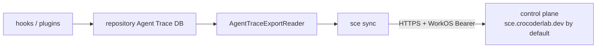

# Agent Trace sync architecture

`sce sync` is the composition step that synchronizes a repository's local Agent Trace capture database with the control-plane Agent Trace ingestion API. It composes already-shipped infrastructure — repository/source identity, the read-only export readers, and the existing WorkOS auth/token-storage stack — into one command; it does not redesign the local database, source identity, export readers, or control-plane storage model.

## User flow

```
sce auth login          # obtain and store WorkOS credentials
cd <repository>          # any directory inside the target Git repository
sce sync                  # synchronize this repository's Agent Trace DB
```

`sce sync --format json` produces the same synchronization with machine-readable output; see [sync-command.md](sync-command.md) for the exact rendering contracts.

## Composed data flow



- **hooks/plugins** write local capture rows (`messages`, `parts`, `diff_traces`, `agent_traces`) into the current repository's `RepositoryAgentTraceDb` during normal Git/editor activity — this is unchanged by sync.
- **`AgentTraceExportReader`** (PR #198) is the read-only local export boundary sync uses to read rows after a cursor; sync never queries the repository DB directly.
- **`sce sync`** resolves repository storage through `agent_trace_storage` (not the hook-runtime resolver), builds an `AuthenticatedControlPlaneClient` from stored WorkOS credentials and the resolved `control_plane_base_url`, and drives one authoritative `/state` call before starting four concurrent stream state machines. Each stream keeps its own batches and reconciliation refreshes sequential and cursor-safe; the bounded per-stream reconciliation loop remains independent. With no environment or config override, that base is `https://sce.crocoderlab.dev`; it is distinct from the `https://sce.crocoder.dev` SCE web and config-schema URL owner.
- **Credential runtime boundary:** `AuthenticatedControlPlaneClient` keeps the synchronous `CredentialStore` behind an `Arc` and runs every token-storage `load`/`save` through `tokio::task::spawn_blocking`. The underlying encrypted auth DB and Linux Secret Service/zbus APIs are blocking and may create their own Tokio runtime, so they must never execute directly inside the async control-plane request future. Token refresh and HTTP requests remain asynchronous; only credential persistence crosses the blocking boundary. The client owns a refresh single-flight guard: expired-token callers re-check credentials after acquiring it, and callers retrying the same rejected access token reuse a token saved by an earlier refresh; valid-token resolution does not acquire the guard.
- **control plane** is the sole source of cursor truth: every invocation starts from `POST /agent-trace/ingestion/state`, uploads via `POST /agent-trace/ingestion/batch`, and advances a stream's cursor only from a validated batch response (`accepted == rows.len()` and `cursor == rows.last().sourceRowId`), never by inferring `cursor + rows.len()`.

The four streams (`messages`, `parts`, `diff_traces`, `agent_traces`) start concurrently after the single authoritative state response; batches and cursor-refresh calls remain sequential within each stream. Accepted-batch progress and stream-completion events may arrive as their respective futures complete. Text mode creates four aligned `indicatif` rows immediately on `stderr`, before any accepted batch can be reported, each with a 15-column stream label, a steady spinner, and a `0 rows uploaded` starting message. Accepted batches update only their stream's cumulative count; each stream changes its spinner to a shared-policy styled `✓` with its final count as soon as its own future completes, including an empty stream with zero uploaded rows. After the progress rows, the final text report contains only a status heading: `Agent Trace already synced.` when all four streams uploaded zero rows, otherwise `Agent Trace sync complete.`. Non-TTY output uses stable aligned plain snapshots without ANSI or terminal-control sequences, and `NO_COLOR` disables completion styling. JSON mode uses a no-op progress sink and retains its JSON-only stdout contract without human progress on `stderr`.

## No-local-persistence invariants

Sync creates no local sync state anywhere on disk:

- No local sync cursor or cursor file.
- No `agent-trace-sync.db` or equivalent local database/table.
- No Turso Sync and no direct Turso credentials in SCE.
- No `BridgeLock` or local data-warehouse (DWH).

Because every invocation starts from the control plane's authoritative `/state` cursors instead of local progress, restarts, conflicts, and ambiguous network failures are all recoverable without any client-side persisted state, and running `sce sync` twice in a row is naturally incremental — the second run's `/state` reflects the first run's uploads and only unsynced rows are re-read.

## Recovery semantics

- **`401` (unexpected):** the control-plane client refreshes the WorkOS token exactly once, saves it, and retries the request exactly once. Concurrent callers that observed the same rejected token coalesce onto the first refresh and reuse its saved token; a second `401` (`ControlPlaneError::MissingCredentials`/`AuthenticationFailed`) fails the command with `sce auth login` guidance, and there is no further retry.
- **Typed authentication classification:** `ControlPlaneError::is_authentication_failure()` is `true` only for `MissingCredentials`/`AuthenticationFailed`, and the same typed traversal is exposed as `StreamSyncError::is_authentication_failure()` and `TraceSyncError::is_authentication_failure()` — no sync-stream path erases a `ControlPlaneError` into a bare `String` before it reaches the command boundary. `cli/src/services/sync/command.rs`'s `classify_sync_error` calls this traversal (never string/substring matching). Manual invocations route authentication failures from the initial `/state` call, a stream batch request, or a stream reconciliation `/state` refresh to `CliError::User { error: UserError::NotAuthenticated, .. }`; every other failure stays internal with its full technical chain preserved. Automatic invocations use the payload-bearing `UserError::AutomaticSyncFailed` entry, with a typed authentication, control-plane, stream, or runtime failure kind and the display reason preserved separately from the technical source. See [CLI error-code taxonomy](../sce/cli-error-code-taxonomy.md) for the `CliError`/`UserError` architecture and [sync-command.md](sync-command.md#error-classification) for the command-level classifier.
- **`409` (cursor conflict):** the per-stream sync engine reconciles by refetching `/state`, replacing only the affected stream's cursor, and resuming from local rows after the refreshed cursor — already-accepted rows are never resent.
- **Ambiguous batch failure (`5xx`, transport failure, or an undecodable `2xx` body):** the engine reconciles via `/state` before any resend. If the refreshed cursor advanced (the batch was actually committed), sync continues from it without resending. If the cursor is unchanged (the batch was not committed), sync may resend once from the authoritative cursor.
- **Reconciliation bound:** both the `409` and ambiguous-failure reconciliation paths share one bounded attempt counter per stream; exhausting it fails that stream with a "did not converge" error instead of looping unboundedly.
- **Invalid response:** a syntactically successful (`2xx`) but semantically inconsistent batch response (`accepted`/`cursor` not matching the sent rows, or an undecodable body) yields `ControlPlaneError::InvalidResponse` and is treated as ambiguous — it still reconciles via `/state` above, rather than failing the command outright.
- **`403` (ownership rejection):** fails the command immediately with a clear message. It never generates a new `source_instance_id`, mutates local repository metadata, or attempts ownership transfer — a `403` is treated as terminal, not reconciled.
- **Terminal protocol/API mismatch (`404`/`405`/`415`/`422` and other unrecognized `4xx` statuses during `/batch`):** classified as `ControlPlaneError::Protocol` and treated as terminal exactly like `400`/`403` — the stream fails immediately with no `/state` refetch and no resend, since a route/format mismatch is not something reconciling cursors can resolve.
- **Sanitized error messages:** every non-2xx control-plane error surfaces at most a narrow, length-bounded `message`/`error` string extracted from the response body (or a generic per-status fallback when the body is malformed, HTML, oversized, or missing that field) — the raw server response body is never included in a command-visible error.

## Related context

- [sync-command.md](sync-command.md) — the `sce sync` command and its text/JSON rendering contract.
- [agent-trace-storage.md](agent-trace-storage.md) — the repository-scoped storage resolver used by sync.
- [agent-trace-export-readers.md](../sce/agent-trace-export-readers.md) — the read-only local export boundary sync reads through.
- [auth-db.md](../sce/auth-db.md) — encrypted WorkOS credential storage sync authenticates through.
- [CLI error-code taxonomy](../sce/cli-error-code-taxonomy.md) — the `CliError`/`UserError` typed boundary that authentication-failure classification renders through.
- [Trace-sync progress stream contract](../decisions/2026-08-13-trace-sync-progress-stream-contract.md) — stderr progress/timestamps and stdout/JSON compatibility boundary.
