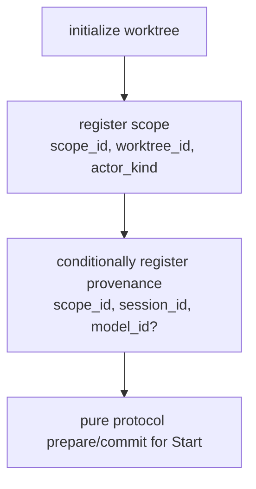

# Mutation-scope provenance (`mutation_trace_scope_provenance`)

Durable, insert-once metadata answering one question the verified
mutation-cursor protocol deliberately does not: given a `ScopeId`, which session
and model did that scope represent? It is stored beside — never inside — the
protocol state persisted by the
[mutation-trace store](mutation-trace-store.md), and reached through that same
`MutationTraceStore` seam.

## Table shape

Migration `005_mutation_scope_provenance.sql` adds a sixth table alongside
`004_mutation_trace_protocol.sql`'s five, keyed `scope_id TEXT PRIMARY KEY` with
`session_id TEXT NOT NULL`, a nullable `model_id TEXT`, and the same `created_at`
default the `004` tables use. It deliberately does not duplicate `actor_kind`,
`worktree_id`, or `status` — those remain owned by `mutation_trace_scopes` — and
it stores no `agent_id`.

`session_id` holds a canonical SCE session identity verbatim (`cc_` for Claude,
`cx_` for Codex); `model_id` is already normalized by its producer and may be
`NULL`. Unknown model information is `NULL`, never guessed.

## Provenance is not protocol state

Provenance is metadata *about* an already-established scope. It is not part of
`ProtocolState`, never enters a `DurableTransition` or the CAS batch, and never
participates in deciding `IneligibleUnscoped` / `AiExclusive` / `AiContended`.
The pure protocol works identically when it is entirely absent. `ScopeId` proves
ownership; scope provenance only describes the owning scope.

## Seams

`MutationTraceStore::register_scope_provenance(&ScopeProvenance { scope_id,
session_id, model_id }) -> Result<ScopeProvenance>` is the write seam, returning
whichever row is stored afterwards.
`MutationTraceStore::load_scope_provenance(scope_id) ->
Result<Option<ScopeProvenance>>` is the read seam; a scope with no provenance
reads back `None`, which is an ordinary absence of metadata rather than an error.

## Insert-once semantics

The first persisted row always wins:

- `session_id` is immutable identity. A `scope_id` belongs to exactly one
  session, permanently.
- `model_id` is immutable first-observed descriptive metadata. A stored `NULL`
  is never backfilled by a later discovery, and a stored model is never cleared
  by a later `None` or overwritten by a disagreeing one. No `UPDATE` path exists.

Every replay carrying the same `session_id` therefore succeeds and returns the
stored row unchanged, whatever its model says. The **only** provenance condition
that returns `Err` is a `scope_id` already bound to a different `session_id`, and
that failure leaves the stored row untouched — session identity is never silently
rewritten. A model disagreement is not a conflict: no attribution decision
depends on this metadata, so a disagreement about it is not a reason to deny a
mutation-capable tool.

## Optional on the `Start` ingress

The generic [mutation-scope hook ingress](mutation-scope-hook-ingress.md)
accepts provenance as one optional `provenance` object, on `start` only:

```json
{
  "operation": "start",
  "scope_id": "...",
  "event_id": "...",
  "actor_kind": "codex",
  "provenance": { "session_id": "cx_...", "model_id": "..." }
}
```

Omitting it is a first-class case: a producer that supplies no provenance keeps
the exact pre-provenance behavior and persists no row. When present, the strict
parser requires a JSON object, accepts only `session_id` and `model_id`
(anything else is `unexpected field 'provenance.<key>'`), requires a non-blank
`session_id`, and reads `model_id` as an optional value where an absent key and
an explicit `null` both mean "no model". A blank or whitespace-only `model_id`
is rejected rather than coerced: both shipped producers normalize an unknown
model to an absent value, so a blank string is malformed input, not an
expression of "unknown". `advance`, `close`, `flush`, and `abandon` reject the
key outright, so provenance is only ever established at admission and never
updated by a later boundary. Every rejection uses the ingress's existing
`Invalid mutation-scope payload from STDIN: <detail>.` diagnostic.

The ingress stays harness-neutral: it forwards the already-canonical
`session_id` and already-normalized `model_id` verbatim onto
`RuntimeBoundary::Start`, whose optional `StartProvenance { session_id,
model_id }` carries them into the runtime. That value omits `scope_id` because
the boundary already names the scope; the
[runtime](mutation-scope-runtime.md) composes the stored `ScopeProvenance` from
both.

## Durable `Start` ordering

A `Start` carrying provenance runs these steps in order, inside the existing
protected-worktree boundary:



Provenance registration therefore always has its owning `mutation_trace_scopes`
row, including on a scope's very first `Start`, and the durable row is in place
before the boundary reports success. It sits outside the CAS retry loop, so a
CAS conflict retries only the protocol transition and never re-registers
provenance — which is safe in either direction, because registration is
insert-once and idempotent.

## Provenance creation is admission-bounded

Provenance describes the owning scope **as observed at admission**, so it is
never attached retroactively. `register_scope` already returns the durable
`ScopeState`, and the runtime uses that returned `status` together with the
existing provenance row to decide what a `Start` carrying provenance may do:

| stored row | durable scope status | behavior |
| --- | --- | --- |
| present | any | register as usual — the insert-once matrix above stays authoritative |
| absent | `NeverSeen` | register the incoming provenance |
| absent | `Active` or terminal | do nothing; provenance stays absent |

A provenance row may therefore only be **created** while the durable scope is
still `NeverSeen`. Once a scope has crossed protocol admission, absence of
provenance is permanent, and a later `Start` replay cannot backfill it. That
replay is not an error: it continues through the protocol's normal replay and
guard behavior and simply persists no provenance.

This closes a retroactive-attachment hole. A scope admitted by a `Start`
carrying no provenance could otherwise gain one from a later replay, which for
Claude means a replay after a `PostModelSwitch` could resolve the *newer* model
and attach it to an *older* scope — provenance that no longer describes
admission.

The rule is deliberately not "skip provenance whenever the scope is past
`NeverSeen`". An **existing** provenance row is still checked on every `Start`
carrying provenance, including for a long-admitted scope, so a replay naming a
different `session_id` remains a fail-closed identity conflict. Only *creation*
is admission-bounded; *validation* is not.

The rule is also deliberately keyed on durable scope status rather than on "the
scope row already exists", which preserves the legitimate retry: a first attempt
that registered the scope but never committed the protocol `Start` leaves the
scope `NeverSeen`, so the retry may still register provenance and then commit.

## Failure is fail-closed and pre-commit

Any provenance failure — in practice only a `scope_id` already bound to a
different `session_id` — aborts the `Start` as
`CoordinateError::ScopeProvenanceRegistration` before the pure protocol commits.
The durable scope keeps whatever status it already had (at most a freshly
created `NeverSeen` row when the failing `Start` was the scope's first), the
triggering event is never recorded as processed, the worktree revision is
unchanged, and the stored provenance row is byte-unchanged. This mirrors the
runtime's existing register-before-protocol behavior for
`CoordinateError::ScopeIdentityConflict`. Because a model disagreement is never
a conflict, the only way provenance denies a mutation-capable tool is a
session-identity contradiction, which neither shipped producer can generate:
both `ScopeId` formats embed the session length-prefixed in the identity
itself.

## Owning-scope requirement

Like `register_scope`, registration requires its owning row to already exist: the
`mutation_trace_scopes` row for `scope_id` is checked before any insert, so
provenance never creates a scope implicitly. Through the `MutationTraceStore`
write seam, provenance therefore cannot be registered without an existing owning
`mutation_trace_scopes` row, and a missing scope leaves no orphan row behind.
That requirement is enforced in the store rather than by a `FOREIGN KEY`, leaving
`004_mutation_trace_protocol.sql` unchanged.

## Related context

- [Mutation-scope hook ingress](mutation-scope-hook-ingress.md)
- [Mutation-scope runtime: the harness-adapter contract](mutation-scope-runtime.md)
- [Mutation-trace store](mutation-trace-store.md)
- [Agent Trace DB](../sce/agent-trace-db.md)
