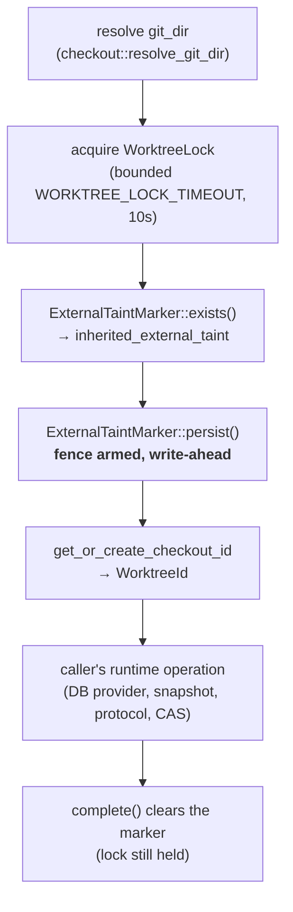

# Mutation-cursor protected-worktree prefix (`runtime::protected_worktree`)

The shared safety prefix every mutation-cursor runtime entrypoint runs behind,
in `cli/src/services/mutation_trace/runtime/protected_worktree.rs`. It was
extracted from `coordinate()`'s own critical section so that a second entrypoint
built on the same guarantees cannot drift from the first — the ordering below is
safety-critical, and one owner is the mechanism that keeps it single-sourced.

Extracted by the `mutation-scope-runtime-integration` plan
(`context/plans/mutation-scope-runtime-integration.md`) ahead of the
`abandon_scope()` entrypoint that will share it.

## The fixed order

The fence is armed **write-ahead of every fallible step that follows it**,
including the DB acquisition and any durable-state lookup. A process that dies
anywhere past that point leaves the worktree-local signal behind for the next
invocation to recover from. See
[`mutation-trace-external-taint.md`](mutation-trace-external-taint.md) for the
marker primitive itself and the recovery it triggers.

## Surface

`ProtectedWorktree::acquire(repository_root) -> Result<ProtectedWorktree,
ProtectedWorktreeError>` runs the whole prefix. The guard then exposes:

- `worktree_id() -> &WorktreeId` — the durable identity derived from this
  checkout. No caller ever supplies a `WorktreeId`; it is always derived here.
- `inherited_external_taint() -> bool` — whether a marker was already present
  on entry, i.e. whether some earlier invocation never proved a trustworthy
  durable completion.
- `complete(self) -> anyhow::Result<()>` — clears the marker while the worktree
  lock is still held, then releases the lock as the guard is consumed. This is
  the **only** thing that clears the marker.

`WORKTREE_LOCK_TIMEOUT` (10s) is owned by this module. `pub(super)
acquire_inner(repository_root, on_lock_contention)` carries the lock-contention
test seam; a private timeout-overriding constructor serves the guard's own
tests.

**`Drop` releases only the lock. It never clears the marker** — so a guard
abandoned by any failure, panic, or early return leaves the fence armed, which
is precisely the conservative outcome the fence exists to produce.

## Error contract

`ProtectedWorktreeError` carries one variant per prefix step, so a caller can
map it onto its own error surface without losing which safety step failed:

| Variant | Raised at | Fence state |
| --- | --- | --- |
| `GitDirResolution(anyhow::Error)` | before the lock | untouched |
| `LockAcquisition(WorktreeLockError)` | lock acquire/timeout | untouched |
| `ExternalTaintMarker { operation: Inspect \| Persist, source }` | fence inspect/arm | left as it was |
| `CheckoutIdentity(anyhow::Error)` | after the fence is armed | **armed** |

`ExternalTaintOperation` lives here, beside the fence step that produces it, and
is re-exported by `coordinator.rs` so `CoordinateError::ExternalTaintMarker`
keeps naming it. `coordinate()` maps `GitDirResolution` and `CheckoutIdentity`
onto `CoordinateError::Other`, `LockAcquisition` onto
`CoordinateError::LockAcquisition`, and the fence variant onto
`CoordinateError::ExternalTaintMarker` with the same `operation` — the exact
variants that step produced before the extraction.

## Testing boundary

Inline `#[cfg(test)] mod tests` uses RAII `tempfile::TempDir` fixtures over real
`git init` repositories (see [`../patterns.md`](../patterns.md)): a clean
worktree arms a fresh marker and reports no inherited taint, then `complete()`
clears it; a marker present on entry is reported as inherited and left armed; a
guard dropped without completing leaves the fence armed while releasing the
lock; the lock is proven held for the guard's whole lifetime through the
`on_lock_contention` seam; and a prefix that times out against a held lock fails
with `LockAcquisition` having armed nothing.

The coordinator's own pre-existing fence and lock regressions
([`mutation-trace-runtime-coordinator.md`](mutation-trace-runtime-coordinator.md#testing-boundary))
pass unchanged through the guard, which is what proves `coordinate()`'s
externally observable ordering and error semantics survived the extraction.

See also: [`mutation-trace-runtime-coordinator.md`](mutation-trace-runtime-coordinator.md),
[`mutation-trace-external-taint.md`](mutation-trace-external-taint.md),
[`checkout-identity.md`](checkout-identity.md).
