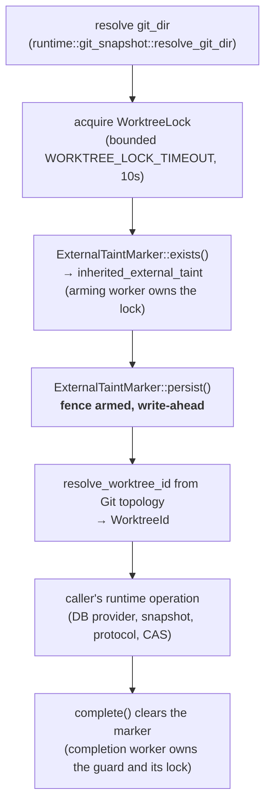

# Mutation-cursor protected-worktree prefix (`runtime::protected_worktree`)

The shared safety prefix every mutation-cursor runtime entrypoint runs behind,
in `cli/src/services/mutation_trace/runtime/protected_worktree.rs`. It was
extracted from `coordinate()`'s own critical section so that a second entrypoint
built on the same guarantees cannot drift from the first — the ordering below is
safety-critical, and one owner is the mechanism that keeps it single-sourced.

Extracted by the `mutation-scope-runtime-integration` plan
(`context/plans/mutation-scope-runtime-integration.md`) ahead of the
`abandon_scope()` entrypoint
([`mutation-trace-scope-abandonment.md`](mutation-trace-scope-abandonment.md)),
which now shares it: `coordinate()` observes a boundary and snapshots, while
`abandon_scope()` observes nothing and snapshots nothing, and this prefix is the
only piece they hold in common.

## The fixed order

```mermaid
flowchart TD
    A["resolve git_dir<br/>(runtime::git_snapshot::resolve_git_dir)"] --> B["acquire WorktreeLock<br/>(bounded WORKTREE_LOCK_TIMEOUT, 10s)"]
    B --> C["ExternalTaintMarker::exists()<br/>→ inherited_external_taint<br/>(arming worker owns the lock)"]
    C --> D["ExternalTaintMarker::persist()<br/><b>fence armed, write-ahead</b>"]
    D --> E["resolve_worktree_id from Git topology<br/>→ WorktreeId"]
    E --> F["caller's runtime operation<br/>(DB provider, snapshot, protocol, CAS)"]
    F --> G["complete() clears the marker<br/>(completion worker owns the guard and its lock)"]
```

### Blocking-worker ownership

The marker's synchronous filesystem I/O (`symlink_metadata`, `create_dir_all`,
`open`, `sync_data`, `remove_file`, parent-directory `sync_all`) never runs on
a Tokio worker. It runs on Tokio's blocking pool behind two ownership
boundaries, each of which owns the worktree lock for its whole duration:

1. **Arming.** Lock acquisition stays a separate `acquire_inner_async` worker,
   so a caller cancelled while waiting for the lock still writes no marker.
   Only after acquisition succeeds does the private `arm_marker_with_lock` move
   the acquired `WorktreeLock` into a second `spawn_blocking` worker that runs
   `exists()` then `persist()` and returns the lock, marker, and inherited flag.
   If the awaiting caller is cancelled mid-arming, the worker still owns the
   lock until persistence finishes, so the marker is left armed and the lock
   releases afterwards.
2. **Completion.** `complete(self)` is `async`. It moves the entire
   `ProtectedWorktree` (through the by-value `complete_blocking(self)` method,
   not just the `marker` field) into a `spawn_blocking` worker, so the lock is
   released only after `clear()` returns. A cancelled completion therefore
   cannot release the lock early and let an older clear delete a newer
   operation's marker. If `complete()` is dropped before it spawns its worker,
   the guard just drops and the marker stays armed.

Git, worktree-identity, and Turso work stay on the async side. Neither worker
runs DB futures.

The fence is armed **write-ahead of every fallible step that follows it**,
including the DB acquisition and any durable-state lookup. A process that dies
anywhere past that point leaves the worktree-local signal behind for the next
invocation to recover from. See
[`mutation-trace-external-taint.md`](mutation-trace-external-taint.md) for the
marker primitive itself and the recovery it triggers.

## Surface

`ProtectedWorktree::acquire(repository_root) -> Result<ProtectedWorktree,
ProtectedWorktreeError>` runs the whole prefix. The guard then exposes:

- `worktree_id() -> &WorktreeId` — the durable identity derived from Git's topology for this
  worktree. No caller ever supplies a `WorktreeId`; it is always derived here.
- `inherited_external_taint() -> bool` — whether a marker was already present
  on entry, i.e. whether some earlier invocation never proved a trustworthy
  durable completion.
- `async complete(self) -> anyhow::Result<()>` — moves the whole guard into a
  blocking worker that clears the marker while the worktree lock is still held,
  then releases the lock as the guard is consumed. This is the **only** thing
  that clears the marker. A completion-worker panic surfaces as an error and
  leaves the marker state unspecified, with no retry.

`WORKTREE_LOCK_TIMEOUT` (10s) is owned by this module. `pub(super)
acquire_inner(repository_root, on_lock_contention)` carries the lock-contention
test seam; a private timeout-overriding constructor serves the guard's own
tests.

**`Drop` releases only the lock. It never clears the marker** — so a guard
abandoned by any failure, panic, or early return leaves the fence armed, which
is precisely the conservative outcome the fence exists to produce.

## Error contract

`ProtectedWorktreeError` carries one variant per prefix step, so a caller can
map it onto its own error surface without losing which safety step failed:

| Variant | Raised at | Fence state |
| --- | --- | --- |
| `GitDirResolution(anyhow::Error)` | before the lock | untouched |
| `LockAcquisition(WorktreeLockError)` | lock acquire/timeout | untouched |
| `ExternalTaintMarker { operation: Inspect \| Persist, source }` | fence inspect/arm | left as it was |
| `MarkerWorkerFailed(JoinError)` | arming blocking worker panicked or was cancelled by the runtime while holding the lock | unknown; never auto-cleared |
| `CheckoutIdentity(anyhow::Error)` | Git-derived worktree identity resolution, after the fence is armed | **armed** |

`ExternalTaintOperation` lives here, beside the fence step that produces it, and
is re-exported by `coordinator.rs` so `CoordinateError::ExternalTaintMarker`
keeps naming it; `AbandonScopeError::ExternalTaintMarker` carries the same type.
`coordinate()` maps `GitDirResolution` and `CheckoutIdentity`
onto `CoordinateError::Other`, `LockAcquisition` onto
`CoordinateError::LockAcquisition`, and the fence variant onto
`CoordinateError::ExternalTaintMarker` with the same `operation` — the exact
variants that step produced before the extraction. `MarkerWorkerFailed` maps
onto `CoordinateError::Other` / `AbandonScopeError::Other`, keeping the
`JoinError` cause, and the external mutation guard passes it through
`GuardError::Acquire`.

## Testing boundary

Inline `#[cfg(test)] mod tests` uses RAII `tempfile::TempDir` fixtures over real
`git init` repositories (see [`../patterns.md`](../patterns.md)): a clean
worktree arms a fresh marker and reports no inherited taint, then `complete()`
clears it; a marker present on entry is reported as inherited and left armed; a
guard dropped without completing leaves the fence armed while releasing the
lock; the lock is proven held for the guard's whole lifetime through the
`on_lock_contention` seam; and a prefix that times out against a held lock fails
with `LockAcquisition` having armed nothing.

Two one-worker (`multi_thread`, `worker_threads = 1`) regressions use static
`FnOnce() + Send + 'static` hooks that run inside the blocking workers to pause
them deterministically. They prove that an unrelated Tokio timer keeps making
progress while the hook holds the worker; that aborting the awaiting caller
leaves the worktree lock held, so another acquisition times out; that cancelled
arming leaves the marker armed, so the next `acquire()` reports inherited
taint; and that a cancelled completion clears its marker before the next
`acquire()` can arm, which then reports no inherited taint and keeps its own
marker.

The coordinator's own pre-existing fence and lock regressions
([`mutation-trace-runtime-coordinator.md`](mutation-trace-runtime-coordinator.md#testing-boundary))
pass unchanged through the guard, which is what proves `coordinate()`'s
externally observable ordering and error semantics survived the extraction.

See also: [`mutation-trace-runtime-coordinator.md`](mutation-trace-runtime-coordinator.md),
[`mutation-trace-scope-abandonment.md`](mutation-trace-scope-abandonment.md),
[`mutation-trace-external-taint.md`](mutation-trace-external-taint.md),
[`checkout-identity.md`](checkout-identity.md) (historical removal and identity boundary).
