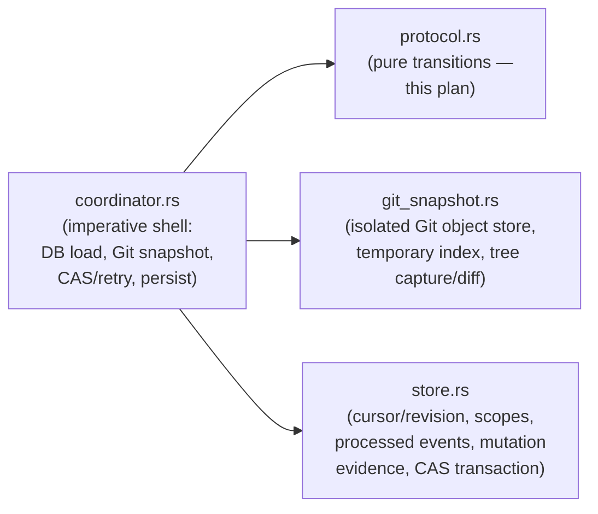

# Mutation-cursor protocol module (`mutation_trace`)

Pure Rust refinement of the verified `spec/mutation_cursor.qnt` protocol, living
at `cli/src/services/mutation_trace/`. It is not yet wired into any hook,
command, or database call site; that integration is out of scope for the
`mutation-cursor-protocol-kernel` plan and is left for a later plan.

## Current state

Only the domain-types slice exists so far (`mutation-cursor-protocol-kernel`
plan, task T01). `types.rs` defines the protocol's state and pure accessors;
transition, attribution, failure/recovery, and cross-action test coverage land
in later tasks of the same plan. Registered in `cli/src/services/mod.rs` with
`#[allow(dead_code)]`, matching the existing precedent for modules not yet
consumed by production call sites (`bash_policy`, `repository_identity`,
`agent_trace_export`).

## Module layout

- `mod.rs` — public module boundary and module-level doc comment.
- `types.rs` — state/domain types and pure accessors (`WorktreeState`,
  `ScopeState`, `AttemptState`, `MutationEvent`, `Boundary`, `Attribution`,
  and the identity/status/failure-kind types they compose from).
- `tests.rs` — `#[cfg(test)]` coverage for the current slice, sibling to
  `mod.rs`.

The module performs no Git, database, filesystem, environment, network,
async, or lock I/O: `types.rs` and later `protocol.rs` only ever receive and
return plain domain values.

## Refinement decisions vs. the Quint model

`spec/mutation_cursor.md` states the model's enumerated identities
(`WorktreeId`/`ScopeId`/`TreeId`/`EventId`/`AttemptId`) are bounded
verification domains only, and that "production code must support larger and
unbounded identifier spaces." This module refines each as an opaque
`String`-wrapping newtype rather than a fixed enum.

Two consequences follow from that choice:

- The Quint functions `scopeWorktree`/`scopeActor` are pure `match` tables
  only because the model's `ScopeId` enum is pre-associated with a fixed
  worktree/actor. Since `ScopeState` already carries `worktree_id`/
  `actor_kind` fields, this module refines them as accessor methods on
  `ScopeState` instead of a lookup over `ScopeId`.
- `Boundary::Start`/`Advance`/`Close` carry only `scope`/`event`, exactly
  like the Quint constructors (`spec/mutation_cursor.qnt:31-35`) — no
  independent `worktree` field. An earlier version of this module added one
  so `boundary_worktree` could stay a pure function of `Boundary` alone;
  review caught that this was unfaithful, since it let a boundary claim a
  worktree inconsistent with its own scope's true assignment, a state the
  Quint type cannot represent. `boundary_worktree(boundary, scope:
  Option<&ScopeState>)` now resolves a hook boundary's worktree from the
  associated scope's own durable state instead, mirroring how
  `commitAttempt`/`prepareAvailable` (`spec/mutation_cursor.qnt:418,458`)
  resolve it from `scopeWorktree(data.scope)` rather than from the boundary
  itself.
- `boundary_scope`/`boundary_event`/`boundary_event_key` return
  `Option<_>` (`None` for `Flush`) rather than mirroring the Quint model's
  arbitrary `Scope0`/`Event0` placeholder default.

`ActorKind` and `FailureKind` stay fixed Rust enums: unlike the identity
types, they represent real, closed sets (supported harnesses; snapshot
health), not bounded verification domains.

## Target end-state architecture

The plan's file split anticipates three later seams this module does not yet
implement, recorded here so a later plan does not have to rediscover the
layout:

`protocol.rs` (added by later tasks in this plan) stays free of any Git
object, DB row, or CAS transaction concept; `coordinator.rs`, `git_snapshot.rs`,
and `store.rs` are not created by this plan.

## Authoritative source

`spec/mutation_cursor.qnt` (verified Quint model) and `spec/mutation_cursor.md`
(model-boundary and implementation-refinement notes) remain the authoritative
description of protocol behavior; this module's doc comments cite concrete
spec line ranges per type/function. See `context/plans/mutation-cursor-protocol-kernel.md`
for current build-out status across tasks.
