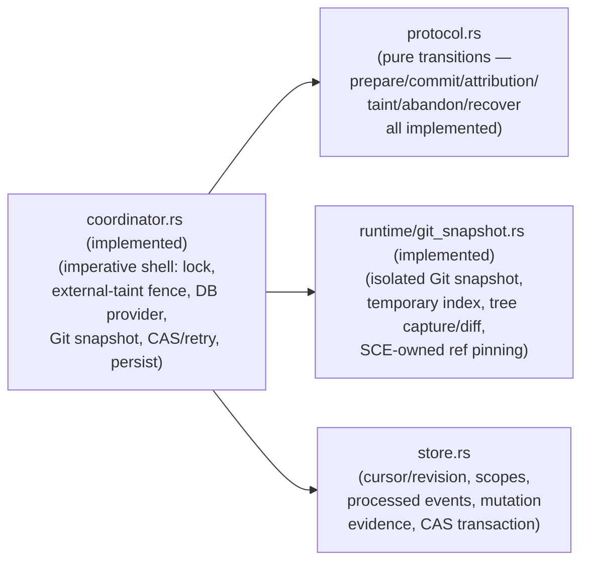

# Mutation-cursor protocol module (`mutation_trace`)

Pure Rust refinement of the verified `spec/mutation_cursor.qnt` protocol, living
at `cli/src/services/mutation_trace/`. `protocol.rs`'s transitions are not yet
wired into any hook/command; `store.rs` now provides a real database call site
(see "Target end-state architecture" below).

## Current state

Domain types, `prepare`/`commit` transition logic, attribution/mutation-event
materialization, snapshot-failure/database-failure taint actions, scope
abandonment, and recovery are all implemented. `types.rs` defines the
protocol's state (including the `ProtocolState` aggregate) and pure
accessors; `protocol.rs` implements `prepare` and `commit` (all four boundary
kinds — `Start`/`Advance`/`Close`/`Flush` — in one pass, refining
`prepareAvailable`/`prepare`/`commitAttempt`), `live_scopes_on`/
`attribution_for` (refining `liveScopesOn`/`attributionFor`),
`taint`/`database_failure` (refining
`taintHealthy`/`taint`/`recordDatabaseFailure`/`databaseFailure`), `abandon`
(refining `abandonLiveScope`/`abandon`), and `recover` (refining
`recoverNeeded`/`recover`). Cross-action sequence/invariant tests and a
module-level Quint refinement matrix (`mod.rs`) close out the
`mutation-cursor-protocol-kernel` plan's task stack (T01-T07). Registered in
`cli/src/services/mod.rs` with `#[allow(dead_code)]`, matching the existing
precedent for modules not yet consumed by production call sites
(`bash_policy`, `repository_identity`, `agent_trace_export`).

`commit` materializes exactly one `MutationEvent` into `mutation_events` when
`changed` is true, with `active_scopes`/`attribution` computed by
`live_scopes_on`/`attribution_for` against the state as it existed *before*
the same call's own scope-lifecycle transition — a `Start` boundary's emitted
event never attributes the mutation to the scope it is about to activate, and
a `Close` boundary's emitted event still attributes to the scope it is about
to close.

## Module layout

- `mod.rs` — public module boundary and module-level doc comment.
- `types.rs` — state/domain types and pure accessors (`ProtocolState`,
  `WorktreeState`, `ScopeState`, `AttemptState`, `MutationEvent`, `Boundary`,
  `Attribution`, and the identity/status/failure-kind types they compose
  from).
- `protocol.rs` — pure transition logic: `prepare` (refining
  `prepareAvailable`/`prepare`) and `commit` (refining `commitAttempt`),
  returning a `CommitOutcome` that pairs the resulting `ProtocolState` with a
  `CommitEvaluation` (`accepted`/`observes`/`observed_change`/`changed`/
  `advances_revision`); `live_scopes_on` and `attribution_for` (refining
  `liveScopesOn`/`attributionFor`), each callable standalone or via `commit`'s
  internal `MutationEvent` materialization; `taint` (refining
  `taintHealthy`/`taint`), `database_failure` (refining
  `recordDatabaseFailure`/`databaseFailure`), `abandon` (refining
  `abandonLiveScope`/`abandon`), and `recover` (refining
  `recoverNeeded`/`recover`, taking the currently observed tree as an
  explicit `TreeId` parameter), each a guarded no-op action independent of
  `prepare`/`commit`.
- `tests.rs` — `#[cfg(test)]` coverage for the current slice, sibling to
  `mod.rs`.

See [mutation-trace-revision-refinement.md](mutation-trace-revision-refinement.md)
for the Quint `int` → Rust `u64` worktree-revision refinement all four enforce.

The module performs no Git, database, filesystem, environment, network,
async, or lock I/O: `types.rs` and `protocol.rs` only ever receive and
return plain domain values — `prepare` takes the currently observed tree as
an explicit `TreeId` parameter rather than reading Git itself; `commit`
operates on the tree already captured in the prepared `AttemptState`
(`before_tree`/`after_tree`) and takes no tree input of its own.

## Refinement decisions vs. the Quint model

`spec/mutation_cursor.md` states the model's enumerated identities
(`WorktreeId`/`ScopeId`/`TreeId`/`EventId`/`AttemptId`) are bounded
verification domains only, and that "production code must support larger and
unbounded identifier spaces." This module refines each as an opaque
`String`-wrapping newtype rather than a fixed enum.

Two consequences follow from that choice:

- The Quint functions `scopeWorktree`/`scopeActor` are pure `match` tables
  only because the model's `ScopeId` enum is pre-associated with a fixed
  worktree/actor. Since `ScopeState` already carries `worktree_id`/
  `actor_kind` fields, this module refines them as accessor methods on
  `ScopeState` instead of a lookup over `ScopeId`.
- `Boundary::Start`/`Advance`/`Close` carry only `scope`/`event`, exactly
  like the Quint constructors (`spec/mutation_cursor.qnt:31-35`) — no
  independent `worktree` field, so a boundary can never claim a worktree
  inconsistent with its own scope's true assignment, a state the Quint type
  cannot represent. `boundary_worktree(boundary, scopes: &BTreeMap<ScopeId,
  ScopeState>)` resolves a hook boundary's worktree by reading the `ScopeId`
  out of the boundary and looking up that exact key in `scopes`, mirroring
  how `commitAttempt`/`prepareAvailable` (`spec/mutation_cursor.qnt:418,458`)
  resolve it from `scopeWorktree(data.scope)` rather than from the boundary
  itself. The Rust refinement does not accept an arbitrary `ScopeState`
  alongside a boundary: the boundary's own `ScopeId` is the only key ever
  used to look one up, preserving the Quint relationship
  `scopeWorktree(boundary.scope)`. The result is `None` when that key is
  absent from `scopes`; `Flush` carries its worktree directly and does not
  consult `scopes` at all.
- `boundary_scope`/`boundary_event`/`boundary_event_key` return
  `Option<_>` (`None` for `Flush`) rather than mirroring the Quint model's
  arbitrary `Scope0`/`Event0` placeholder default.

`ActorKind` and `FailureKind` stay fixed Rust enums: unlike the identity
types, they represent real, closed sets (supported harnesses; snapshot
health), not bounded verification domains.

## Runtime scope materialization

The Quint model's `SCOPES` universe is finite: `init` populates every
possible `ScopeId` with a `ScopeState` up front (`scopes' =
SCOPES.mapBy(scope => { status: NeverSeen, actorKind: scopeActor(scope),
worktreeId: scopeWorktree(scope) })`), so by the time any boundary is
evaluated, `scopeActor`/`scopeWorktree` already resolve for that scope — its
identity is a static fact of the model, not something a transition
establishes.

This module's `ScopeId` is an unbounded runtime string (see "Refinement
decisions" above), so `ProtocolState.scopes` cannot be prepopulated with
every possible scope the way `init` does. Materializing a newly observed
scope's durable identity — `status: NeverSeen`, its `actor_kind`, and its
`worktree_id` — is therefore an **adapter/store responsibility, not a
protocol transition**:

- Quint: a finite universe means every `ScopeState` value already exists at
  `init`.
- Rust production: an unbounded identifier space means `ScopeState` is
  lazily materialized by the persistence/adapter layer *before* the scope's
  `ScopeId` is ever passed into `prepare`/`commit`.

Before invoking the pure protocol with a hook boundary (`Start`/`Advance`/
`Close`) that references a `ScopeId`, the surrounding coordinator/store
projection must ensure that scope already exists in `ProtocolState.scopes`.
`prepare`/`commit` do not infer identity from hook context, command type, or
any other heuristic: they never choose a default worktree, choose a default
actor, or synthesize a new `NeverSeen` scope. `boundary_worktree` returning
`None` for an unregistered scope, and `prepare`/`commit`'s resulting no-op,
are exactly this boundary — a missing `ScopeId` is unresolved protocol
input, not a scope the protocol may create.

### Identity immutability

Once a `ScopeId` is materialized, its `actor_kind` and `worktree_id` are
immutable identity facts for the lifetime of that scope. Only lifecycle
`status` transitions, exactly as the protocol already governs:

```text
NeverSeen -> Active -> Closed
NeverSeen -> Closed
Active -> Abandoned
```

If a future adapter observes an existing `ScopeId` with a conflicting
`actor_kind` or `worktree_id`, that is an identity/protocol error to reject
and report — never a record to silently overwrite. This is the concrete
adapter-side half of `ScopeActorIdentityIsStable` (`spec/mutation_cursor.qnt`);
the protocol-side half is that no transition in `protocol.rs` ever writes
`actor_kind`/`worktree_id` (only `status` fields change).

### Missing scope vs. `NeverSeen` scope

These are not equivalent:

- A **missing** `ScopeId` (absent from `ProtocolState.scopes`) means its
  identity has not been materialized — invalid/unresolved protocol input.
- An **existing** `ScopeState { status: NeverSeen, .. }` is a known,
  materialized scope identity that simply has not yet had an accepted
  `Start`.

The production entry path never calls `prepare`/`commit` with the first
case; the no-op behavior for a missing scope is a defensive kernel property,
not a path the coordinator is expected to exercise.

## Runtime worktree materialization

The same representation/refinement boundary applies to `WorktreeId`, one
level up from scope identity, and governs `taint`/`database_failure`/
`abandon`/`recover`:

- **Quint**: `WorktreeId` ranges over the finite `WORKTREES` universe, and
  `init` materializes a `WorktreeState` for every member up front — every
  `WorktreeId` already resolves before any action runs. This is why
  `recordDatabaseFailure` (`spec/mutation_cursor.qnt:712-737`) states no
  explicit worktree-existence guard: there is no state for it to guard
  against. That omission is a fact about the closed, pre-populated Quint
  domain, not evidence that an arbitrary unknown worktree is valid protocol
  input.
- **Rust production**: `WorktreeId` is an unbounded opaque runtime string, so
  `ProtocolState.worktrees` contains only worktrees a future coordinator/
  store layer has actually materialized. Every pure protocol action requires
  its target `WorktreeId` to already exist in `ProtocolState.worktrees`; an
  unknown `WorktreeId` is invalid/unresolved kernel input and causes a
  defensive no-op, exactly as an unregistered `ScopeId` does for `prepare`/
  `commit`. The pure kernel never creates a `WorktreeState`, infers one, or
  synthesizes a worktree from context.

A **missing** `WorktreeId` (absent from `ProtocolState.worktrees`) is not
equivalent to a **healthy** `WorktreeState` (`tainted: false`,
`failure_kind: Healthy`, ...): the former means the protocol has no
materialized state for that identity at all, while the latter means the
identity is known and currently healthy. `taint`, `database_failure`,
`abandon`, and `recover` all enforce this distinction with the same existence
guard — `abandon` resolves it through the referenced scope's own materialized
`worktree_id` rather than taking a `WorktreeId` directly — which keeps
`external_taint ⊆ ProtocolState.worktrees` an invariant of every state this
module can produce, since `database_failure` is the sole path that inserts
into `external_taint`. The concrete runtime refinement of `external_taint` is
the worktree-local `<git-dir>/sce/mutation-cursor-tainted` marker (see
[`mutation-trace-external-taint.md`](mutation-trace-external-taint.md)), armed
write-ahead before Agent Trace DB acquisition and overlaid onto
`database_failure` recovery only when a later invocation inherits it;
`WorktreeProjection::into_protocol_state()` itself always returns an empty
`external_taint`. A pre-protected marker inspect/persist failure means no
mutation boundary committed; a marker-*clear* failure means the boundary already
committed durably — the coordinator surfaces that as
`CoordinateError::MarkerClearAfterCommit`, carrying the committed
`CoordinateOutcome` so no evidence is lost, and leaves the marker armed so the
next invocation still promotes it to protocol `external_taint`.

Future responsibility split (mirrors "Runtime scope materialization" above):
the coordinator/store layer resolves/materializes worktree identity/state and
loads a `ProtocolState`; `protocol.rs` only transitions already-known ones.

## Target end-state architecture

The plan's file split anticipated three seams beyond `protocol.rs`. `store.rs`,
`runtime/git_snapshot.rs`, and `coordinator.rs` (with its public `coordinate()`
entrypoint) now all exist as real call sites, covered by cross-module
integration tests; only harness/command wiring remains:



`coordinator.rs` (see
[`mutation-trace-runtime-coordinator.md`](mutation-trace-runtime-coordinator.md))
owns the lock, the external-taint fence, the caller-supplied DB provider, one
Git snapshot, and a bounded CAS-retry loop; `store.rs` never remaps an existing
`ScopeId`'s `actor_kind`/`worktree_id`; `protocol.rs` assumes referenced scopes
already exist and stays free of any Git object, DB row, or CAS transaction
concept. `runtime::ref_reconciliation`
([`mutation-trace-ref-reconciliation.md`](mutation-trace-ref-reconciliation.md))
is imperative durability maintenance *outside* the verified protocol — it never
advances the cursor, chooses attribution, changes scope state, or creates a
`MutationEvent`, only reclaims SCE-owned snapshot refs that are no durable root.

## Authoritative source

`spec/mutation_cursor.qnt` (verified Quint model) and `spec/mutation_cursor.md`
(model-boundary/implementation-refinement notes) remain authoritative; doc
comments cite concrete spec line ranges per type/function. See
`context/plans/mutation-cursor-protocol-kernel.md` for build-out status.
