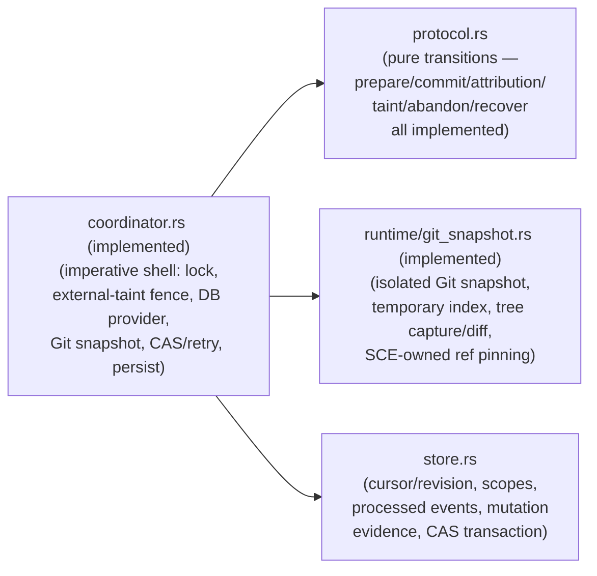

# Mutation-cursor protocol module (`mutation_trace`)

Pure Rust refinement of the verified `spec/mutation_cursor.qnt` protocol, living
at `cli/src/services/mutation_trace/`. `protocol.rs` is invoked only through the
`runtime/` layer; that runtime is now driven by the generic
`sce hooks mutation-scope` CLI ingress, with no concrete harness lifecycle
adapter wired. `store.rs` provides the real database call site
(see "Target end-state architecture" below).

## Current state

Domain types, `prepare`/`commit` transition logic, attribution/mutation-event
materialization, snapshot-failure/database-failure taint actions, scope
abandonment, and recovery are all implemented. `types.rs` defines the
protocol's state (including the `ProtocolState` aggregate) and pure
accessors; `protocol.rs` implements `prepare` and `commit` (all four boundary
kinds — `Start`/`Advance`/`Close`/`Flush` — in one pass, refining
`prepareAvailable`/`prepare`/`commitAttempt`), `live_scopes_on`/
`attribution_for` (refining `liveScopesOn`/`attributionFor`),
`taint`/`database_failure` (refining
`taintHealthy`/`taint`/`recordDatabaseFailure`/`databaseFailure`), `abandon`
(refining `abandonLiveScope`/`abandon`), and `recover` (refining
`recoverNeeded`/`recover`). Cross-action sequence/invariant tests and a
module-level Quint refinement matrix (`mod.rs`) close out the
`mutation-cursor-protocol-kernel` plan's task stack (T01-T07). Registered in
`cli/src/services/mod.rs` with `#[allow(dead_code)]`.

`commit` materializes exactly one `MutationEvent` into `mutation_events` when
`changed` is true, with `active_scopes`/`attribution` computed by
`live_scopes_on`/`attribution_for_boundary` against the state as it existed
*before* the same call's own scope-lifecycle transition — a `Start` boundary's
emitted event never attributes the mutation to the scope it is about to
activate, and an `Active -> Close` boundary's emitted event still attributes
to the scope it is about to close. A `Close` whose scope was `NeverSeen`
(refining `boundaryClosesNeverSeenScope`) is always `IneligibleUnscoped`,
whatever else is live: its `Start` was never durably observed, so it can
neither confirm nor attribute; acceptance, cursor movement and the `Closed`
transition are unchanged.

## Module layout

- `mod.rs` — public module boundary and module-level doc comment.
- `types.rs` — state/domain types and pure accessors (`ProtocolState`,
  `WorktreeState`, `ScopeState`, `AttemptState`, `MutationEvent`, `Boundary`,
  `Attribution`, and the identity/status/failure-kind types they compose
  from).
- `protocol.rs` — pure transition logic: `prepare` (refining
  `prepareAvailable`/`prepare`) and `commit` (refining `commitAttempt`),
  returning a `CommitOutcome` that pairs the resulting `ProtocolState` with a
  `CommitEvaluation` (`accepted`/`observes`/`observed_change`/`changed`/
  `advances_revision`); `live_scopes_on` and `attribution_for` (refining
  `liveScopesOn`/`attributionFor`), each callable standalone or via `commit`'s
  internal `MutationEvent` materialization; `taint` (refining
  `taintHealthy`/`taint`), `database_failure` (refining
  `recordDatabaseFailure`/`databaseFailure`), `abandon` (refining
  `abandonLiveScope`/`abandon`), and `recover` (refining
  `recoverNeeded`/`recover`, taking the currently observed tree as an
  explicit `TreeId` parameter), each a guarded no-op action independent of
  `prepare`/`commit`.
- `tests.rs` — `#[cfg(test)]` coverage for the current slice, sibling to
  `mod.rs`.

See [mutation-trace-revision-refinement.md](mutation-trace-revision-refinement.md)
for the Quint `int` → Rust `u64` worktree-revision refinement all four enforce.

The module performs no Git, database, filesystem, environment, network,
async, or lock I/O: `types.rs` and `protocol.rs` only ever receive and
return plain domain values — `prepare` takes the currently observed tree as
an explicit `TreeId` parameter rather than reading Git itself; `commit`
operates on the tree already captured in the prepared `AttemptState`
(`before_tree`/`after_tree`) and takes no tree input of its own.

## Refinement decisions vs. the Quint model

`spec/mutation_cursor.md` states the model's enumerated identities
(`WorktreeId`/`ScopeId`/`TreeId`/`EventId`/`AttemptId`) are bounded
verification domains only, and that "production code must support larger and
unbounded identifier spaces." This module refines each as an opaque
`String`-wrapping newtype rather than a fixed enum.

Two consequences follow from that choice:

- The Quint functions `scopeWorktree`/`scopeActor` are pure `match` tables
  only because the model's `ScopeId` enum is pre-associated with a fixed
  worktree/actor. Since `ScopeState` already carries `worktree_id`/
  `actor_kind` fields, this module refines them as accessor methods on
  `ScopeState` instead of a lookup over `ScopeId`.
- `Boundary::Start`/`Advance`/`Close` carry only `scope`/`event`, exactly
  like the Quint constructors (`spec/mutation_cursor.qnt:31-35`) — no
  independent `worktree` field, so a boundary can never claim a worktree
  inconsistent with its own scope's true assignment, a state the Quint type
  cannot represent. `boundary_worktree(boundary, scopes: &BTreeMap<ScopeId,
  ScopeState>)` resolves a hook boundary's worktree by reading the `ScopeId`
  out of the boundary and looking up that exact key in `scopes`, mirroring
  how `commitAttempt`/`prepareAvailable` (`spec/mutation_cursor.qnt:536,496`)
  resolve it from `scopeWorktree(data.scope)` rather than from the boundary
  itself. The Rust refinement does not accept an arbitrary `ScopeState`
  alongside a boundary: the boundary's own `ScopeId` is the only key ever
  used to look one up, preserving the Quint relationship
  `scopeWorktree(boundary.scope)`. The result is `None` when that key is
  absent from `scopes`; `Flush` carries its worktree directly and does not
  consult `scopes` at all.
- `boundary_scope`/`boundary_event`/`boundary_event_key` return
  `Option<_>` (`None` for `Flush`) rather than mirroring the Quint model's
  arbitrary `Scope0`/`Event0` placeholder default.

`ActorKind` and `FailureKind` stay fixed Rust enums: unlike the identity
types, they represent real, closed sets (supported harnesses; snapshot
health), not bounded verification domains.

## Runtime materialization

Scope and worktree materialization (the finite Quint universes vs. the
unbounded Rust identity space, identity immutability, and missing scope vs.
`NeverSeen` scope) lives in
[`mutation-trace-runtime-materialization.md`](mutation-trace-runtime-materialization.md).

## Target end-state architecture

The plan's file split anticipated three seams beyond `protocol.rs`. `store.rs`,
`runtime/git_snapshot.rs`, and `coordinator.rs` (with its public `coordinate()`
entrypoint) now all exist as real call sites, covered by cross-module
integration tests. The generic command ingress is implemented — the
`sce hooks mutation-scope` command drives `coordinate()` / `abandon_scope()` —
the Claude Code, Codex, and OpenCode lifecycle adapters are wired (OpenCode via a
generated plugin installed by `sce setup`), so only the Pi adapter remains future
work; `protocol.rs` itself stays pure and unaware of any CLI or harness concept:

```mermaid
flowchart LR
    coordinator["coordinator.rs (implemented)\n(imperative shell: lock,\nexternal-taint fence, DB provider,\nGit snapshot, CAS/retry, persist)"]
    protocol["protocol.rs\n(pure transitions —\nprepare/commit/attribution/\ntaint/abandon/recover\nall implemented)"]
    git_snapshot["runtime/git_snapshot.rs (implemented)\n(isolated Git snapshot,\ntemporary index, tree capture/diff,\nSCE-owned ref pinning)"]
    store["store.rs\n(cursor/revision, scopes,\nprocessed events, mutation\nevidence, CAS transaction)"]

    coordinator --> protocol
    coordinator --> git_snapshot
    coordinator --> store
```

`coordinator.rs` (see
[`mutation-trace-runtime-coordinator.md`](mutation-trace-runtime-coordinator.md))
owns the lock, the external-taint fence, the caller-supplied DB provider, one
Git snapshot, and a bounded CAS-retry loop; `store.rs` never remaps an existing
`ScopeId`'s `actor_kind`/`worktree_id`; `protocol.rs` assumes referenced scopes
already exist and stays free of any Git object, DB row, or CAS transaction
concept. `runtime::ref_reconciliation`
([`mutation-trace-ref-reconciliation.md`](mutation-trace-ref-reconciliation.md))
is imperative durability maintenance *outside* the verified protocol — it never
advances the cursor, chooses attribution, changes scope state, or creates a
`MutationEvent`, only reclaims SCE-owned snapshot refs that are no durable root.

## Authoritative source

`spec/mutation_cursor.qnt` (verified Quint model) and `spec/mutation_cursor.md`
(model-boundary/implementation-refinement notes) remain authoritative; doc
comments cite concrete spec line ranges per type/function. See
`context/plans/mutation-cursor-protocol-kernel.md` for build-out status.
