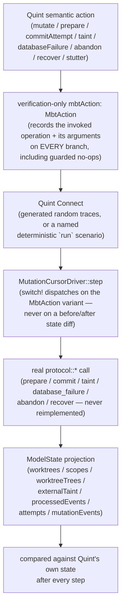

# Quint Connect model-based testing (`mutation_trace::mbt`)

`#[cfg(test)]`-only harness that continuously checks the pure Rust refinement
at [`cli/src/services/mutation_trace/protocol.rs`](mutation-trace-protocol.md)
against the verified `spec/mutation_cursor.qnt` model, using
[Quint Connect](https://github.com/informalsystems/quint-connect) (crate
`quint-connect` 0.1.2, `[dev-dependencies]`-only — never a production one).
It replaces the one-time manual translation the base protocol module was
reviewed against with a driver that replays real Quint traces through the
real `prepare`/`commit`/`taint`/`database_failure`/`abandon`/`recover`
functions and compares state after every step. It introduces no `store.rs`,
`coordinator.rs`, `git_snapshot.rs`, database, Git, filesystem, network, or
hook integration — `protocol.rs` stays exactly as pure as
[mutation-trace-protocol.md](mutation-trace-protocol.md) describes it.

## Pipeline



Every action sets `mbtAction'` to its own variant on every branch, including
guarded/no-op ones, so the driver always knows which operation Quint
selected and dispatches to the matching `protocol::*` function
unconditionally — never inferring arguments from state, never skipping a
call because Quint's own state happened not to change.

## Why `mbtAction` exists and is excluded from comparison

Quint Connect needs a nondeterministic-choice path it can extract and hand to
the driver as a typed action (`Config { nondet: &["mbtAction"], state: &[] }`
in [`driver.rs`](../../cli/src/services/mutation_trace/mbt/driver.rs)).
`mbtAction: MbtAction` is a verification-only state variable added to
`spec/mutation_cursor.qnt` purely to carry that choice — never read by any
other action, invariant, or production logic, and never participating in
freshness, lifecycle, attribution, revisions, cursor movement, taint,
recovery, or mutation-evidence semantics.

Because it is transport metadata, `mbtAction` has no field anywhere in the
`mbt/model.rs` wire types
([`WireModelState`](../../cli/src/services/mutation_trace/mbt/model.rs)). When
the full top-level Quint state record deserializes, `serde`'s default
unknown-field handling silently drops it — keeping it out of `ModelState`,
the struct actually compared against the driver's projected state.

## Operation identity vs. `MbtStutter`

`MbtAction` identifies the invoked operation and its concrete arguments,
never whether that invocation changed anything. `prepare`, `taint`,
`databaseFailure`, `abandon`, and `recover` each guard their real transition
and, on the guarded path, previously fell through to the spec's shared
top-level `stutter` action. Naively wiring `mbtAction' = MbtStutter` into
that shared path would have erased which operation was actually invoked and
silently stopped the MBT harness from exercising Rust's guard behavior on
exactly the paths where refinement bugs hide.

Instead, a shared `mbtStutterAs(taken: MbtAction): bool` helper (identical to
the old `stutter` body, parameterized on the `MbtAction` to record) replaced
the inline field list `stutter` used to duplicate. Each guarded branch calls
`mbtStutterAs(<its own MbtVariant>(...))` with its real arguments, leaving
every other semantic state assignment exactly as `stutter` already produced
it. `commitAttempt`'s own not-accepted path got the same treatment directly.
`stutter` itself is now `mbtStutterAs(MbtStutter)`, so `MbtStutter` is
reachable only from the explicit top-level `stutter` action — never as a
byproduct of another operation's internal guard branch.

Two deterministic regressions in `mbt/tests.rs` prove this holds: replaying
`Attempt0` through `Start` then `Advance` (the second `prepare` guards since
the attempt is no longer `Available`) and replaying `recover(WT0)` from
`init` (guards immediately — nothing is tainted or needs rebaseline). Both
prove the driver still calls the real `protocol::prepare`/`protocol::recover`
function on the guarded step and independently reaches the same no-op
outcome Quint does.

## Record-payload action encoding

Quint Connect's custom sum-type decoder distinguishes a unit variant from a
record variant, so every argument-carrying `MbtAction` variant is a record —
even single-field ones (`MbtMutate({worktree, tree})`,
`MbtPrepare({attempt, boundary})`, `MbtCommit({attempt})`,
`MbtTaint({worktree})`, `MbtDatabaseFailure({worktree})`,
`MbtAbandon({scope})`, `MbtRecover({worktree})`) — and only the two truly
argument-free variants (`MbtInit`, `MbtStutter`) are bare, matching the
`itf`/`quint-connect` `#[serde(tag = "tag", content = "value")]` wire shape.
Its nondet-pick extraction (`extract_nondet_from_sum_type`) accepts a
`Value::Record` directly for both the top-level nondet-picked action and
nested record fields (e.g. `Boundary`'s `Start`/`Advance`/`Close` variants
nested inside `MbtPrepare`).

## Finite ID mapping

The Quint model's identity types (`WorktreeId`, `ScopeId`, `TreeId`,
`EventId`, `AttemptId`) are bounded enums (`WT0`/`WT1`, `Scope0`-`Scope3`,
`Tree0`-`Tree3`, `Event0`-`Event9`, `Attempt0`-`Attempt5`). `mbt/model.rs`
defines one `Wire*` enum per identity type mirroring those exact members,
each converting via `From` into this crate's own opaque `String`-wrapping
newtypes (e.g. `WireWorktreeId::WT0 -> WorktreeId("wt0")`) — the same
production types [mutation-trace-protocol.md](mutation-trace-protocol.md)
describes. This mapping exists only inside the test-only `mbt` module.

## Comparable state

`ModelState` (`mbt/model.rs`) holds exactly the fields AC5 named:

- `worktrees: BTreeMap<WorktreeId, WorktreeState>`
- `scopes: BTreeMap<ScopeId, ScopeState>`
- `worktree_trees: BTreeMap<WorktreeId, TreeId>` (refines `worktreeTrees` —
  the driver-only observed-tree input, since the pure kernel does no Git I/O)
- `external_taint: BTreeSet<WorktreeId>`
- `processed_events: BTreeSet<EventKey>`
- `attempts: BTreeMap<AttemptId, AttemptState>`
- `mutation_events: BTreeSet<MutationEvent>`, each with its full field set

Every verification-only history the spec tracks for its own invariant
checking (`cursorHistory`, `protocolHistory`, `scopeHistory`,
`abandonHistory`, `startHistory`, `recoveryHistory`, `taintHistory`,
`evidenceAttempts`, `scopeStartCount`, `everTerminal`, `mbtAction`) has no
field in `ModelState` and is dropped the same way `mbtAction` is.

## `randomPrepare` stays one `step` branch

`step`'s eight top-level alternatives
(`randomMutate`/`randomPrepare`/`randomCommit`/`randomTaint`/`randomRecover`/
`randomDatabaseFailure`/`randomAbandon`/`stutter`) are unchanged by this
harness. `prepare` unconditionally sets `mbtAction' =
MbtPrepare({attempt, boundary})` on both its accepted and guarded paths, and
`boundary` there is always the exact concrete `Boundary` value whichever of
`randomPrepare`'s five inner `any` alternatives fired — so the driver already
recovers which boundary kind Quint selected from the `MbtPrepare` variant
alone. No dedicated `PrepareKind`-style nondet choice was needed.

## Driver and test coverage

[`driver.rs`](../../cli/src/services/mutation_trace/mbt/driver.rs) defines
`MutationCursorDriver { protocol: ProtocolState, worktree_trees:
BTreeMap<WorktreeId, TreeId> }`, an `init()` matching Quint's `init` exactly,
and `Driver::step` dispatching via `switch!` on every `MbtAction` variant.
Every arm unconditionally calls its `protocol::*` function with the
transported, converted arguments; `MbtMutate` alone doesn't call into
`protocol.rs` (it only updates `worktree_trees`); `MbtStutter` calls a
dedicated no-op method rather than being inlined.

[`mbt/tests.rs`](../../cli/src/services/mutation_trace/mbt/tests.rs) wires:

- One non-default-values smoke replay (`WT1`/`Tree3`/`Attempt5`/`Flush(WT1)`,
  scenario `testMbtDriverTransportsNonDefaultArguments`), proving the driver
  transports a trace's actual concrete arguments rather than guessing or
  defaulting them.
- All eight named deterministic scenarios already defined in the spec
  (`testStartObservesBeforeActivation`, `testCloseObservesBeforeDeactivation`,
  `testContendedIntervalsRemainAiContended`,
  `testNoChangeHookReplayCannotStealFutureChange`,
  `testConcurrentObservationsHaveOneWinner`,
  `testTaintInvalidatesPreparedObservation`, `testRecoveryEstablishesBaseline`,
  `testClosedScopeCannotReactivate`) via `#[quint_test]`, expressed as the
  same semantic-action call chains the spec already uses — no duplicated
  scenario logic in Rust.
- The two guarded-no-op regressions (`testMbtGuardedPrepareInvokesRealPrepare`,
  `testMbtGuardedRecoverInvokesRealRecover`).
- `mutation_cursor_generated_traces_refine_rust_protocol`, a
  `#[quint_run(max_samples = 500, max_steps = 30)]` test comparing
  `ModelState` against Quint's own state after every step across 500
  randomized traces up to 30 steps deep. Reproducible by fixing `QUINT_SEED`
  and re-running — the same seed always regenerates the same trace set.

## `u64` revision boundary

`WorktreeState::revision` is Rust `u64`, refining Quint's unbounded `int`
(see [mutation-trace-revision-refinement.md](mutation-trace-revision-refinement.md)
for the full `next_revision` checked-arithmetic contract). This harness
replays real traces, so it incidentally exercises `next_revision`'s guarded
paths whenever a trace reaches them, but does not specifically target
`revision: u64::MAX` — Quint's unbounded `int` domain cannot represent or
generate traces toward that boundary. The dedicated no-wrap regressions in
`mutation-trace-revision-refinement.md` remain the sole targeted coverage for
it; this harness's coverage is incidental, not a substitute.

## CI: two Nix checks, both need Quint

`mutation_trace::mbt` is registered as an ordinary `#[cfg(test)] mod mbt;`
(gated behind `#[cfg(test)]` in `mutation_trace/mod.rs`), so it is compiled
and run by *any* `cargo test` over the CLI crate — including the pre-existing
generic `checks.cli-tests` in `flake.nix`, not only a dedicated focused
check:

```text
checks.cli-tests
    -> full `cargo test`, including mutation_trace::mbt
    -> needs the pinned Quint binary on PATH

checks.mutation-trace-quint-connect
    -> focused `cargo test ... mutation_trace::mbt` only
    -> needs the pinned Quint binary on PATH
```

Both checks list the Nix `quint` package in `nativeCheckInputs`. Quint's
presence alone is not sufficient, though: `quint run`/`quint test` resolve
the spec by a path relative to the `cli/` crate root
(`../spec/mutation_cursor.qnt`), and `craneLib.fileset.commonCargoSources`
only covers each crate's own Cargo-referenced sources, not files outside any
crate. `workspaceSrc`'s Nix fileset therefore lists the top-level `spec/`
directory explicitly; without it, the spec never reaches either check's
sandbox and every MBT test fails with an opaque `"Quint returned non-zero
code."` (`quint-connect`'s error formatting is `Display`-only, so the
underlying Quint stderr explaining *why* — file not found — never surfaces
in the Rust test panic).

`checks.mutation-trace-quint-connect` follows the same `craneLib.cargoTest`
pattern as `cli-tests`/`cli-clippy`/`cli-fmt`, reusing the pinned
`rustToolchain`/`cargoArtifacts`, scoped via `cargoTestExtraArgs`, printing
`rustc`/`cargo`/`quint --version` in `preCheck`. Both checks are part of
ordinary `nix flake check` (not Linux-only); `.github/workflows/quint.yml`
additionally invokes the dedicated check directly (`nix build
.#checks.x86_64-linux.mutation-trace-quint-connect`) for fast, targeted
feedback without waiting on the full Nix CI matrix — the entire invocation
comes from Nix, never a second, unpinned Rust toolchain stitched together
with the runner's own Cargo. That workflow's change detector also watches
`cli/src/services/mutation_trace/mbt/**`, `.../protocol.rs`, `.../types.rs`,
`cli/Cargo.toml`, `cli/Cargo.lock` (`flake.nix`/`flake.lock` were already
watched), so a Rust-only refinement/driver change triggers Quint CI without
touching the spec. Its "Run Quint tests" step passes `--match '^test.*'` —
omitting `--match` silently selects zero tests on this spec rather than
running the named scenarios.

## Non-goals

- No production DB/Git/filesystem/coordinator/hook code: `grep -RnE
  "std::(fs|process|env)|tokio|reqwest|turso" cli/src/services/mutation_trace`
  returns no matches.
- No second implementation of `protocol.rs`'s logic: every `MbtAction` arm
  calls exactly one `protocol::*` function (or, for `MbtMutate`, mutates only
  `worktree_trees`).
- `quint-connect` never appears under `[dependencies]`.

## Authoritative source

`spec/mutation_cursor.qnt` (verified Quint model, including the `MbtAction`
instrumentation and its guarded-branch identity-preserving refactor) and
[mutation-trace-protocol.md](mutation-trace-protocol.md) (the pure Rust
kernel this harness verifies) remain authoritative. See
`context/plans/mutation-cursor-quint-connect.md` for build-out status.
