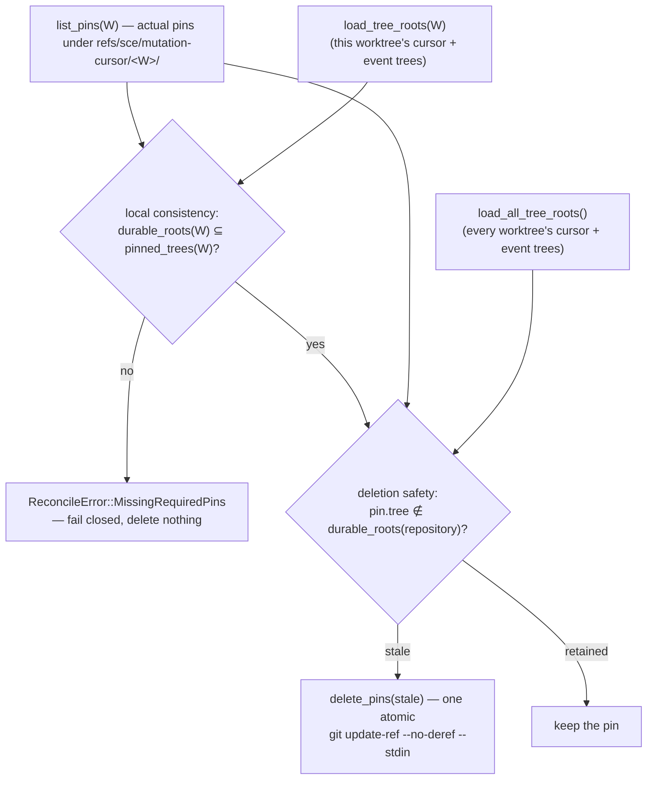

# Mutation-cursor snapshot-ref reconciliation (`runtime::ref_reconciliation`)

`cli/src/services/mutation_trace/runtime/ref_reconciliation.rs` is a
conservative, per-worktree maintenance pass that removes orphaned / unreferenced
SCE-owned snapshot pins **within the ref namespace of a checkout identity a
current worktree still owns** while retaining every tree any current or
historical durable mutation-cursor state in the repository still references.
Built by the `mutation-cursor-ref-reconciliation` plan
(`context/plans/mutation-cursor-ref-reconciliation.md`). It is deliberately
**not** a guarantee that SCE snapshot refs never accumulate: a namespace whose
checkout identity no current worktree derives is beyond its reach (see
[Scope: an owned checkout-identity namespace only](#scope-an-owned-checkout-identity-namespace-only)).

`GitSnapshotService::pin_tree` is **create-only per invocation** — a crash,
failed transition, or other interrupted `coordinate()` path can leave a
`refs/sce/mutation-cursor/<worktree-id>/<tree-sha>` pin with no corresponding
durable root. Reconciliation is the reclamation step for exactly that state. It
is **not** a bound on storage growth: every retained `mutation_trace_events`
row keeps its `before_tree` / `after_tree` as durable roots, so a successful
`A → B → C → D` history keeps all four pins. Bounding historical snapshot
storage needs a separate future retention/compaction lifecycle this module does
not design.

The design is deliberately asymmetric and this bias governs every rule below:
**keeping an unnecessary ref costs disk; deleting a required ref destroys
durable evidence.** False retention is acceptable; false deletion is not.

`mod ref_reconciliation;` is private in `runtime/mod.rs` (like `coordinator`);
`reconcile_worktree` is `pub` only within `runtime` — no `pub(crate)` re-export,
no hook / command / `diff_traces` wiring yet (invocation timing is the
harness-wiring PR's).

## Entry point and identity

```rust
pub fn reconcile_worktree(
    repository_root: &Path,
    open_db: impl FnOnce() -> anyhow::Result<RepositoryAgentTraceDb>,
) -> Result<ReconciliationOutcome, ReconcileError>
```

A one-line delegation to `pub(super) fn reconcile_worktree_inner(..,
on_lock_contention: impl FnOnce())` — the deterministic test seam (mirroring
`coordinate` / `coordinate_inner`), visible only within `runtime`.

Like `coordinate()`, it never accepts a `WorktreeId`, `TreeId`, or ref name and
never opens the DB itself: identity is
`repository_root → resolve_git_dir → read_checkout_id`, `open_db` is
caller-supplied. `read_checkout_id → Ok(None)` returns
`Ok(SkippedNoCheckoutIdentity)` — an observable skip, **not** a zero-count
report: nothing inventoried, `open_db` never called, no ref touched, lock
released, no identity created or recovered; it makes **no** claim the repository
holds no SCE refs for a prior checkout identity (those are the unowned
namespaces below). `Err` is `ReconcileError::CheckoutIdentity` (a corrupt id, not an absent one).

## Scope: an owned checkout-identity namespace only

Reconciliation reclaims orphan / unreferenced pins **only** under
`refs/sce/mutation-cursor/<id>/` where `<id>` is a checkout identity a **current
worktree still derives** (`resolve_git_dir → read_checkout_id`). The unsupported
case is identity-based, not path-based:

```text
refs/sce/mutation-cursor/<checkout-id>/*  —  does a current worktree derive <checkout-id>?
    yes → active namespace   (reclaimed here under the WorktreeLock)
     no → unowned namespace  (no per-worktree pass can ever reach it)
```

High-frequency harness traffic against a worktree with a **stable** checkout
identity — where interrupted `coordinate()` runs leave orphan pins — is exactly
the active-namespace case this pass covers.

A namespace becomes **unowned** whenever no current worktree can derive its
checkout id. Two lifecycles cause this:

**Case A — deleted linked worktree.** `git worktree remove W` deletes W's
worktree-specific git dir, so its `<git-dir>/sce/checkout-id` is gone; the
`refs/sce/mutation-cursor/<id>/*` it created survive in the shared repository
ref namespace.

**Case B — checkout-identity metadata loss / recreation.** A **present**
worktree's `<git-dir>/sce/checkout-id` disappears (id `A`). `reconcile_worktree`
returns `SkippedNoCheckoutIdentity` and does nothing. A later
`get_or_create_checkout_id` (e.g. the next `coordinate()`) mints a **new** id
`B`; the worktree now operates as `B` while `refs/.../A/*` are unowned. This is
**not** normal operation: it is a metadata-loss / recreation lifecycle the
maintenance model must handle conservatively — reconciliation never recreates
`A` or adopts its namespace.

**Harness gate.** A persistent / current-worktree harness whose **checkout
identity stays stable** relies on this pass for active-namespace orphan cleanup
and is storage-cleanup complete for this module's scope. Any lifecycle that can
**retire, replace, lose, or recreate** checkout identities (ephemeral linked
worktrees among them, but not only those) can leave unowned namespaces and needs
the future repository-scoped operation below. This is a scope limit, not a bug,
orthogonal to the "reconciliation ≠ historical retention policy" boundary above.

### Future work: repository-scoped unowned-namespace reconciliation

Not implemented here — this module adds **no** repository-global namespace scan
and **no** repository-global ref deletion. Recorded shape:

```text
enumerate refs/sce/mutation-cursor/<id>/*   (git for-each-ref on the namespace)
        ↓
active checkout ids   (enumerate current worktrees → read each one's checkout-id)
        ↓
unowned ids           (namespace present, no current worktree derives it)
        ↓
for each unowned namespace, each pinned tree T:
    T ∈ durable_roots(repository)  →  retain
    T ∉ durable_roots(repository)  →  safe deletion candidate
```

It must inherit this module's guarantees: the repository-wide durability
invariant (`delete <namespace>/T` only if `T ∉ durable_roots(repository)`, read
through `load_all_tree_roots()`) because an unowned namespace may still hold the
only SCE ref protecting historical `mutation_trace_events` trees other tooling
needs; the false-retention-over-false-deletion bias; and a hard prohibition on
the shortcut "checkout id is unowned → delete its whole namespace". It is a
separate PR (a repository-global scan and cross-worktree active-id inventory this
module omits), gated behind the same harness-wiring work as invocation timing.

## Two invariants

Conflating them — deciding deletion from the target worktree's roots alone — is
the cross-worktree safety bug this design avoids: linked worktrees share one
object database, so an `A`-owned ref can be the last SCE ref protecting a tree only `B` durably requires.



- **Local consistency** (`load_tree_roots(W)`) is strictly per-worktree. A
  missing pin in some *other* worktree never makes `W`'s pass fail — that would
  let one worktree's degradation block maintenance everywhere.
- **Deletion safety** (`load_all_tree_roots()`) is repository-wide. `W/T` is
  deleted only when `T` is in **no** worktree's durable root set. If `B` durably
  needs `T` and `A` also has a `T` pin, `A` retains it as accidental backup
  reachability for `B`'s degraded state.

A DB `TreeId` is a *logical* durability requirement, not itself a Git
reachability edge: it obliges reconciliation to keep at least one SCE ref
protecting that tree, and that retained ref supplies physical Git reachability.
Each root-set query is [one SQL statement over one DB
snapshot](mutation-trace-store.md), which keeps a concurrent atomic
`cursor T → X` + `event T → X` commit on another worktree from tearing the
repository-wide read — no repository-global lock is needed.

## Locking

Reconciliation holds the **same** `<git-dir>/sce/mutation-cursor.lock`
`WorktreeLock` that `coordinate()` holds across `pin → CAS → return`, acquired
via `worktree_lock::acquire_inner` and bounded by the module-owned
`RECONCILIATION_LOCK_TIMEOUT` (`Duration::from_secs(10)`, matching the
coordinator's private `WORKTREE_LOCK_TIMEOUT` by intent, not a shared constant).
Mutual exclusion on that one file makes the pin → DB-CAS race structurally
impossible: the reconciler's inventory → diff → delete runs wholly before
`coordinate()` takes the lock (nothing pinned yet) or wholly after it releases
it (tree committed → durable root → retained; never committed → true orphan →
deletable). The lock stays per-worktree; only the durable-root *read* is repository-wide.

## Algorithm and error contract

Every step runs under the lock, and every fallible step maps to one dedicated
`ReconcileError` variant — there is no `Other` catch-all:

| Step | Error on failure |
| --- | --- |
| `resolve_git_dir` | `GitDir` |
| `acquire_inner(RECONCILIATION_LOCK_TIMEOUT)` | `Lock(WorktreeLockError)` |
| `read_checkout_id` → `Err` (corrupt id) | `CheckoutIdentity` |
| `open_db()` provider | `AgentTraceDbUnavailable` |
| `GitSnapshotService::new` | `SnapshotService` |
| `list_pins` → `PinInventoryError::Git` | `PinInventory` |
| `list_pins` → `PinInventoryError::MalformedRef` | `MalformedPin { ref_name, reason }`, delete nothing |
| `load_tree_roots` / `load_all_tree_roots` | `DurableRoots` |
| a target-worktree root has no pin | `MissingRequiredPins { missing }`, delete nothing |
| `delete_pins` transaction | `DeleteTransaction`, delete nothing (atomic-or-nothing) |

`AgentTraceDbUnavailable` here is a **maintenance** error only: reconciliation
never arms `ExternalTaintMarker`, calls `protocol::*`, or writes a
`mutation_trace_*` row, and never becomes
`CoordinateError::AgentTraceDbUnavailable` — no mutation boundary is being
coordinated (contrast [`mutation-trace-external-taint.md`](mutation-trace-external-taint.md)).

## Outcome and report

Both entrypoints return `Result<ReconciliationOutcome, ReconcileError>` —
`Reconciled(ReconciliationReport)` | `SkippedNoCheckoutIdentity`, the skip an
`Ok` (never `Err`) and distinct from a zero-work `Reconciled(.. { deleted: 0 })`.

`ReconciliationReport { local_required: usize, retained: usize, deleted: usize }`
— `local_required = load_tree_roots(W).len()`, `deleted` = stale pins removed,
`retained = actual.len() − deleted`. `retained == local_required` is **not** an
invariant (a pin another worktree needs counts toward `retained` only); for
`Reconciled(report)` the only relation is `report.local_required ≤ report.retained`,
and `SkippedNoCheckoutIdentity` carries no report.

## Model boundary

Ref reconciliation is imperative durability maintenance **below** the verified
`spec/mutation_cursor.qnt` protocol — it never advances the cursor, chooses
attribution, changes scope state, or creates a `MutationEvent`, so no Quint
change is warranted. It deletes only SCE-owned refs, never Git objects, and runs
no `git gc` / `git prune` / `git reflog expire`; Git reclaims unreachable
objects on its own schedule.

## Testing boundary

`ref_reconciliation.rs`'s inline `#[cfg(test)] mod tests` uses a RAII
`Fixture` (`tempfile::TempDir`, real `git init` repo, checkout id via
`get_or_create_checkout_id`, a schema `RepositoryAgentTraceDb` at a path
**beside** the worktree so it never perturbs a captured tree) with raw-SQL row
seeders, following the filesystem-touching inline-test precedent
(`context/patterns.md`). Coverage: orphan pin deleted (with and without a
worktree row); current-cursor pin retained without a referencing event;
historical `before`/`after` pins retained after the cursor advances; a pin
another worktree durably requires retained (also the `retained > local_required`
count case); `MissingRequiredPins` fail-closed; a malformed / symbolic namespace
ref fail-closed; idempotence; refs deleted without object reclamation; and the
no-checkout-identity skip (a distinct `SkippedNoCheckoutIdentity`; `open_db`
never called; the owned pin ref structurally byte-identical — name, SHA, object
type, direct/symbolic shape — across the skip, read via `git for-each-ref`).

`runtime/tests.rs` holds the cross-module scenarios: linked-worktree isolation,
and two deterministic lock-race regressions (no sleeps) — the generic
`WorktreeLock` happens-before edge
(`reconciliation_blocks_on_the_worktree_lock_and_retains_a_pin_that_becomes_durable_under_it`,
X made durable directly) and the same edge across the real `coordinate()`
`pin → store CAS` path
(`reconciliation_blocks_until_a_real_coordinate_cas_commits_the_pinned_tree`,
paused via the `pub(super)` `after_load` seam — test-only, production passes a
no-op).

See also: [`mutation-trace-runtime-coordinator.md`](mutation-trace-runtime-coordinator.md),
[`mutation-trace-snapshot-service.md`](mutation-trace-snapshot-service.md) (`list_pins` / `delete_pins`),
[`mutation-trace-store.md`](mutation-trace-store.md) (`load_tree_roots` / `load_all_tree_roots`),
[`mutation-trace-protocol.md`](mutation-trace-protocol.md).
