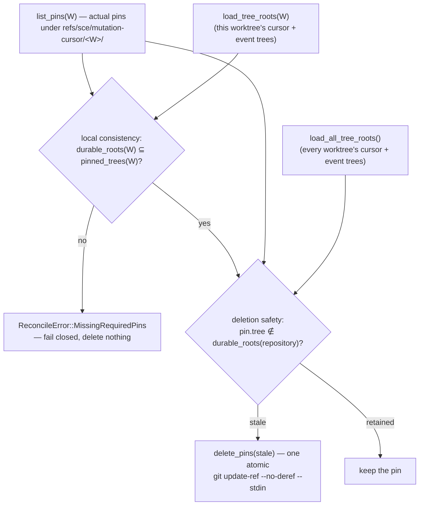

# Mutation-cursor snapshot-ref reconciliation (`runtime::ref_reconciliation`)

`cli/src/services/mutation_trace/runtime/ref_reconciliation.rs` is a
conservative, per-worktree maintenance pass that removes orphaned / unreferenced
SCE-owned snapshot pins while retaining every tree any current or historical
durable mutation-cursor state in the repository still references. Built by the
`mutation-cursor-ref-reconciliation` plan
(`context/plans/mutation-cursor-ref-reconciliation.md`).

`GitSnapshotService::pin_tree` is **create-only per invocation** — a crash,
failed transition, or other interrupted `coordinate()` path can leave a
`refs/sce/mutation-cursor/<worktree-id>/<tree-sha>` pin with no corresponding
durable root. Reconciliation is the reclamation step for exactly that state. It
is **not** a bound on storage growth: every retained `mutation_trace_events`
row keeps its `before_tree` / `after_tree` as durable roots, so a normal
successful history `A → B → C → D` keeps all four pins. Truly bounding
historical snapshot storage needs a separate future retention/compaction
lifecycle that this plan does not design.

The design is deliberately asymmetric: **keeping an unnecessary ref costs disk;
deleting a required ref destroys durable evidence.** False retention is
acceptable; false deletion is not.

`mod ref_reconciliation;` is private in `runtime/mod.rs` (like `mod
coordinator;`). `reconcile_worktree` is `pub` only within `runtime` — no
`pub(crate)` re-export — and nothing wires it into a hook, command, or the
`diff_traces` path yet; deciding *when* it runs is deferred to the
harness-wiring PR.

## Entry point and identity

```rust
pub fn reconcile_worktree(
    repository_root: &Path,
    open_db: impl FnOnce() -> anyhow::Result<RepositoryAgentTraceDb>,
) -> Result<ReconciliationReport, ReconcileError>
```

A one-line delegation to `pub(super) fn reconcile_worktree_inner(..,
on_lock_contention: impl FnOnce())` — the deterministic test seam mirroring
`coordinate` / `coordinate_inner`, reachable from `runtime` and
`runtime::tests` (where the T04/T05 tests live) but invisible outside
`runtime`.

Like `coordinate()`, it never accepts a `WorktreeId`, `TreeId`, or ref name,
and never opens the DB itself: worktree identity is derived
`repository_root → checkout::resolve_git_dir → checkout::read_checkout_id`, and
`open_db` is a caller-supplied provider. `read_checkout_id → Ok(None)` (no
current checkout identity to derive an owned ref prefix from) is a clean no-op
`ReconciliationReport { 0, 0, 0 }` with the lock already held and **no**
identity created; `Err` is `ReconcileError::CheckoutIdentity` (a corrupt id is
not an absent one).

## Two invariants

Conflating them — deciding deletion from the target worktree's roots alone — is
the cross-worktree safety bug this design exists to avoid. Linked worktrees
share one Git object database, so an `A`-owned ref can be the last SCE ref
protecting a tree that only worktree `B` durably requires.



- **Local consistency** (`load_tree_roots(W)`) is strictly per-worktree. A
  missing pin in some *other* worktree never makes `W`'s pass fail — that would
  let one worktree's degradation block maintenance everywhere.
- **Deletion safety** (`load_all_tree_roots()`) is repository-wide. `W/T` is
  deleted only when `T` is in **no** worktree's durable root set. If `B`
  durably needs `T` and `A` also has a `T` pin, `A` retains it — `A`'s
  otherwise-stale ref then supplies accidental backup reachability for `B`'s
  degraded state (`reconcile_a_retains_its_pin_when_another_worktree_durably_requires_the_same_tree`).

A DB `TreeId` is a *logical* durability requirement, not itself a Git
reachability edge: it obliges reconciliation to keep at least one SCE ref
protecting that tree, and that retained ref is what supplies physical Git
reachability. Each root-set query is [one SQL statement over one DB
snapshot](mutation-trace-store.md), which is what keeps a concurrent atomic
`cursor T → X` + `event T → X` commit on another worktree from tearing the
repository-wide read — no repository-global lock is needed.

## Locking

Reconciliation holds the **same** `<git-dir>/sce/mutation-cursor.lock`
`WorktreeLock` that `coordinate()` holds across `pin → CAS → return`, acquired
via `worktree_lock::acquire_inner` and bounded by the module-owned
`const RECONCILIATION_LOCK_TIMEOUT: Duration = Duration::from_secs(10)` (its
value matches the coordinator's private `WORKTREE_LOCK_TIMEOUT` by intent, not
a shared constant). Mutual exclusion on that one file makes the pin → DB-CAS
race structurally impossible: the reconciler's inventory → diff → delete runs
wholly before `coordinate()` takes the lock (tree not pinned yet) or wholly
after it releases it (tree committed → a durable root → retained; or never
committed → a true orphan → safe to delete). The lock is per-worktree; only the
retention *read* is repository-wide.

## Algorithm and error contract

Every step runs under the lock, and every fallible step maps to one dedicated
`ReconcileError` variant — there is no `Other` catch-all:

| Step | Error on failure |
| --- | --- |
| `resolve_git_dir` | `GitDir` |
| `acquire_inner(RECONCILIATION_LOCK_TIMEOUT)` | `Lock(WorktreeLockError)` |
| `read_checkout_id` → `Err` (corrupt id) | `CheckoutIdentity` |
| `open_db()` provider | `AgentTraceDbUnavailable` |
| `GitSnapshotService::new` | `SnapshotService` |
| `list_pins` → `PinInventoryError::Git` | `PinInventory` |
| `list_pins` → `PinInventoryError::MalformedRef` | `MalformedPin { ref_name, reason }`, delete nothing |
| `load_tree_roots` / `load_all_tree_roots` | `DurableRoots` |
| a target-worktree root has no pin | `MissingRequiredPins { missing }`, delete nothing |
| `delete_pins` transaction | `DeleteTransaction`, delete nothing (atomic-or-nothing) |

`AgentTraceDbUnavailable` here is a **maintenance** error only: reconciliation
never arms `ExternalTaintMarker`, never calls `protocol::*`, never writes any
`mutation_trace_*` row, and a failure never becomes
`CoordinateError::AgentTraceDbUnavailable` — no mutation boundary is being
coordinated (contrast [`mutation-trace-external-taint.md`](mutation-trace-external-taint.md)).

## Report

`ReconciliationReport { local_required: usize, retained: usize, deleted: usize }`
— `local_required = load_tree_roots(W).len()`, `deleted` = stale pins removed,
`retained = actual.len() − deleted`. `retained == local_required` is **not**
an invariant (a pin another worktree needs counts toward `retained` only); the
only `Ok`-path relation is `local_required ≤ retained`.

## Model boundary

Ref reconciliation is imperative durability maintenance **below** the verified
`spec/mutation_cursor.qnt` protocol — it never advances the cursor, chooses
attribution, changes scope state, or creates a `MutationEvent`, so no Quint or
refinement-matrix change is warranted. It deletes only SCE-owned refs, never
Git objects; Git reclaims the now-unreachable objects itself on its own GC
schedule (this pass runs no `git gc` / `git prune` / `git reflog expire`).

## Testing boundary

`ref_reconciliation.rs`'s inline `#[cfg(test)] mod tests` uses a RAII
`Fixture` (`tempfile::TempDir`, real `git init` repo, checkout id via
`get_or_create_checkout_id`, a schema `RepositoryAgentTraceDb` at a path
**beside** the worktree so it never perturbs a captured tree) with raw-SQL row
seeders, following the filesystem-touching inline-test precedent
(`context/patterns.md`). Coverage: orphan pin deleted (with and without a
worktree row); current-cursor pin retained without a referencing event;
historical `before`/`after` pins retained after the cursor advances; a pin
another worktree durably requires retained (also the `retained > local_required`
count case); `MissingRequiredPins` fail-closed; a malformed namespace ref
(symbolic ref) fail-closed; idempotence; refs deleted without object
reclamation (`git cat-file -t` still resolves the orphan tree); and the
no-checkout-identity clean no-op. The deterministic pin→CAS lock-race
regression and the cross-module linked-worktree scenarios live in
`runtime/tests.rs` (plan tasks T04/T05).

See also:
[`mutation-trace-runtime-coordinator.md`](mutation-trace-runtime-coordinator.md),
[`mutation-trace-snapshot-service.md`](mutation-trace-snapshot-service.md)
(`list_pins` / `delete_pins`),
[`mutation-trace-store.md`](mutation-trace-store.md)
(`load_tree_roots` / `load_all_tree_roots`),
[`mutation-trace-protocol.md`](mutation-trace-protocol.md).
