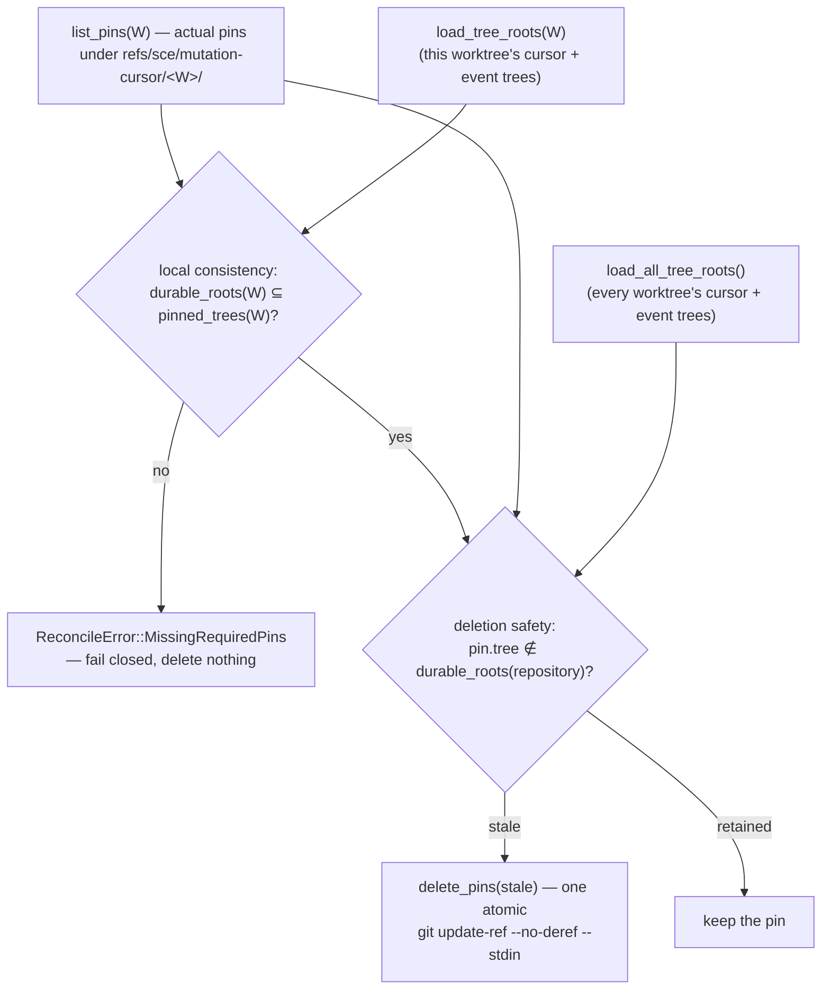

# Mutation-cursor snapshot-ref reconciliation (`runtime::ref_reconciliation`, `runtime::ref_maintenance`)

Snapshot-ref reconciliation is a conservative, per-worktree maintenance pass that
removes orphaned SCE-owned snapshot pins under
`refs/sce/mutation-cursor/<worktree-id>/` while retaining every tree any current
or historical durable mutation-cursor state in the repository still references.
It is built by the `mutation-cursor-ref-reconciliation` plan and wired by the
`mutation-cursor-ref-reconciliation-wiring` plan
(`context/plans/mutation-cursor-ref-reconciliation-wiring.md`).

`GitSnapshotService::pin_tree` is **create-only per invocation**: a crash, failed
transition, or other interrupted `coordinate()` path can leave a pin with no
corresponding durable root. Reconciliation is the reclamation step for exactly
that state. It is **not** a bound on storage growth: every retained
`mutation_trace_events` row keeps its `before_tree` / `after_tree` as durable
roots, so a successful `A → B → C → D` history keeps all four pins. Bounding
historical snapshot storage needs a separate retention/compaction lifecycle that
does not exist.

The design is deliberately asymmetric: **keeping an unnecessary ref costs disk;
deleting a required ref destroys durable evidence.** False retention is
acceptable; false deletion is not.

## Who runs it

Reconciliation is **explicit only**. `sce doctor --fix` is the single production
caller (see [`doctor-ref-reconciliation.md`](doctor-ref-reconciliation.md)).
Orphan pins are reclaimed only when an operator runs it. **Automatic reclamation
is not delivered** and nothing may claim otherwise; it is a follow-up (see
[Deferred follow-ups](#deferred-follow-ups)).

The mutation-hook completion path performs no reconciliation, ref listing, DB
I/O, or Git subprocess. After a durably completed `Close`/`Flush` it only runs a
lightweight advisory check that may record "reconciliation is recommended" in a
small state file (see [`mutation-scope-ref-advisory.md`](mutation-scope-ref-advisory.md)).
Inline reconciliation was rejected because `git for-each-ref`, DB open,
repository-wide durable-root queries, and a started `git update-ref` cannot be
bounded, the Tokio runtime joins in-flight blocking workers, and the pass holds
`WorktreeLock`, which a coordinator waits on for at most 10 s before failing the
boundary.

## Module layout and entrypoints

All runtime modules are private to `mutation_trace::runtime`; only the
`ref_doctor` facade and the advisory seam are re-exported `pub(crate)`.

| Module | Role |
| --- | --- |
| `ref_reconciliation.rs` | The single reconciliation algorithm, `reconcile_with_held_lock` |
| `ref_maintenance.rs` | `reconcile_explicit`: the production maintenance entrypoint |
| `ref_advisory.rs` | `advise_if_due`: hook-path advisory |
| `maintenance_state.rs` | `<git-dir>/sce/ref-maintenance.json` state, normalization, atomic writes, `evaluate_recommendation` |
| `ref_doctor.rs` | Plain-data facade used by `sce doctor` |

### Single lock acquisition

`WorktreeLock` is a non-reentrant advisory file lock. The algorithm is split so
each maintenance operation acquires it **exactly once**:

- `reconcile_with_held_lock` borrows the held `&WorktreeLock`, never acquires,
  and derives deletion leases from `lock.lease()`.
- `reconcile_explicit(repository_root) -> ExplicitOutcome` acquires the lock once
  with the bounded 10 s `EXPLICIT_LOCK_TIMEOUT`, resolves the repository identity
  and canonical Agent Trace DB path itself, opens the DB only through the
  verified-existing opener, runs `reconcile_with_held_lock`, records the result
  in the state file while still holding the same lock, then drops it. It takes
  no opener parameter; the injection seam is private to `ref_maintenance`.
- `advise_if_due` takes one zero-wait `try_lock`, has no Git/DB/store
  parameters, and never reaches reconciliation.
- `reconcile_with_held_lock` is the only reconciliation entrypoint; it never
  acquires the lock. The former test-only lock-acquiring wrappers were removed.

Mutating Git work receives `lock.lease()` and moves it into the `spawn_blocking`
worker, so dropping the caller future cannot release the file lock while a ref
deletion is running.

### Concurrency contract

An explicit pass holds the lock for its whole duration, because the
pin-then-root ordering that makes deletion safe requires inventory, root reads,
and deletion not to interleave with `coordinate()`'s pin-then-CAS. A mutation
boundary arriving meanwhile waits up to `WORKTREE_LOCK_TIMEOUT` (10 s) and then
fails **before durable completion** with the existing lock-timeout error. This is
an operator-initiated trade-off of `sce doctor --fix`. The hook advisory never
waits on the lock; contention yields `Busy`.

## Worktree identity

Identity is Git-topology-derived (`resolve_worktree_id`): `main` for the primary
worktree, `worktrees/<sanitized git-dir name>` for a linked worktree. Failure is
an `Err`. The former checkout-identity service was removed (see
[`checkout-identity.md`](checkout-identity.md)); there is no skip-on-missing-identity
outcome. `ReconcileError::CheckoutIdentity` remains the error variant for a
worktree identity that cannot be resolved.

The dedicated DB opener and the `ref-maintenance.json` state file are documented in
[`mutation-trace-ref-maintenance-state.md`](mutation-trace-ref-maintenance-state.md).

## Two invariants

Conflating them, i.e. deciding deletion from the target worktree's roots alone,
is the cross-worktree safety bug this design avoids: linked worktrees share one
object database, so an `A`-owned ref can be the last SCE ref protecting a tree
only `B` durably requires.

```mermaid
flowchart TD
    inv["list_pins(W) — actual pins under refs/sce/mutation-cursor/&lt;W&gt;/"]
    local["load_tree_roots(W)\n(this worktree's cursor + event trees)"]
    repo["load_all_tree_roots()\n(every worktree's cursor + event trees)"]
    inv --> lc
    local --> lc{"local consistency:\ndurable_roots(W) ⊆ pinned_trees(W)?"}
    lc -- "no" --> fail["ReconcileError::MissingRequiredPins\n— fail closed, delete nothing"]
    lc -- "yes" --> ds
    inv --> ds{"deletion safety:\npin.tree ∉ durable_roots(repository)?"}
    repo --> ds
    ds -- "stale" --> del["delete_pins(stale) — one atomic\ngit update-ref --no-deref --stdin"]
    ds -- "retained" --> keep["keep the pin"]
```

- **Local consistency** (`load_tree_roots(W)`) is per-worktree and checked before
  any deletion. If it fails the pass deletes nothing and returns
  `MissingRequiredPins`. A missing pin in some *other* worktree never makes `W`'s
  pass fail.
- **Deletion safety** (`load_all_tree_roots()`) is repository-wide: `delete(W, T)`
  only if `T` is in **no** worktree's durable root set. A pin another worktree
  requires is retained.

Claimed: these two invariants. **Not claimed:** that every repository-wide durable
root is pinned. Reconciliation does not repair, recreate, or verify missing pins
belonging to other worktrees.

A DB `TreeId` is a *logical* durability requirement, not itself a Git
reachability edge: it obliges reconciliation to keep at least one SCE ref
protecting that tree. Each root-set query is [one SQL statement over one DB
snapshot](mutation-trace-store.md), so a concurrent atomic `cursor T → X` +
`event T → X` commit on another worktree cannot tear the repository-wide read.

## Locking and the pin → CAS boundary

The pass holds the **same** `<git-dir>/sce/mutation-cursor.lock` that
`coordinate()` holds across `pin → CAS → return`. Mutual exclusion on that one
file makes the pin → DB-CAS race structurally impossible: the inventory → diff →
delete runs wholly before `coordinate()` takes the lock (nothing pinned yet) or
wholly after it releases it (tree committed → durable root → retained; never
committed → true orphan → deletable). The lock stays per-worktree; only the
durable-root *read* is repository-wide.

## Algorithm and error contract

Every step runs under the lock and every fallible step maps to one dedicated
`ReconcileError` variant; there is no catch-all:

| Step | Error on failure |
| --- | --- |
| `resolve_git_dir` | `GitDir` |
| lock acquisition (`EXPLICIT_LOCK_TIMEOUT`) | `Lock(WorktreeLockError)`; surfaced as `Skipped(Busy)` by `reconcile_explicit` |
| worktree identity resolution | `CheckoutIdentity` |
| verified-existing DB open | `AgentTraceDbUnavailable` (downcastable `ExistingRepositoryDbError`) |
| `GitSnapshotService::new` | `SnapshotService` |
| `list_pins` → `PinInventoryError::Git` | `PinInventory` |
| `list_pins` → `PinInventoryError::MalformedRef` | `MalformedPin { ref_name, reason }`, delete nothing |
| `load_tree_roots` / `load_all_tree_roots` | `DurableRoots` (durable-root queries belong to migration `004_mutation_trace_protocol`) |
| a target-worktree root has no pin | `MissingRequiredPins { missing }`, delete nothing |
| `delete_pins` transaction | `DeleteTransaction`, delete nothing (atomic-or-nothing) |

`AgentTraceDbUnavailable` here is a **maintenance** error only: reconciliation
never arms `ExternalTaintMarker`, calls `protocol::*`, or writes a
`mutation_trace_*` row, and never becomes
`CoordinateError::AgentTraceDbUnavailable` (contrast
[`mutation-trace-external-taint.md`](mutation-trace-external-taint.md)).
`delete_pins` is the only ref-deletion path; there is no `git gc`, object
removal, or independent deletion.

## Outcomes and report

`reconcile_with_held_lock` returns `Result<ReconciliationOutcome, ReconcileError>`
where `ReconciliationOutcome` has the single variant `Reconciled(ReconciliationReport)`.

`ReconciliationReport { local_required, retained, deleted }`:
`local_required = load_tree_roots(W).len()`, `deleted` = stale pins removed,
`retained = actual.len() − deleted`. `retained == local_required` is not an
invariant; only `report.local_required ≤ report.retained` holds.

`reconcile_explicit` returns the typed, never-merged `ExplicitOutcome`:

- `Completed(report)`
- `CompletedStatePersistFailed { report, warning }`: the cleanup stands and is
  reported as done
- `Failed { error, state_warning: Option<StatePersistWarning> }`: keeps both the
  reconciliation error and any persistence warning
- `Skipped(Busy)`: lock contention; state untouched; not a failure

`StatePersistWarning` is `PreviousStateUnreadable(io::Error)` (update not
attempted) or `WriteFailed(PersistFailure)`. `PersistFailure::NotApplied` means
the atomic replacement did not occur and the previous state is preserved;
`PersistFailure::DurabilityUncertain` means the rename occurred (new state may be
visible) but crash durability could not be confirmed. A completed ref deletion is
never rolled back.

## Model boundary

Ref reconciliation is imperative durability maintenance **below** the verified
`spec/mutation_cursor.qnt` protocol. It never advances the cursor, chooses
attribution, changes scope state, or creates a `MutationEvent`, so no Quint or
`protocol.rs` change was made. It deletes only SCE-owned refs, never Git objects.

## Testing

Coverage lives in `runtime/ref_maintenance/tests.rs` and its submodules
(`support`, `coordination`, `worktrees`, `cross_process`, `fail_closed`,
`state_recovery`), the advisory and state unit tests, `git_snapshot` cancellation
tests, `hooks::mutation_scope::advisory_trigger_tests`, and
`app::doctor_reconciliation_cli_tests`. Race and ordering scenarios use
deterministic coordination (barriers, parked phase hooks via `ReconcilePhase`,
the worker-entered seam, injected clocks), not sleeps. The plan's coverage map
records each scenario's verification status and the guard-removal results.

## Deferred follow-ups

Not implemented and not to be described as behavior:

- **Automatic out-of-band reclamation.** Binding prerequisites: (1) a
  lifecycle-owned execution point with defined ownership, lifetime, scheduling,
  and failure recovery (for example an explicitly invoked `sce` maintenance
  command run by a user-managed scheduler, or a future shared session-end
  mechanism), never a detached task, daemon, fire-and-forget subprocess, or
  timeout-cancelled Git/DB work; (2) a durable next-attempt reservation persisted
  under `WorktreeLock` **before** opening the DB, listing pins, or loading
  durable roots, bounded, never interpreted as success, superseded by the success
  cadence or exponential failure backoff, and bypassed by explicit repair, with
  the automatic pass skipped if the reservation cannot be persisted; (3)
  distinct outcomes for completed, completed-but-state-not-persisted, failed, and
  skipped/deferred; (4) bounded or split lock-hold analysis against the 10 s
  coordinator timeout; (5) the same invalid-timestamp normalization as above.
- **Retired-worktree cleanup.** The pass only inventories the namespace of a
  currently resolvable worktree, so refs owned by removed linked worktrees
  survive. A repository-scoped operation would need active-worktree inventory,
  repository-wide durable-root retention (`delete <namespace>/T` only if `T` is
  outside `durable_roots(repository)`, never "namespace unowned → delete all"),
  and protection against worktree removal/recreation races.
- **Evidence-based advice.** The advisory is time-based; detecting actual orphans
  requires the Git/DB scan kept off the hook path.
- **Historical retention.** Trees referenced by retained mutation events are
  never deleted; bounding history needs a separate event-retention and
  snapshot-compaction policy.

See also: [`mutation-trace-ref-maintenance-state.md`](mutation-trace-ref-maintenance-state.md), [`doctor-ref-reconciliation.md`](doctor-ref-reconciliation.md), [`mutation-scope-ref-advisory.md`](mutation-scope-ref-advisory.md), [`mutation-trace-runtime-coordinator.md`](mutation-trace-runtime-coordinator.md), [`mutation-trace-snapshot-service.md`](mutation-trace-snapshot-service.md) (`list_pins` / `delete_pins`), [`mutation-trace-store.md`](mutation-trace-store.md) (`load_tree_roots` / `load_all_tree_roots`), [`mutation-trace-protocol.md`](mutation-trace-protocol.md).
