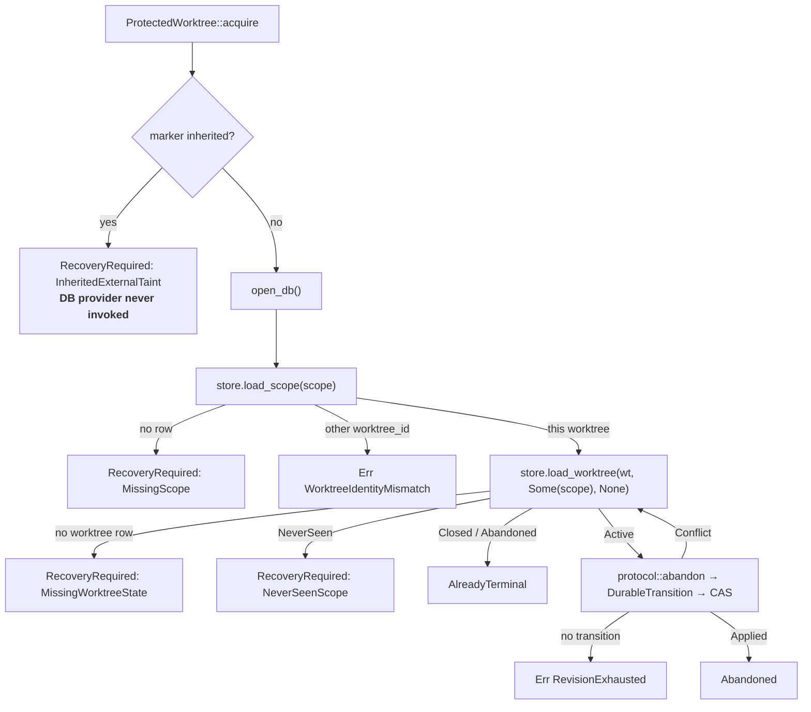

# Mutation-scope abandonment (`runtime::scope_runtime`)

The mutation-cursor runtime's second protected entrypoint, in
`cli/src/services/mutation_trace/runtime/scope_runtime.rs`. It retires a
mutation scope whose execution ended without a trustworthy final worktree
boundary — a dead agent process leaves no `Close` behind.

A dead execution can leave its scope `Active` indefinitely. This is unsafe
because a later `Start` observes the worktree before activating its successor —
`commit` computes `active_scopes`/`attribution` against the state as it existed
*before* the same call's own scope-lifecycle transition — so changes made after
the dead execution may be incorrectly classified as `AiExclusive` to the stale
scope. Once another scope starts, subsequent overlapping intervals become
`AiContended` against the zombie:

```text
scope A Active → A dies without Close → unobserved edit → Start(B)

  at Start(B):   live = { A }        → that interval may become AiExclusive(A)
  after Start(B): live = { A, B }    → later overlapping intervals: AiContended
```

Built by the `mutation-scope-runtime-integration` plan
(`context/plans/mutation-scope-runtime-integration.md`). It is the first
production call site for `protocol::abandon`
([`mutation-trace-protocol.md`](mutation-trace-protocol.md)).

## Observed vs. unobserved boundaries

`coordinate()` and `abandon_scope()` share the `ProtectedWorktree` prefix
([`mutation-trace-protected-worktree.md`](mutation-trace-protected-worktree.md))
and deliberately diverge below it:

| | `coordinate()` | `abandon_scope()` |
| --- | --- | --- |
| Boundary | observed (`Start`/`Advance`/`Close`/`Flush`) | **never observed** |
| Git snapshot / pin | always exactly one | **none** |
| Cursor tree | advanced to the observed tree | left untouched |
| Mutation evidence | may emit one `MutationEvent` | never |

Abandonment means nobody saw where the worktree ended up. Capturing a snapshot
here would silently give it `Close`'s observation semantics, so the module names
none of `GitSnapshotService`, `SnapshotCapture`, `capture_tree`, `pin_tree`,
`diff_trees`, `reconcile_worktree`, `initialize_worktree`, or `register_scope`:
it reads and transitions only already-durable state. Abandonment is therefore
**not** a `RuntimeBoundary` variant and needs no change to
`spec/mutation_cursor.qnt`.

## Surface

```text
abandon_scope(repository_root, scope: &ScopeId, open_db)
  open_db: impl FnOnce() -> anyhow::Result<RepositoryAgentTraceDb>
  -> Result<AbandonScopeOutcome, AbandonScopeError>
```

The DB-provider shape matches `coordinate()`'s, so DB acquisition falls inside
the same fence. No caller ever supplies a `WorktreeId`; it is always derived
from this checkout by the guard.

`AbandonScopeOutcome` is one of:

- `Abandoned { worktree_id, scope, revision }` — the scope moved to
  `Abandoned`, the worktree revision advanced by exactly one, and
  `needs_rebaseline` was set. `cursor_tree`, `tainted`, and `failure_kind` are
  untouched, and no `mutation_trace_events`,
  `mutation_trace_event_active_scopes`, or `mutation_trace_processed_events`
  row is written.
- `AlreadyTerminal { worktree_id, scope, status, revision }` — the scope was
  already `Closed` or `Abandoned`. A terminal scope can never be reactivated or
  abandoned again, so this is a success with nothing written; `revision` is the
  current, unchanged revision.
- `RecoveryRequired { worktree_id, scope, reason }` — nothing was written and
  the fence stays armed, so the next boundary recovers conservatively.

## Classification before transition

`protocol::abandon` is a guarded no-op for `NeverSeen`, `Closed`, `Abandoned`,
an unknown scope, a missing `WorktreeState`, and `revision == u64::MAX` alike,
returning an unchanged state in every case — the runtime cannot recover *which*
of those happened by diffing its output. So this path classifies the target's
durable state first:



`load_scope` ([`mutation-trace-store.md`](mutation-trace-store.md)) comes first
precisely because the projection seam `load_worktree` treats both of that read's
outcomes as errors, and neither is one here: a scope with no row is a recovery
case, and a scope on another worktree is this path's own typed rejection.

A `DurableTransition::between` that yields no transition for a scope already
proved `Active`, on a worktree present in the projection whose `external_taint`
is always empty, can only mean an unadvanceable revision — hence
`RevisionExhausted` rather than a silent success.

`CasResult::Conflict` re-enters the loop and re-classifies from scratch, bounded
by the coordinator's own `MAX_CAS_RETRY_ATTEMPTS` (5, no backoff — one shared
constant, not a second one). A competitor that closed the scope meanwhile
therefore settles as `AlreadyTerminal`, never as a second abandonment
overwriting it.

## Why a missing or `NeverSeen` target forces strong recovery

`MissingScope` and `NeverSeenScope` leave the external-taint marker armed, so
the next `coordinate()` performs *inherited-taint* recovery — and
`protocol::recover` abandons **every** live scope on a worktree recovering from
external taint, not only the one named here.

That is deliberate. A missing row means the scope's `Start` never committed
while its execution may well have run and edited files; a `NeverSeen` row means
the identity exists but no accepted `Start` was ever observed. Neither proves
the execution mutated nothing, and the runtime cannot bound what happened inside
that interval, so it cannot let any scope keep an exclusivity claim spanning it.

The cost is a false negative: legitimately live scopes on the same worktree can
be abandoned by a recovery they did nothing to cause, and their in-flight
evidence is discarded. That is accepted because the alternative is a false
positive — attributing an interval exclusively to a scope while an unobserved
execution may have been mutating the same worktree. **Attribution safety
outranks preserving potentially valid evidence.**

This does not contradict the normal `Abandoned` outcome: that one sets only
`needs_rebaseline`, whose recovery preserves live scopes by design.

## Fence completion semantics

The marker is cleared only for `Abandoned` and `AlreadyTerminal`. Every
`RecoveryRequired` and every error leaves it armed — see
[`mutation-trace-external-taint.md`](mutation-trace-external-taint.md#abandonment-path-completion).

## Testing boundary

Inline `#[cfg(test)] mod tests` uses an RAII `tempfile::TempDir` fixture holding
a real `git init` repository and a real temp-file `RepositoryAgentTraceDb` (see
[`../patterns.md`](../patterns.md)). Coverage: the inherited-marker
short-circuit proving a flag-setting DB provider is never invoked; missing,
`NeverSeen`, and missing-worktree-row recovery with the marker still on disk and
no row changed; a live abandonment asserting every durable field and all three
absent row kinds, plus an unrelated live scope left `Active`; separate `Closed`
and `Abandoned` terminal no-ops; cross-worktree rejection leaving both worktree
revisions and the scope status untouched; `u64::MAX` revision exhaustion with
the scope still live; a CAS conflict recomputing from the competitor's revision;
a CAS conflict whose competitor closed the scope settling as `AlreadyTerminal`;
a DB-provider `Err` leaving the fence armed; a persistence failure rolling the
whole transition back (below); and a `clear()` failure returning
`MarkerClearAfterCompletion` whose carried outcome matches the durable state.

A `pub(super) abandon_scope_inner(.., after_load)` seam (mirroring
`coordinate_inner`) fires once per CAS attempt after the projection loads, so a
test — in this module or in `runtime/tests.rs` — can land a competing write
inside the CAS window. It is invisible outside `runtime`; production passes a
no-op.

### Proving the transition is all-or-nothing

`MutationTraceStore::commit` runs the worktree CAS `UPDATE` as the transaction's
guard **before** the scope-status `UPDATE`, so a failure in that later statement
is the case where a partially applied worktree would show. The regression forces
exactly that: with the target `active` beside an already-`abandoned` bystander,
`after_load` creates a `UNIQUE` index on `mutation_trace_scopes(status)` — one
the seeded rows already satisfy, and that only the `abandoned` status the
transition is about to write violates. Nothing about the worktree row changes, so
the CAS guard still matches its expected revision and the commit reaches the
failing statement rather than settling as a conflict.

After the resulting `Err`, the worktree is still at its original revision with
`needs_rebaseline` false and its cursor untouched, the target scope is still
`Active`, no `mutation_trace_events` /
`mutation_trace_event_active_scopes` / `mutation_trace_processed_events` row
exists, and the external-taint marker is still armed — the general rule that
**every** runtime error after the fence is armed leaves it armed.

### Cross-runtime regressions

`runtime/tests.rs` ([`mutation-trace-runtime-coordinator.md`](mutation-trace-runtime-coordinator.md#testing-boundary))
drives `coordinate()` and `abandon_scope()` together over real `git init` /
`git worktree add` repositories and one real repository-scoped Agent Trace DB,
covering what a single-module test with no real Git cannot:

- **The successor sequence.** `Start(A)` → edit → `abandon_scope(A)` →
  unobserved edit → `coordinate(Start(B))`. The abandonment's
  `needs_rebaseline` sends the successor's invocation through recovery first, so
  the cursor lands on the tree observed at `Start(B)`, A stays `Abandoned`, B
  becomes `Active`, and the ambiguous A→B interval produces no
  `mutation_trace_events` row at any revision.
- **An unrelated live scope survives it.** With B legitimately `Active` across
  `abandon_scope(A)`, B is still `Active` after its next `Advance` — the
  `needs_rebaseline` recovery preserves live scopes, unlike the external-taint
  recovery a `RecoveryRequired` outcome forces (above).
- **Wrong checkout.** Abandoning worktree A's scope through worktree B's
  checkout is `WorktreeIdentityMismatch`; neither worktree's revision moves and
  the scope stays `Active`. The fence ends up armed only on the *invoking*
  checkout, because the guard derives its `WorktreeId` from the caller's own
  checkout before any scope is read — the rejection is the invoking worktree's
  error, not the target's.
- **A real CAS race.** A competing OS thread with its own handle on the same
  on-disk DB commits a genuine `Close` (`load_worktree` →
  `protocol::prepare`/`commit` → `DurableTransition` → `store.commit`) while the
  abandonment sits between its own load and commit. The abandonment loses the
  CAS, reloads, and settles as `AlreadyTerminal { status: Closed }` at the
  competitor's revision. That competitor writes through the store rather than
  through `coordinate()` deliberately: `abandon_scope()` holds the worktree lock
  for its whole body, so a competitor taking the same lock would serialize
  behind it instead of racing. Within one worktree the lock is what actually
  prevents this race; the CAS retry is defense in depth for anything that
  reaches the store without it.

## Status

The entrypoint, its outcome/error types, its unit coverage, its cross-runtime
regressions against real Git repositories, its `pub(crate)` re-export out of
`runtime`, and the harness-adapter contract document all exist. The generic
`sce hooks mutation-scope` CLI ingress now calls `abandon_scope()` for an
`abandon` payload; no concrete harness lifecycle adapter (Claude Code, Codex,
OpenCode, Pi) is wired to it yet.

See also: [`mutation-trace-runtime-coordinator.md`](mutation-trace-runtime-coordinator.md),
[`mutation-trace-protected-worktree.md`](mutation-trace-protected-worktree.md),
[`mutation-trace-external-taint.md`](mutation-trace-external-taint.md),
[`mutation-trace-protocol.md`](mutation-trace-protocol.md),
[`mutation-trace-store.md`](mutation-trace-store.md),
[`mutation-scope-runtime.md`](mutation-scope-runtime.md).
