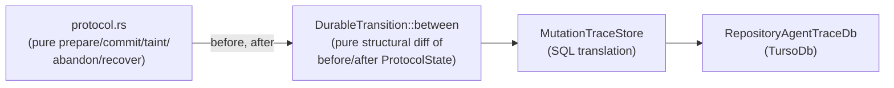

# Mutation-trace store (`mutation_trace::store`)

Durable persistence for the verified mutation-cursor protocol
([`protocol.rs`](mutation-trace-protocol.md)), built by the
`mutation-cursor-store-persistence` plan. `store.rs` is the protocol's first
real database call site: it stores worktree/scope/processed-event/mutation-event
state in the repository-scoped Agent Trace DB (`RepositoryAgentTraceDb`) via
migration `004_mutation_trace_protocol.sql`.

## Boundary shape

The boundary is one-directional and structural. `protocol.rs` never depends
on SQL or `RepositoryAgentTraceDb`. `DurableTransition::between` diffs two
`ProtocolState` values field-by-field — it never branches on `Boundary`,
`BoundaryKind`, `Attribution`, or taint state, so it cannot make a persistence
decision based on protocol meaning. `store.rs` never interprets protocol
semantics either: it only translates an already-validated `DurableTransition`
into SQL statements and reconstructs domain values out of query rows.

## What's persisted, and what isn't

Five tables (`mutation_trace_worktrees`, `mutation_trace_scopes`,
`mutation_trace_processed_events`, `mutation_trace_events`,
`mutation_trace_event_active_scopes`) hold `WorktreeState`, `ScopeState`,
`EventKey` replay identity, and historical `MutationEvent`s.

Two `ProtocolState` fields are deliberately never persisted:

- `AttemptState` — explicitly transient in the domain model; no
  `mutation_trace_attempts` table exists.
- `external_taint` — a `database_failure()` cannot use the database it just
  failed against as the authoritative record that the write was uncertain.
  `DurableTransition::between` returns `Ok(None)` for a `database_failure`-only
  transition, so `store.commit` is never even called for it.

`revision` (on both worktree and event rows) is stored as an 8-byte
big-endian `BLOB`, via `encode_revision`/`decode_revision`, never a SQLite
`INTEGER` — every revision column carries
`CHECK (typeof(revision) = 'blob' AND length(revision) = 8)`, so this survives
`u64::MAX` exactly and rejects a same-length `TEXT` value. Every other
enum-shaped column (`ActorKind`, `FailureKind`, `ScopeStatus`, and the
`AttributionKind`/`BoundaryKind` discriminants derived from `Attribution` and
`Boundary`) has an explicit `encode_*`/`decode_*` function pair — none derives
from `Debug` or a serde representation.

## Read path

`MutationTraceStore::load_worktree(worktree, scope, event_key)` is the hot
path: it loads one worktree row, only that worktree's currently `Active`
scopes, plus one optional *effective referenced scope* (from `scope` or
`event_key.scope_id` — the two must agree when both are given), included
regardless of status. It never queries `mutation_trace_events`. A missing
effective scope, a `scope`/`event_key.scope_id` disagreement, or an effective
scope belonging to a different worktree all return `Err` rather than silently
loading, omitting, or reassigning it. The result, `WorktreeProjection`,
widens into a full `ProtocolState` via `into_protocol_state` (with `attempts`,
`mutation_events`, and `external_taint` always empty) so unmodified
`protocol.rs` functions can operate on it.

`MutationTraceStore::load_mutation_event(worktree, revision)` is the separate
cold path: it reconstructs one historical `MutationEvent`, including full
`Attribution`/`Boundary` decoding, by `(worktree_id, revision)`. It is never
called from `load_worktree` or from any hook-boundary path, so a
projection load never pays for the full historical event set.

## Write path

`MutationTraceStore::commit(transition: &DurableTransition) -> Result<CasResult>`
translates the transition into one worktree CAS `UPDATE`, zero or more scope
status `UPDATE`s, an optional processed-event `INSERT`, and an optional
mutation-event `INSERT` plus its active-scope `INSERT`s — all run through
`TursoDb::execute_transactional_cas_batch` inside exactly one
`BEGIN IMMEDIATE` transaction. The worktree `UPDATE`'s `WHERE worktree_id = ?
AND revision = ?` clause is the CAS guard: `execute_transactional_cas_batch`
treats its affected-row count as the outcome (`0` rows → no-op commit,
`CasResult::Conflict`; `1` row → every other statement runs,
`CasResult::Applied`). Every non-guard statement also carries
`expect_rows_affected(1)`, which fails the transaction deterministically on an
unexpected affected-row count. A `(scope_id, event_id)` replay is a distinct
failure path: the processed-event `INSERT`'s `PRIMARY KEY` constraint rejects
it as a SQL error before any row-count check applies. Both paths roll back
the transaction and propagate out of `commit()` as `Err`, never as
`CasResult::Conflict`, and neither is retried unless the underlying error is
`Busy`/`BusySnapshot`.

`execute_transactional_cas_batch` keeps three outcomes distinct: a stale
revision is a `Conflict` that is never retried; a transient DB failure
(`Busy`/`BusySnapshot`) retries the whole transaction from a fresh
`BEGIN IMMEDIATE`; and any other deterministic SQL/constraint failure
propagates out of `commit()` as `Err`, never as `CasResult::Conflict`.

`DurableTransition`'s six fields are private — `between()` is the only way to
construct one outside `store.rs`, so `commit()` can trust the structural
invariants `between()` already proved (single worktree, revision advances by
exactly one, at most one new processed/mutation event) without re-validating
them.

## Initialization

`initialize_worktree`/`register_scope` are idempotent idle-inserts (`INSERT
... ON CONFLICT DO NOTHING`) outside the CAS commit path:
`initialize_worktree` never overwrites an existing cursor, and
`register_scope` requires the referenced worktree to already have a durable
row and never auto-creates it. An existing scope is returned unchanged only
when its stored `worktree_id` and `actor_kind` match the request; a mismatch
returns `Err`.

## Non-goals

- No Git or filesystem I/O — `store.rs` itself calls neither Git nor the
  filesystem. `runtime/git_snapshot.rs` now exists as a sibling module (see
  [`mutation-trace-runtime-coordinator.md`](mutation-trace-runtime-coordinator.md))
  but is not wired to this store yet; `coordinator.rs`, the future caller of
  both, remains future work.
- No attribution or boundary-kind decisions — `DurableTransition::between`
  and `store.rs` are both structurally blind to protocol meaning.
- No retry-after-`Conflict` loop — `CasResult::Conflict` is returned to the
  caller; retrying with a freshly reloaded revision is a future adapter's
  responsibility, not this module's.
- No deletion of terminal (`Closed`/`Abandoned`) scope rows or historical
  `mutation_trace_events` rows — scope garbage collection is out of scope for
  this plan.
