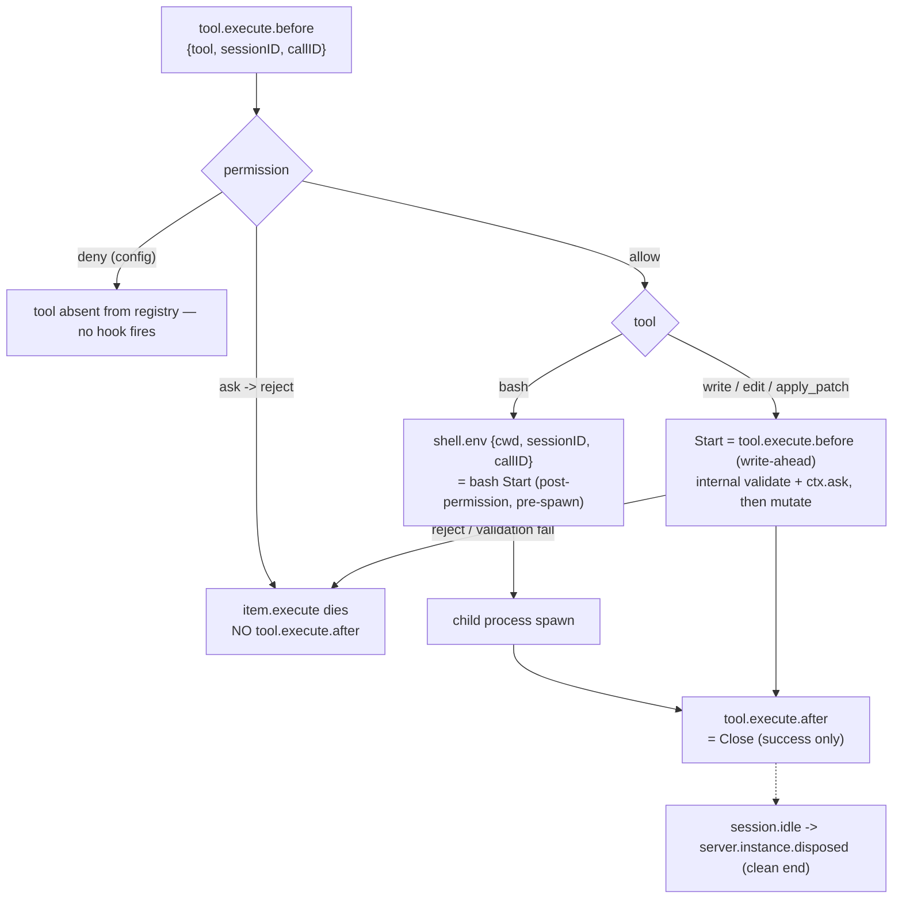

# OpenCode mutation-scope integration

OpenCode is the third concrete mutation-scope producer, after
[Claude Code](claude-mutation-scope-integration.md) and
[Codex](codex-mutation-scope-integration.md). As of the
`opencode-mutation-scope-integration` plan's **T05**, the *lifecycle evidence*
(T01), the *protocol generalization* (T02), the adapter's *identity and
classification layer* (T03), its *scope lifecycle and recovery* (T04), and the
*generated plugin and `sce setup` registration* (T05) all exist: a generated
`sce-mutation-scope.ts` plugin routes real OpenCode tool-lifecycle events to the
adapter, which drives the generic in-process ingress seam with a full
`Start`/`Close`/`Abandon` lifecycle and checkout-local durable state
([`mutation-scope-hook-ingress.md`](mutation-scope-hook-ingress.md) reserves the
`"opencode"` actor value and the `oc_` session prefix via
[`mutation-scope-provenance.md`](mutation-scope-provenance.md)). End-to-end
production regressions are **T06**.

This document records what T01 froze about OpenCode's tool lifecycle so the
remaining task (T06) and any later revision inherit it without re-probing,
the identity/encoding contract T03 froze (see **Adapter identity and
encoding**), and the lifecycle/recovery behavior T04 shipped (see **Adapter
lifecycle and recovery**) — including T04's soundness/liveness corrections: an
abandoned uncertain scope's ambiguous filesystem interval is consumed with an
ineligible `flush` before any surviving scope can confirm itself; broad
asynchronous lifecycle events no longer retire live attempts; and exact
`ToolError` terminal evidence is now persisted as a durable `PendingAbandon`
attempt phase **before** any cleanup call, so a transient failure of the
`flush`/`abandon`/rebaseline sequence retries the cleanup on the next
recovery-capable boundary instead of silently forgetting the scope. T02 (the
protocol generalization) has shipped — see **Attribution boundary**. No protocol
or Quint change was needed for the durability contract.

T05's plugin transport was itself corrected after its first cut: (1) the plugin
originally fail-*opened* on `ENOENT` (`sce` CLI missing), which contradicted the
requirement that any inability to establish a tracked `Start` must block
execution — it now fails closed on every transport failure, `ENOENT` included,
while still logging an install warning; (2) the per-session `chat.params` model
cache originally only ever `set` an entry, so a later turn with unavailable
model evidence kept serving the previous turn's model — it now `delete`s the
cached entry whenever a non-`title` `chat.params` event lacks a valid model,
so `Start` never observes stale evidence; (3) the plugin no longer spawns the
adapter for `SessionIdle` / `SessionError` / `ServerDisposed` at all, since T04's
dispatch is a hard no-op for all four broad events — only exact `ToolError`
(which drives real recovery) and local `SessionDeleted` bookkeeping (clearing
the model cache) remain.

## Evidence base

- **Bound to OpenCode CLI `opencode-ai@1.15.4` and `@opencode-ai/plugin@1.15.4`**
  (identical versions — the plugin pin inherited from PR #275, the CLI version
  selected and recorded before the first probe per the plan's version policy).
- Upstream source: `github.com/sst/opencode` tag `v1.15.4`, commit
  `2b92c5677e830e95d34fc3d5664a69297d2d0b51`.
- Probe fixtures and the full disposition report:
  [`../../cli/src/services/hooks/opencode_mutation_scope/fixtures/`](../../cli/src/services/hooks/opencode_mutation_scope/fixtures/)
  (`NOTES.md` plus 23 instrumented hook/event captures and the probe plugins).
- Evidence is version-bound: a different OpenCode CLI or plugin version requires
  re-running the probe matrix before any load-bearing behavior is reused.

## Scope model

The attribution unit is **one independently executing tracked OpenCode tool
call**, identified by `(sessionID, callID)`. An OpenCode session, turn, agent, or
task/subagent session is an identity/provenance input, never a scope. `callID`
(`call_<24 hex>`) is stable across a call's `tool.execute.before` →
`shell.env` → `tool.execute.after` and unique across concurrent calls;
`sessionID` (`ses_<24 base62>`) brackets subagent sessions and builds provenance.

| OpenCode tool class | Tool names (v1.15.4) | Mutation-scope behavior |
| --- | --- | --- |
| `TrackedMutation` | `bash`, `write`, `edit`, `apply_patch` | one call, one scope; `Start` at the proven boundary, `Close` at successful `tool.execute.after` |
| `Delegation` | `task` | no scope for the delegation; the child session's tracked tools get their own scopes under the child `sessionID` |
| `Untracked` | `read`/`glob`/`grep`/…, MCP tools, plugin-defined tools, unknown/future names | tool runs, may mutate, **no scope, no positive individual attribution** |

`Untracked` is a coverage boundary, not "read-only": a plugin-defined tool was
observed mutating a file while firing the same `tool.execute.before`/`after`
hooks as a builtin (fixture `captures/customtool.jsonl`). Classification must
therefore be a closed **allowlist keyed on the exact tool string** — hook
presence is not a mutation signal.

### The patch gate

OpenCode registers `apply_patch` **only** for models whose id contains `gpt-`
(excluding `oss` and `gpt-4`); it registers `edit`/`write` only for every other
model (`packages/opencode/src/tool/registry.ts`). So **`apply_patch` and
`edit`/`write` are mutually exclusive within one session**. The four tracked tool
*names* are all real; a single session exposes at most three of them
(`{bash, write, edit}` or `{bash, apply_patch}`) plus always-present `task`.

## Adapter identity and encoding

The adapter lives in
[`../../cli/src/services/hooks/opencode_mutation_scope/`](../../cli/src/services/hooks/opencode_mutation_scope/)
and is reached by the hidden `sce hooks opencode-mutation-scope` command
(`HookSubcommand::OpenCodeMutationScope`, kept out of `sce hooks --help` like the
Claude and Codex adapter commands). T03 built the pure layer, T04 the lifecycle,
T05 the generated plugin and `sce setup` registration.

- **Wire contract (plugin → adapter).** The generated `sce-mutation-scope.ts`
  plugin sends one JSON object per hook, discriminated by `hook_event_name`:
  `ToolExecuteBefore` / `ShellEnv` / `ToolExecuteAfter` carry
  `session_id`, `call_id`, `cwd` (`ToolExecuteBefore`/`ToolExecuteAfter` also
  `tool_name`; the two start-boundary events also an optional `model`);
  `ToolError` carries `session_id`, `call_id`, `cwd`, and `tool_name`
  (the OpenCode `message.part.updated` tool part carries `part.tool` on the
  `error` transition — T01, `captures/*-perm-ask.jsonl` — so the adapter can
  classify a `ToolError` before resolving Git or opening adapter state). The
  adapter parser still accepts the broad lifecycle signals `SessionIdle` /
  `SessionError` / `SessionDeleted` (`session_id`, `cwd`) and `ServerDisposed`
  (`cwd`) as a stable wire contract, but dispatch is a pure no-op for all four
  (see **Adapter lifecycle and recovery**); as of T05's correction the generated
  plugin no longer spawns the adapter for them at all — only `SessionDeleted`
  drives local, adapter-independent bookkeeping (clearing the plugin's own
  cached model for that session; see **Model and session provenance**). Every
  field is strictly validated: a missing,
  blank, or wrong-typed required field is rejected as
  `Invalid OpenCode hook event payload from STDIN: <detail>.` with no
  fabricated identity.
- **Classification** is the closed allowlist in the **Scope model** table,
  keyed on the exact tool string.
- **`AttemptKey`** is `(session_id, call_id)` — no turn or agent component.
- **`ScopeId`** is the frozen, hash-free, length-prefixed encoding
  `oc-tool-v1|s=<len>:<sessionID>|c=<len>:<callID>`. There is no
  attempt-sequence component (T01 proved `callID` is never reused); a future
  generational need bumps the scheme to `oc-tool-v2`. `EventId` is
  `<scope_id>|start` / `<scope_id>|close`.
- **Provenance** is built by `opencode_scope_provenance`:
  `session_id = oc_<sessionID>` (via the shared `prefixed_diff_trace_session_id`),
  `model_id = normalize_opencode_model_id(model)` — trim, `None` on blank —
  else `NULL`.

## Lifecycle boundaries

- **bash Start = `shell.env`.** It fires after OpenCode's permission evaluation
  and before the child spawn (`tool/shell.ts` L412/L482/L628). A rejected bash
  never reaches `shell.env`, so a `shell.env`-anchored Start yields **zero
  scope** for a rejected bash. A config-level `permission: {bash:"deny"}` removes
  `bash` from the registry entirely.
- **`write`/`edit`/`apply_patch` Start = `tool.execute.before`** (write-ahead).
  It carries no permission or validation guarantee; a rejection or internal
  validation failure leaves the scope with no `Close`. `apply_patch`'s lifecycle
  is proven-by-source identical to `write`/`edit` (same `resolveTools` registry
  path); the patch gate blocked live `apply_patch` fixtures in the probe
  environment (no working `gpt-`-class OpenCode credential).
- **`Close` = successful `tool.execute.after`.** It fires for bash success,
  non-zero exit, exit 127, and tool-enforced timeout (all "successful tool
  results"), but **not** for permission rejection, interrupt, or internal
  validation failure. Its absence is genuinely ambiguous.
- **Interrupt / hard kill:** SIGINT or SIGKILL to `opencode run` ends the process
  with **no terminal hook and no cleanup event**, and spawned child processes
  are **orphaned and keep running** (a `sleep; echo > file` orphan completed its
  write after OpenCode was gone). No elapsed-time signal can distinguish an
  abandoned scope from an orphan still mutating — **no TTL is safe**.

## Adapter lifecycle and recovery

T04 wired the T01-frozen boundaries above onto the runtime: attempt phases
(`PendingStart` → `Active` → `PendingAbandon`), a per-`git-dir` boundary lock,
durable checkout-local state under `<git-dir>/sce/`, write-ahead fail-closed
`Start`, `Close` on a successful `ToolExecuteAfter`, exact-`ToolError`-only
`Abandon` with durable terminal intent and an ambiguity-consuming `flush`, a
generation-tracked recovery barrier that retries transient cleanup failures, and
no same-session sweep or TTL. Broad asynchronous lifecycle events retire nothing.
No protocol or Quint change. Full detail:
[`opencode-mutation-scope-adapter-lifecycle.md`](opencode-mutation-scope-adapter-lifecycle.md).

## Attribution boundary

Because a tracked OpenCode `Start` is reachable without any confirming `Close`
(permission rejection, interrupt, validation failure — all in the fixtures),
OpenCode scopes are **confirmation-required**, like Codex: an OpenCode scope
stays unconfirmed until its own exact successful `Close`, and an unconfirmed
scope suppresses positive attribution at any boundary.

T02 shipped this: `protocol.rs` (`requires_boundary_confirmation(ActorKind)` /
`has_unconfirmed_required_scope`) and `spec/mutation_cursor.qnt`
(`requiresBoundaryConfirmation` / `hasUnconfirmedRequiredScope`) replaced the
former Codex-only rule with a harness-independent confirmation-required-actor
predicate — `Codex` and `OpenCode` → confirmation-required, `ClaudeCode` and
`Pi` → not. A live unconfirmed OpenCode scope now yields `IneligibleUnscoped`
at any Claude, Codex, Pi, Flush, or other-OpenCode boundary, and a confirming
`Close(OpenCode A)` yields `AiExclusive(A)` when A is the only live scope,
`AiContended` when the other live scopes are confirmation-safe. Codex outcomes
are unchanged bit-for-bit. The public `Attribution` variants, `ProtocolState`,
`ScopeState`, `MutationEvent`, and the Quint scope state are untouched. The
Rust adapter drives this boundary as of T04 (see **Adapter lifecycle and
recovery**). The generalized rule is also documented in
[`codex-mutation-scope-integration.md`](codex-mutation-scope-integration.md) and
[`mutation-scope-runtime.md`](mutation-scope-runtime.md).

## Model and session provenance

The construction helper `opencode_scope_provenance` exists as of T03 (see
**Adapter identity and encoding**); as of T04 the adapter stamps its result onto
every tracked `Start` ingress boundary. As of T05 the generated plugin supplies
the observed `model` from its per-session `chat.params` map (`providerID/api.id`,
ignoring the internal `title` agent); absent evidence forwards `model: null`.

`chat.params` (`packages/opencode/src/session/llm.ts` L162) fires before every
LLM call — before that turn's `tool.execute.before` — carrying
`{ sessionID, agent, model, provider }` with `model.providerID` + `model.api.id`.
An ephemeral per-`sessionID` model map populated on `chat.params` is always ready
before that session's next tracked `Start`. Subagents get their own child-session
`chat.params`. At `Start`: `session_id = oc_<sessionID>`,
`model_id = normalized(providerID + "/" + api.id)` from the live observation,
else `NULL` — never guessed, never copied from another session, never backfilled
(consistent with [`mutation-scope-provenance.md`](mutation-scope-provenance.md)'s
insert-once semantics). The internal `title` agent's `chat.params` must be
ignored so it does not pollute the map. Every non-`title` `chat.params` event for
a session **replaces** that session's cached observation rather than merging
into it: a valid `providerID` + `api.id` overwrites the previous entry, and an
invalid/missing model on a later event **deletes** the cached entry rather than
leaving the prior model in place — a model switch (or a turn with unavailable
model evidence) can never resurrect a stale observation from an earlier turn.

## Generated plugin and ordering

The plugin (`config/lib/mutation-scope-plugin/opencode-sce-mutation-scope-plugin.ts`,
copied verbatim to `config/.opencode/plugins/sce-mutation-scope.ts` by
`config/pkl/generate.pkl`) is a pure transport adapter — no protocol state, no
business logic. It observes the model per turn from `chat.params` (see **Model
and session provenance**), maps `write`/`edit`/`apply_patch`
`tool.execute.before` → fail-closed `ToolExecuteBefore`, `shell.env` →
fail-closed `ShellEnv` bash `Start`, `tool.execute.after` → best-effort
`ToolExecuteAfter` `Close`, and a tool-part `error` event → best-effort `ToolError`. It calls
`sce hooks opencode-mutation-scope` synchronously (`spawnSync`, 20s timeout) and
**throws** on any failure to establish a tracked `Start` — non-zero adapter
exit, spawn failure, timeout, or the `sce` CLI being absent (`ENOENT`) — so
OpenCode always blocks the tool when Start cannot be established; `ENOENT`
additionally logs a one-line installation warning, but still fails closed like
every other transport failure. The broad asynchronous events `SessionIdle` /
`SessionError` / `ServerDisposed` are not forwarded at all — T04's adapter
dispatch is a genuine no-op for them, so the plugin does not spawn the adapter
process for a signal it knows will do nothing; `session.deleted` only clears the
plugin's own local per-session model cache (see **Model and session
provenance**).

OpenCode runs plugin hooks **sequentially in merged `plugin` config-array order**
(`packages/opencode/src/plugin/index.ts`): an earlier plugin that throws in
`tool.execute.before` blocks later plugins and the tool
(`captures/probeC-order-throw.jsonl`); a failing `shell.env` blocks the spawn
(`captures/probeB-shellenv-throw.jsonl`). `config/pkl/renderers/common.pkl` lists
`sce-mutation-scope` last, and the config merge
(`cli/src/services/setup/config_merge.rs`) appends the SCE entries after every
surviving user plugin, so the installed order is
`[<user plugins…>, sce-bash-policy, sce-agent-trace, sce-mutation-scope]` for any
configuration — mutation-scope stays last, so an earlier policy/user plugin
rejects a tool before its `Start` is established. `sce doctor`
(`inspect_opencode_plugin_ordering_health`) flags an installed `opencode.json`
that lists `./plugins/sce-mutation-scope.ts` anywhere but last. SCE keeps
explicit array entries because auto-discovered `.opencode/plugin(s)/*` order is
unsorted glob order; an explicit entry and its auto-discovered file dedupe
correctly (`captures/dup.jsonl`). See
[`generated-opencode-plugin-registration.md`](../sce/generated-opencode-plugin-registration.md).

## Boundaries and open items

- OpenCode persistence is **global-user-scoped** (`~/.local/share/opencode/`,
  keyed by a `projectID` hash of the directory) and schema-coupled to the CLI
  version — **not checkout-local**. The adapter keeps its own checkout-local
  attempt bookkeeping under `<git-dir>/sce/` (T04) and does not assume a single
  OpenCode writer per checkout — the boundary lock serialises concurrent
  processes.
- Live `apply_patch` fixtures (AC2) are outstanding: they need a `gpt-`-class
  OpenCode credential and should be recorded during T06 before `/validate`. This
  is a credential gap, not a soundness gap — `apply_patch` satisfies the contract
  on the pinned versions per source.
- `AiExclusive(scope)` will continue to mean tracked-scope exclusivity, never a
  claim that no human, MCP, plugin, or detached process also mutated the
  worktree.
