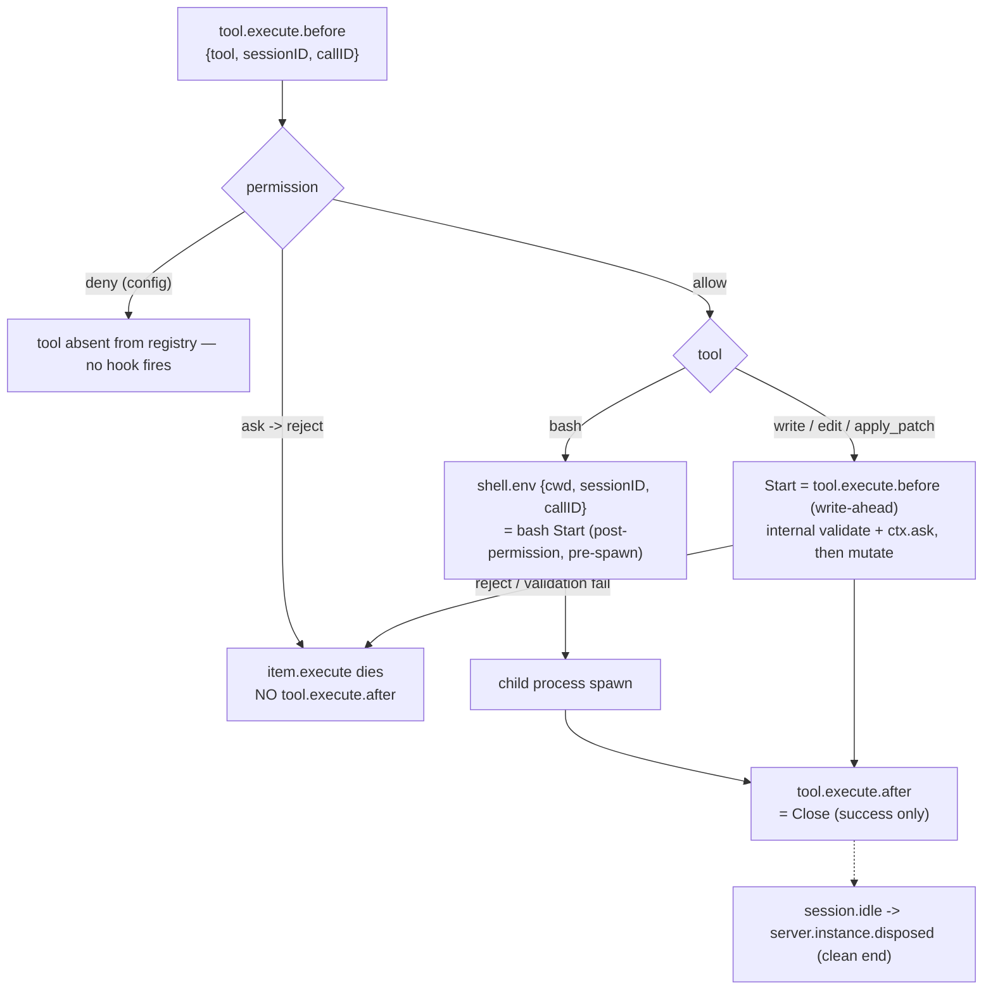

# OpenCode mutation-scope integration

OpenCode is the third concrete mutation-scope producer, after
[Claude Code](claude-mutation-scope-integration.md) and
[Codex](codex-mutation-scope-integration.md). As of the
`opencode-mutation-scope-integration` plan's **T04**, the *lifecycle evidence*
(T01), the *protocol generalization* (T02), the adapter's *identity and
classification layer* (T03), and its *scope lifecycle and recovery* (T04) all
exist: the adapter now drives the generic in-process ingress seam with a full
`Start`/`Close`/`Abandon` lifecycle and checkout-local durable state. It is
**not yet generated as a plugin or registered by `sce setup`** (T05), so no
real OpenCode session reaches it
([`mutation-scope-hook-ingress.md`](mutation-scope-hook-ingress.md) reserves the
`"opencode"` actor value and the `oc_` session prefix via
[`mutation-scope-provenance.md`](mutation-scope-provenance.md)).

This document records what T01 froze about OpenCode's tool lifecycle so the
remaining tasks (T05–T06) and any later revision inherit it without re-probing,
the identity/encoding contract T03 froze (see **Adapter identity and
encoding**), and the lifecycle/recovery behavior T04 shipped (see **Adapter
lifecycle and recovery**) — including T04's soundness correction: an abandoned
uncertain scope's ambiguous filesystem interval is consumed with an ineligible
`flush` before any surviving scope can confirm itself, and broad asynchronous
lifecycle events no longer retire live attempts. T02 (the protocol
generalization) has shipped — see **Attribution boundary**.

## Evidence base

- **Bound to OpenCode CLI `opencode-ai@1.15.4` and `@opencode-ai/plugin@1.15.4`**
  (identical versions — the plugin pin inherited from PR #275, the CLI version
  selected and recorded before the first probe per the plan's version policy).
- Upstream source: `github.com/sst/opencode` tag `v1.15.4`, commit
  `2b92c5677e830e95d34fc3d5664a69297d2d0b51`.
- Probe fixtures and the full disposition report:
  [`../../cli/src/services/hooks/opencode_mutation_scope/fixtures/`](../../cli/src/services/hooks/opencode_mutation_scope/fixtures/)
  (`NOTES.md` plus 23 instrumented hook/event captures and the probe plugins).
- Evidence is version-bound: a different OpenCode CLI or plugin version requires
  re-running the probe matrix before any load-bearing behavior is reused.

## Scope model

The attribution unit is **one independently executing tracked OpenCode tool
call**, identified by `(sessionID, callID)`. An OpenCode session, turn, agent, or
task/subagent session is an identity/provenance input, never a scope. `callID`
(`call_<24 hex>`) is stable across a call's `tool.execute.before` →
`shell.env` → `tool.execute.after` and unique across concurrent calls;
`sessionID` (`ses_<24 base62>`) brackets subagent sessions and builds provenance.

| OpenCode tool class | Tool names (v1.15.4) | Mutation-scope behavior |
| --- | --- | --- |
| `TrackedMutation` | `bash`, `write`, `edit`, `apply_patch` | one call, one scope; `Start` at the proven boundary, `Close` at successful `tool.execute.after` |
| `Delegation` | `task` | no scope for the delegation; the child session's tracked tools get their own scopes under the child `sessionID` |
| `Untracked` | `read`/`glob`/`grep`/…, MCP tools, plugin-defined tools, unknown/future names | tool runs, may mutate, **no scope, no positive individual attribution** |

`Untracked` is a coverage boundary, not "read-only": a plugin-defined tool was
observed mutating a file while firing the same `tool.execute.before`/`after`
hooks as a builtin (fixture `captures/customtool.jsonl`). Classification must
therefore be a closed **allowlist keyed on the exact tool string** — hook
presence is not a mutation signal.

### The patch gate

OpenCode registers `apply_patch` **only** for models whose id contains `gpt-`
(excluding `oss` and `gpt-4`); it registers `edit`/`write` only for every other
model (`packages/opencode/src/tool/registry.ts`). So **`apply_patch` and
`edit`/`write` are mutually exclusive within one session**. The four tracked tool
*names* are all real; a single session exposes at most three of them
(`{bash, write, edit}` or `{bash, apply_patch}`) plus always-present `task`.

## Adapter identity and encoding

The adapter lives in
[`../../cli/src/services/hooks/opencode_mutation_scope/`](../../cli/src/services/hooks/opencode_mutation_scope/)
and is reached by the hidden `sce hooks opencode-mutation-scope` command
(`HookSubcommand::OpenCodeMutationScope`, kept out of `sce hooks --help` like the
Claude and Codex adapter commands). T03 built the pure layer only; T04 adds the
lifecycle, T05 the plugin.

- **Wire contract (plugin → adapter).** The T05 TypeScript plugin sends one JSON
  object per hook, discriminated by `hook_event_name`:
  `ToolExecuteBefore` / `ShellEnv` / `ToolExecuteAfter` carry
  `session_id`, `call_id`, `cwd` (`ToolExecuteBefore`/`ToolExecuteAfter` also
  `tool_name`; the two start-boundary events also an optional `model`);
  `ToolError` carries `session_id`, `call_id`, `cwd`, and `tool_name`
  (the OpenCode `message.part.updated` tool part carries `part.tool` on the
  `error` transition — T01, `captures/*-perm-ask.jsonl` — so the adapter can
  classify a `ToolError` before resolving Git or opening adapter state);
  the broad lifecycle signals `SessionIdle` / `SessionError` / `SessionDeleted`
  (`session_id`, `cwd`) and `ServerDisposed` (`cwd`) are still parsed for a
  stable T05 contract but drive **no** live-scope abandonment (see **Adapter
  lifecycle and recovery**). Every field is strictly validated: a missing,
  blank, or wrong-typed required field is rejected as
  `Invalid OpenCode hook event payload from STDIN: <detail>.` with no
  fabricated identity.
- **Classification** is the closed allowlist in the **Scope model** table,
  keyed on the exact tool string.
- **`AttemptKey`** is `(session_id, call_id)` — no turn or agent component.
- **`ScopeId`** is the frozen, hash-free, length-prefixed encoding
  `oc-tool-v1|s=<len>:<sessionID>|c=<len>:<callID>`. There is no
  attempt-sequence component (T01 proved `callID` is never reused); a future
  generational need bumps the scheme to `oc-tool-v2`. `EventId` is
  `<scope_id>|start` / `<scope_id>|close`.
- **Provenance** is built by `opencode_scope_provenance`:
  `session_id = oc_<sessionID>` (via the shared `prefixed_diff_trace_session_id`),
  `model_id = normalize_opencode_model_id(model)` — trim, `None` on blank —
  else `NULL`.

## Lifecycle boundaries



- **bash Start = `shell.env`.** It fires after OpenCode's permission evaluation
  and before the child spawn (`tool/shell.ts` L412/L482/L628). A rejected bash
  never reaches `shell.env`, so a `shell.env`-anchored Start yields **zero
  scope** for a rejected bash. A config-level `permission: {bash:"deny"}` removes
  `bash` from the registry entirely.
- **`write`/`edit`/`apply_patch` Start = `tool.execute.before`** (write-ahead).
  It carries no permission or validation guarantee; a rejection or internal
  validation failure leaves the scope with no `Close`. `apply_patch`'s lifecycle
  is proven-by-source identical to `write`/`edit` (same `resolveTools` registry
  path); the patch gate blocked live `apply_patch` fixtures in the probe
  environment (no working `gpt-`-class OpenCode credential).
- **`Close` = successful `tool.execute.after`.** It fires for bash success,
  non-zero exit, exit 127, and tool-enforced timeout (all "successful tool
  results"), but **not** for permission rejection, interrupt, or internal
  validation failure. Its absence is genuinely ambiguous.
- **Interrupt / hard kill:** SIGINT or SIGKILL to `opencode run` ends the process
  with **no terminal hook and no cleanup event**, and spawned child processes
  are **orphaned and keep running** (a `sleep; echo > file` orphan completed its
  write after OpenCode was gone). No elapsed-time signal can distinguish an
  abandoned scope from an orphan still mutating — **no TTL is safe**.

## Adapter lifecycle and recovery

T04 wired the boundaries above onto the runtime. The adapter processes one hook
event at a time under a per-`git-dir` boundary lock
(`opencode-mutation-scope-boundary.lock`), serialising boundary work across
concurrent OpenCode processes.

- **Start** is durable before the seam call: a `PendingStart` attempt is
  persisted, the ingress `start` boundary is driven, then the attempt flips to
  `Active`. `bash` starts on `ShellEnv` only; `write`/`edit`/`apply_patch` start
  write-ahead on `ToolExecuteBefore`.
- **Close** is a successful `ToolExecuteAfter` — it drives the ingress `close`
  and removes the attempt. An `After` that finds only a `PendingStart` consumes
  the interval and abandons instead (see **Abandon**).
- **Abandon (exact only) + ambiguity consumption.** `ToolError` for a tracked
  tool retires exactly its `(session_id, call_id)` attempt. Removing an
  uncertain scope does **not by itself** make the preceding filesystem interval
  attributable: `abandon_and_consume` (under the boundary lock) first drives an
  ineligible ingress `flush` while the doomed scope and any siblings are still
  live — the runtime resolves it to `IneligibleUnscoped` and advances the cursor
  past the ambiguous interval — then drives the ingress `abandon` for each
  doomed scope, then a second `flush` to clear the rebaseline that `abandon`
  arms so surviving scopes keep their **future** intervals. Surviving attempts
  stay `Active` and untouched. So

  ```text
  Start(A)  Start(B)  mutate(A)  mutate(B)  Abandon(A)  Close(B)
  ```

  can never yield `AiExclusive(B)` for the interval that could contain A's
  changes, while B may still attribute mutations it makes **after** the
  consuming flush.
- **Broad asynchronous events are non-authoritative.** `SessionIdle`,
  `SessionError`, `SessionDeleted`, and `ServerDisposed` are asynchronous /
  fire-and-forget relative to the synchronous mutation boundary (D10), so a
  delayed one can arrive after a newer tracked call already started, and one
  OpenCode process's `ServerDisposed` cannot be distinguished from another's
  (the wire event carries only checkout identity). They therefore drive **no**
  live-scope abandonment — only exact `ToolError` causal evidence retires an
  attempt. Lingering unconfirmed scopes after a crash or a missing terminal
  event are accepted (D3 keeps them non-AI); this trades availability for
  soundness, consistent with D10/D11. No TTL recovers from this.
- **Recovery barrier.** Durable state under
  `<git-dir>/sce/opencode-mutation-scope-state.json` (guarded by
  `opencode-mutation-scope-state.lock`, held only for individual file ops,
  **never across a seam call**) carries a generation-tracked
  `Clear`/`Pending`/`Flushing` recovery state. The ambiguity-consuming `flush`
  runs at abandon time, alongside surviving live attempts — it is **not**
  deferred until `attempts.is_empty()`. A successful consume returns recovery to
  `Clear` with survivors still `Active`; a failed `flush` retains
  `Pending`/recovery-required, and any new tracked `Start` while recovery is
  unresolved stays fail-closed (and retries the consume). Generation ownership
  prevents an old `flush` completion from clearing a newer recovery requirement.
- **Fail-closed.** Any failure to durably establish a tracked `Start` exits the
  adapter non-zero (`SCE could not establish OpenCode mutation attribution for
  this tool execution.`); T05's plugin turns that into a thrown hook that blocks
  the tool. `Close`/terminal paths are best-effort, falling back to
  `abandon_and_consume` on seam failure.
- **No same-session sweep, no TTL.** Attempts are keyed only by `(session_id,
  call_id)`; a second live call runs alongside the first (D9). Nothing retires a
  scope on elapsed time (D11) — an interrupted tool's interval stays
  `IneligibleUnscoped` rather than risk a false positive while an orphan child
  mutates.

## Attribution boundary

Because a tracked OpenCode `Start` is reachable without any confirming `Close`
(permission rejection, interrupt, validation failure — all in the fixtures),
OpenCode scopes are **confirmation-required**, like Codex: an OpenCode scope
stays unconfirmed until its own exact successful `Close`, and an unconfirmed
scope suppresses positive attribution at any boundary.

T02 shipped this: `protocol.rs` (`requires_boundary_confirmation(ActorKind)` /
`has_unconfirmed_required_scope`) and `spec/mutation_cursor.qnt`
(`requiresBoundaryConfirmation` / `hasUnconfirmedRequiredScope`) replaced the
former Codex-only rule with a harness-independent confirmation-required-actor
predicate — `Codex` and `OpenCode` → confirmation-required, `ClaudeCode` and
`Pi` → not. A live unconfirmed OpenCode scope now yields `IneligibleUnscoped`
at any Claude, Codex, Pi, Flush, or other-OpenCode boundary, and a confirming
`Close(OpenCode A)` yields `AiExclusive(A)` when A is the only live scope,
`AiContended` when the other live scopes are confirmation-safe. Codex outcomes
are unchanged bit-for-bit. The public `Attribution` variants, `ProtocolState`,
`ScopeState`, `MutationEvent`, and the Quint scope state are untouched. The
Rust adapter drives this boundary as of T04 (see **Adapter lifecycle and
recovery**). The generalized rule is also documented in
[`codex-mutation-scope-integration.md`](codex-mutation-scope-integration.md) and
[`mutation-scope-runtime.md`](mutation-scope-runtime.md).

## Model and session provenance

The construction helper `opencode_scope_provenance` exists as of T03 (see
**Adapter identity and encoding**); as of T04 the adapter stamps its result onto
every tracked `Start` ingress boundary. T05 supplies the observed `model` from
the plugin's `chat.params` map (until then the forwarded `model` is whatever the
wire payload carries, else `NULL`).

`chat.params` (`packages/opencode/src/session/llm.ts` L162) fires before every
LLM call — before that turn's `tool.execute.before` — carrying
`{ sessionID, agent, model, provider }` with `model.providerID` + `model.api.id`.
An ephemeral per-`sessionID` model map populated on `chat.params` is always ready
before that session's next tracked `Start`. Subagents get their own child-session
`chat.params`. At `Start`: `session_id = oc_<sessionID>`,
`model_id = normalized(providerID + "/" + api.id)` from the live observation,
else `NULL` — never guessed, never copied from another session, never backfilled
(consistent with [`mutation-scope-provenance.md`](mutation-scope-provenance.md)'s
insert-once semantics). The internal `title` agent's `chat.params` must be
ignored so it does not pollute the map.

## Generated plugin ordering (planned)

OpenCode runs plugin hooks **sequentially in the merged `plugin` config-array
order** (`packages/opencode/src/plugin/index.ts`), and an earlier plugin that
throws synchronously in `tool.execute.before` blocks every later plugin's
`tool.execute.before` **and** the tool itself (fixture
`captures/probeC-order-throw.jsonl`). A failing `shell.env` hook blocks the child
spawn (`captures/probeB-shellenv-throw.jsonl`). SCE therefore generates the
mutation-scope plugin as the **last** entry of the explicit `plugin` array in the
generated `opencode.json` (after `sce-bash-policy` and `sce-agent-trace` — see
[`generated-opencode-plugin-registration.md`](../sce/generated-opencode-plugin-registration.md)),
so an earlier policy/user plugin rejects a tool before the mutation-scope `Start`
is established. Ordering among *purely auto-discovered* `.opencode/plugin(s)/*`
files is unsorted glob order, so SCE must keep explicit array entries; an
explicit entry and its auto-discovered file dedupe correctly
(`captures/dup.jsonl`). Setup-merge/doctor must assert the last-entry position
after arbitrary user plugins (T05).

## Boundaries and open items

- OpenCode persistence is **global-user-scoped** (`~/.local/share/opencode/`,
  keyed by a `projectID` hash of the directory) and schema-coupled to the CLI
  version — **not checkout-local**. The adapter keeps its own checkout-local
  attempt bookkeeping under `<git-dir>/sce/` (T04) and does not assume a single
  OpenCode writer per checkout — the boundary lock serialises concurrent
  processes.
- Live `apply_patch` fixtures (AC2) are outstanding: they need a `gpt-`-class
  OpenCode credential and should be recorded during T05–T06 before `/validate`.
  This is a credential gap, not a soundness gap — `apply_patch` satisfies the
  contract on the pinned versions per source.
- `AiExclusive(scope)` will continue to mean tracked-scope exclusivity, never a
  claim that no human, MCP, plugin, or detached process also mutated the
  worktree.
