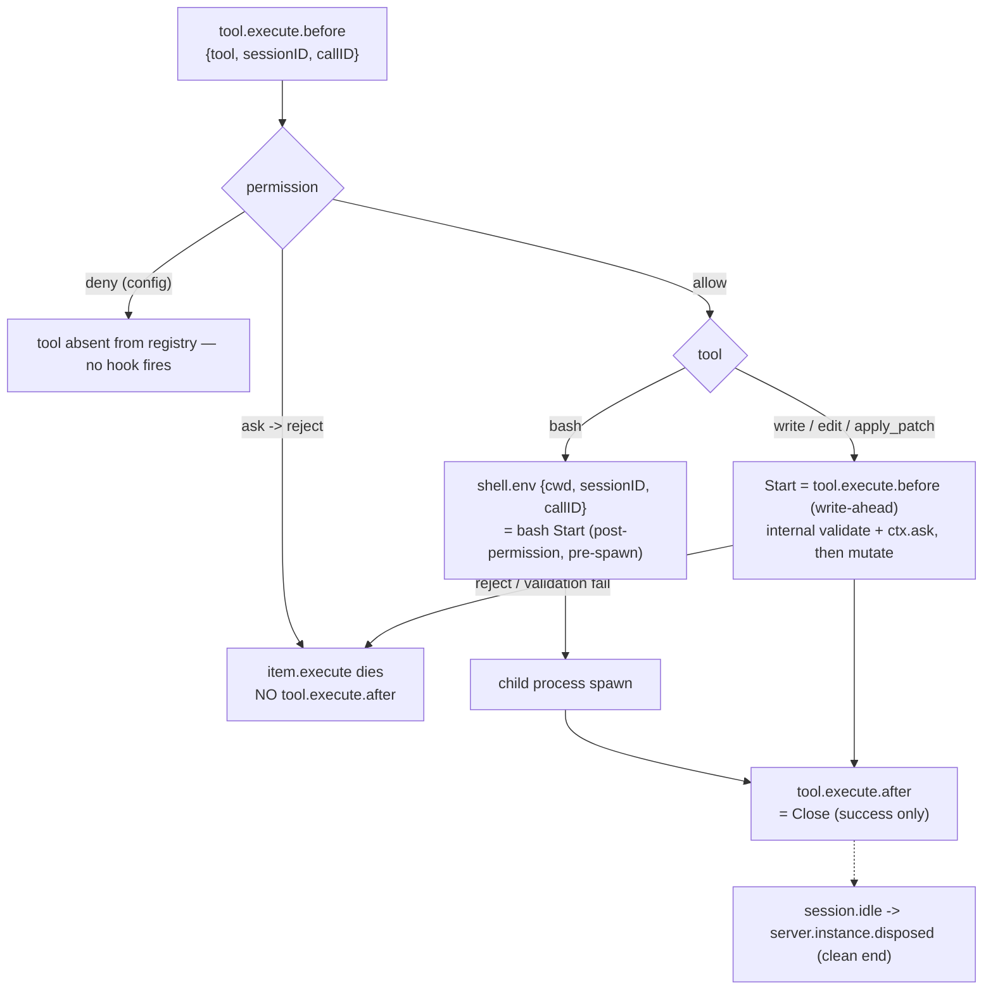

# OpenCode mutation-scope integration

OpenCode is the third planned concrete mutation-scope producer, after
[Claude Code](claude-mutation-scope-integration.md) and
[Codex](codex-mutation-scope-integration.md). As of the
`opencode-mutation-scope-integration` plan's **T01**, only the *lifecycle
evidence* exists: no Rust adapter, no `sce hooks opencode-mutation-scope`
command, no generated plugin. OpenCode remains **unwired** at the runtime seam
([`mutation-scope-hook-ingress.md`](mutation-scope-hook-ingress.md) already
reserves the `"opencode"` actor value and the `oc_` session prefix via
[`mutation-scope-provenance.md`](mutation-scope-provenance.md)).

This document records what T01 froze about OpenCode's tool lifecycle so the
adapter tasks (T03–T06) and any later revision inherit it without re-probing.
T02 (the protocol generalization) has shipped — see **Attribution boundary**
below.

## Evidence base

- **Bound to OpenCode CLI `opencode-ai@1.15.4` and `@opencode-ai/plugin@1.15.4`**
  (identical versions — the plugin pin inherited from PR #275, the CLI version
  selected and recorded before the first probe per the plan's version policy).
- Upstream source: `github.com/sst/opencode` tag `v1.15.4`, commit
  `2b92c5677e830e95d34fc3d5664a69297d2d0b51`.
- Probe fixtures and the full disposition report:
  [`../../cli/src/services/hooks/opencode_mutation_scope/fixtures/`](../../cli/src/services/hooks/opencode_mutation_scope/fixtures/)
  (`NOTES.md` plus 23 instrumented hook/event captures and the probe plugins).
- Evidence is version-bound: a different OpenCode CLI or plugin version requires
  re-running the probe matrix before any load-bearing behavior is reused.

## Scope model

The attribution unit is **one independently executing tracked OpenCode tool
call**, identified by `(sessionID, callID)`. An OpenCode session, turn, agent, or
task/subagent session is an identity/provenance input, never a scope. `callID`
(`call_<24 hex>`) is stable across a call's `tool.execute.before` →
`shell.env` → `tool.execute.after` and unique across concurrent calls;
`sessionID` (`ses_<24 base62>`) brackets subagent sessions and builds provenance.

| OpenCode tool class | Tool names (v1.15.4) | Mutation-scope behavior |
| --- | --- | --- |
| `TrackedMutation` | `bash`, `write`, `edit`, `apply_patch` | one call, one scope; `Start` at the proven boundary, `Close` at successful `tool.execute.after` |
| `Delegation` | `task` | no scope for the delegation; the child session's tracked tools get their own scopes under the child `sessionID` |
| `Untracked` | `read`/`glob`/`grep`/…, MCP tools, plugin-defined tools, unknown/future names | tool runs, may mutate, **no scope, no positive individual attribution** |

`Untracked` is a coverage boundary, not "read-only": a plugin-defined tool was
observed mutating a file while firing the same `tool.execute.before`/`after`
hooks as a builtin (fixture `captures/customtool.jsonl`). Classification must
therefore be a closed **allowlist keyed on the exact tool string** — hook
presence is not a mutation signal.

### The patch gate

OpenCode registers `apply_patch` **only** for models whose id contains `gpt-`
(excluding `oss` and `gpt-4`); it registers `edit`/`write` only for every other
model (`packages/opencode/src/tool/registry.ts`). So **`apply_patch` and
`edit`/`write` are mutually exclusive within one session**. The four tracked tool
*names* are all real; a single session exposes at most three of them
(`{bash, write, edit}` or `{bash, apply_patch}`) plus always-present `task`.

## Lifecycle boundaries

- **bash Start = `shell.env`.** It fires after OpenCode's permission evaluation
  and before the child spawn (`tool/shell.ts` L412/L482/L628). A rejected bash
  never reaches `shell.env`, so a `shell.env`-anchored Start yields **zero
  scope** for a rejected bash. A config-level `permission: {bash:"deny"}` removes
  `bash` from the registry entirely.
- **`write`/`edit`/`apply_patch` Start = `tool.execute.before`** (write-ahead).
  It carries no permission or validation guarantee; a rejection or internal
  validation failure leaves the scope with no `Close`. `apply_patch`'s lifecycle
  is proven-by-source identical to `write`/`edit` (same `resolveTools` registry
  path); the patch gate blocked live `apply_patch` fixtures in the probe
  environment (no working `gpt-`-class OpenCode credential).
- **`Close` = successful `tool.execute.after`.** It fires for bash success,
  non-zero exit, exit 127, and tool-enforced timeout (all "successful tool
  results"), but **not** for permission rejection, interrupt, or internal
  validation failure. Its absence is genuinely ambiguous.
- **Interrupt / hard kill:** SIGINT or SIGKILL to `opencode run` ends the process
  with **no terminal hook and no cleanup event**, and spawned child processes
  are **orphaned and keep running** (a `sleep; echo > file` orphan completed its
  write after OpenCode was gone). No elapsed-time signal can distinguish an
  abandoned scope from an orphan still mutating — **no TTL is safe**.

## Attribution boundary

Because a tracked OpenCode `Start` is reachable without any confirming `Close`
(permission rejection, interrupt, validation failure — all in the fixtures),
OpenCode scopes are **confirmation-required**, like Codex: an OpenCode scope
stays unconfirmed until its own exact successful `Close`, and an unconfirmed
scope suppresses positive attribution at any boundary.

T02 shipped this: `protocol.rs` (`requires_boundary_confirmation(ActorKind)` /
`has_unconfirmed_required_scope`) and `spec/mutation_cursor.qnt`
(`requiresBoundaryConfirmation` / `hasUnconfirmedRequiredScope`) replaced the
former Codex-only rule with a harness-independent confirmation-required-actor
predicate — `Codex` and `OpenCode` → confirmation-required, `ClaudeCode` and
`Pi` → not. A live unconfirmed OpenCode scope now yields `IneligibleUnscoped`
at any Claude, Codex, Pi, Flush, or other-OpenCode boundary, and a confirming
`Close(OpenCode A)` yields `AiExclusive(A)` when A is the only live scope,
`AiContended` when the other live scopes are confirmation-safe. Codex outcomes
are unchanged bit-for-bit. The public `Attribution` variants, `ProtocolState`,
`ScopeState`, `MutationEvent`, and the Quint scope state are untouched. The
Rust adapter (T03–T04) still has to drive this boundary; the protocol accepts
it now. The generalized rule is also documented in
[`codex-mutation-scope-integration.md`](codex-mutation-scope-integration.md) and
[`mutation-scope-runtime.md`](mutation-scope-runtime.md).

## Model and session provenance (planned)

`chat.params` (`packages/opencode/src/session/llm.ts` L162) fires before every
LLM call — before that turn's `tool.execute.before` — carrying
`{ sessionID, agent, model, provider }` with `model.providerID` + `model.api.id`.
An ephemeral per-`sessionID` model map populated on `chat.params` is always ready
before that session's next tracked `Start`. Subagents get their own child-session
`chat.params`. At `Start`: `session_id = oc_<sessionID>`,
`model_id = normalized(providerID + "/" + api.id)` from the live observation,
else `NULL` — never guessed, never copied from another session, never backfilled
(consistent with [`mutation-scope-provenance.md`](mutation-scope-provenance.md)'s
insert-once semantics). The internal `title` agent's `chat.params` must be
ignored so it does not pollute the map.

## Generated plugin ordering (planned)

OpenCode runs plugin hooks **sequentially in the merged `plugin` config-array
order** (`packages/opencode/src/plugin/index.ts`), and an earlier plugin that
throws synchronously in `tool.execute.before` blocks every later plugin's
`tool.execute.before` **and** the tool itself (fixture
`captures/probeC-order-throw.jsonl`). A failing `shell.env` hook blocks the child
spawn (`captures/probeB-shellenv-throw.jsonl`). SCE therefore generates the
mutation-scope plugin as the **last** entry of the explicit `plugin` array in the
generated `opencode.json` (after `sce-bash-policy` and `sce-agent-trace` — see
[`generated-opencode-plugin-registration.md`](../sce/generated-opencode-plugin-registration.md)),
so an earlier policy/user plugin rejects a tool before the mutation-scope `Start`
is established. Ordering among *purely auto-discovered* `.opencode/plugin(s)/*`
files is unsorted glob order, so SCE must keep explicit array entries; an
explicit entry and its auto-discovered file dedupe correctly
(`captures/dup.jsonl`). Setup-merge/doctor must assert the last-entry position
after arbitrary user plugins (T05).

## Boundaries and open items

- OpenCode persistence is **global-user-scoped** (`~/.local/share/opencode/`,
  keyed by a `projectID` hash of the directory) and schema-coupled to the CLI
  version — **not checkout-local**. The adapter must keep its own
  checkout-local attempt bookkeeping under `<git-dir>/sce/` (T04) and must not
  assume a single OpenCode writer per checkout.
- Live `apply_patch` fixtures (AC2) are outstanding: they need a `gpt-`-class
  OpenCode credential and should be recorded during T03–T06 before `/validate`.
  This is a credential gap, not a soundness gap — `apply_patch` satisfies the
  contract on the pinned versions per source.
- `AiExclusive(scope)` will continue to mean tracked-scope exclusivity, never a
  claim that no human, MCP, plugin, or detached process also mutated the
  worktree.
