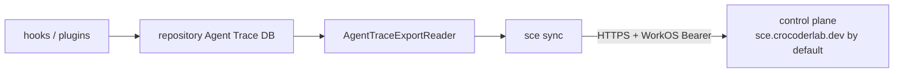

# sce sync command

`sce sync [--format text|json]` is the only user-invocable synchronization
command. It synchronizes the current repository's Agent Trace database with the
control-plane ingestion API. The former `sce trace` command group and its
database discovery, shell, list, status, and nested sync invocations are no
longer available; no compatibility alias is retained.

The Clap surface is defined in `cli/src/cli_schema.rs` and dispatched through
the static `RuntimeCommand::Sync` variant. The sync-owned command boundary lives
under `cli/src/services/sync/`; shared storage, export, authentication, and
control-plane protocol infrastructure remains in their existing services. The
same boundary owns a best-effort one-shot launcher used by the post-commit
hook when `agent_trace.auto_sync` is enabled: it resolves the current `sce`
executable, starts `sync --format json` in the repository root with null standard
streams, and does not wait for the child; executable and spawn failures are
ignored. The launcher is not a daemon or retry queue; local rows remain available
for a later manual or automatic invocation through the control-plane cursor
authority.
Sync orchestration owns its `SyncProgressEvent` lifecycle, batch, and
stream-completion payloads and publishes them through the consumer-typed,
library-independent `services::sync::progress::ProgressReporter<E>` contract.
Reporters may collect events or discard them with the no-op implementation;
the same sync-owned module supplies terminal presentation through that contract
rather than the synchronization algorithm importing terminal-library details.
There is no top-level `services::progress` module or cross-command progress
framework.
Text execution explicitly finalizes the reporter only after a successful sync;
failure paths retain their existing termination behavior, and the final sync
report remains owned by `render_sync` rather than the progress adapter.

## User flow

```
sce auth login          # obtain and store WorkOS credentials
cd <repository>         # any directory inside the target Git repository
sce sync                # synchronize this repository's Agent Trace DB
```

`sce sync --format json` produces the same synchronization with a machine-
readable stdout payload. Text mode creates the aligned multi-progress display
on stderr before stream batches begin; JSON mode emits no human progress or
lifecycle text.

## Composed data flow



The command resolves repository storage through `agent_trace_storage`, builds an
`AuthenticatedControlPlaneClient` from stored WorkOS credentials and the
resolved `control_plane_base_url`, then performs one authoritative `/state`
request before starting the four concurrent stream state machines:
`messages`, `parts`, `diff_traces`, and `agent_traces`. Batches and cursor
refreshes remain sequential within each stream, and final reporting retains the
fixed stream order.

The control plane is the sole cursor authority. Sync creates no local cursor,
`agent-trace-sync.db`, Turso Sync state, `BridgeLock`, or local data warehouse.
Repeated invocations are naturally incremental because each run starts from the
authoritative control-plane cursors.

## Output contract

The final text report contains only a completion heading after the progress
display. It says `Agent Trace already synced.` when all four streams uploaded
zero rows; otherwise it says `Agent Trace sync complete.`. During text mode,
four progress rows are created immediately
in the fixed order
`messages`, `parts`, `diff_traces`, `agent_traces`. Each row uses a 15-column
stream-label field, starts at `0 rows uploaded`, and has its own steady spinner.
Accepted batches update only their stream's cumulative count. A stream replaces
its spinner with a styled `✓` and its final count as soon as that stream's
sync future completes. Redirected/non-TTY stderr uses stable aligned plain
snapshots without ANSI or terminal-control sequences, while `NO_COLOR` also
disables the completion styling. JSON mode uses the no-op human-progress
sink, emits no progress on stderr, and emits this JSON-only stdout shape:

```json
{
  "status": "ok",
  "command": "sync",
  "streams": {
    "messages": {"uploaded": 0, "initialCursor": 0, "finalCursor": 0, "batches": 0},
    "parts": {"uploaded": 0, "initialCursor": 0, "finalCursor": 0, "batches": 0},
    "diffTraces": {"uploaded": 0, "initialCursor": 0, "finalCursor": 0, "batches": 0},
    "agentTraces": {"uploaded": 0, "initialCursor": 0, "finalCursor": 0, "batches": 0}
  }
}
```

Authentication refresh, conflict reconciliation, ambiguous batch recovery,
terminal protocol failures, ownership rejection, and sanitized control-plane
errors remain owned by `services::agent_trace_sync` and its control-plane
client. The command change does not alter those semantics.

## Related context

- [Agent Trace sync architecture](agent-trace-sync-command.md)
- [Agent Trace storage](agent-trace-storage.md)
- [Agent Trace export readers](../sce/agent-trace-export-readers.md)
- [CLI stdout/stderr contract](../sce/cli-stdout-stderr-contract.md)
- [Trace-sync progress stream contract](../decisions/2026-08-13-trace-sync-progress-stream-contract.md)
