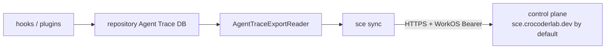

# sce sync command

`sce sync [--format text|json]` is the only user-invocable synchronization
command. It synchronizes the current repository's Agent Trace database with the
control-plane ingestion API. The former `sce trace` command group and its
database discovery, shell, list, status, and nested sync invocations are no
longer available; no compatibility alias is retained.

The Clap surface is defined in `cli/src/cli_schema.rs` and dispatched through
the static `RuntimeCommand::Sync` variant. The sync-owned command boundary lives
under `cli/src/services/sync/`; shared storage, export, authentication, and
control-plane protocol infrastructure remains in their existing services.

## User flow

```
sce auth login          # obtain and store WorkOS credentials
cd <repository>         # any directory inside the target Git repository
sce sync                # synchronize this repository's Agent Trace DB
```

`sce sync --format json` produces the same synchronization with a machine-
readable stdout payload. Text mode emits progress and lifecycle timestamps on
stderr; JSON mode emits no progress or lifecycle text.

## Composed data flow



The command resolves repository storage through `agent_trace_storage`, builds an
`AuthenticatedControlPlaneClient` from stored WorkOS credentials and the
resolved `control_plane_base_url`, then performs one authoritative `/state`
request before starting the four concurrent stream state machines:
`messages`, `parts`, `diff_traces`, and `agent_traces`. Batches and cursor
refreshes remain sequential within each stream, and final reporting retains the
fixed stream order.

The control plane is the sole cursor authority. Sync creates no local cursor,
`agent-trace-sync.db`, Turso Sync state, `BridgeLock`, or local data warehouse.
Repeated invocations are naturally incremental because each run starts from the
authoritative control-plane cursors.

## Output contract

The text report contains the completion heading, repository and source-instance
identifiers, and one row per stream with uploaded rows and final cursor. During
text mode, deterministic flushed stderr lines report start, accepted batches,
stream completion, and terminal completion; empty streams explicitly report no
new rows. JSON mode emits no human text and returns:

```json
{
  "status": "ok",
  "command": "sync",
  "repositoryId": "<repository-id>",
  "sourceInstanceId": "<source-instance-id>",
  "streams": {
    "messages": {"uploaded": 0, "initialCursor": 0, "finalCursor": 0, "batches": 0},
    "parts": {"uploaded": 0, "initialCursor": 0, "finalCursor": 0, "batches": 0},
    "diffTraces": {"uploaded": 0, "initialCursor": 0, "finalCursor": 0, "batches": 0},
    "agentTraces": {"uploaded": 0, "initialCursor": 0, "finalCursor": 0, "batches": 0}
  }
}
```

Authentication refresh, conflict reconciliation, ambiguous batch recovery,
terminal protocol failures, ownership rejection, and sanitized control-plane
errors remain owned by `services::agent_trace_sync` and its control-plane
client. The command change does not alter those semantics.

## Related context

- [Agent Trace sync architecture](agent-trace-sync-command.md)
- [Agent Trace storage](agent-trace-storage.md)
- [Agent Trace export readers](../sce/agent-trace-export-readers.md)
- [CLI stdout/stderr contract](../sce/cli-stdout-stderr-contract.md)
- [Trace-sync progress stream contract](../decisions/2026-08-13-trace-sync-progress-stream-contract.md)
