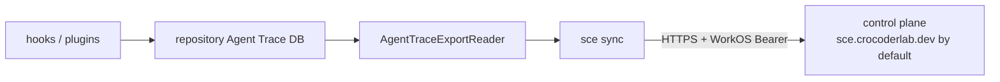

# sce sync command

`sce sync [--format text|json]` is the only user-invocable synchronization
command. It synchronizes the current repository's Agent Trace database with the
control-plane ingestion API. The former `sce trace` command group and its
database discovery, shell, list, status, and nested sync invocations are no
longer available; no compatibility alias is retained.

Sync and its repository storage, export-reader queries, and credential operations are directly awaited on the application-level multi-thread Tokio runtime. Repository storage remains alive across HTTP awaits through ordinary ownership; no blocking constructor/destructor scope or runtime-drop guard is needed. Progress remains alive through the await and presentation finalization occurs only on success. See [application execution runtime](../architecture.md#application-execution-runtime).

The Clap surface is defined in `cli/src/cli_schema.rs` and dispatched through
the static `RuntimeCommand::Sync` variant. The sync-owned command boundary lives
under `cli/src/services/sync/`; shared storage, export, authentication, and
control-plane protocol infrastructure remains in their existing services. The
same boundary owns a best-effort one-shot launcher used by the post-commit
hook when `agent_trace.auto_sync` is enabled: it resolves the current `sce`
executable, starts `sync --format json` in the repository root with null standard
streams, and does not wait for the child; executable and spawn failures are
ignored. The launcher is not a daemon or retry queue; local rows remain available
for a later manual or automatic invocation through the control-plane cursor
authority.
Sync orchestration owns its `SyncProgressEvent` lifecycle, batch, and
stream-completion payloads and publishes them through the consumer-typed,
library-independent `services::sync::progress::ProgressReporter<E>` contract.
Reporters may collect events or discard them with the no-op implementation;
the same sync-owned module supplies terminal presentation through that contract
rather than the synchronization algorithm importing terminal-library details.
There is no top-level `services::progress` module or cross-command progress
framework.
Text execution explicitly finalizes the reporter only after a successful sync;
failure paths retain their existing termination behavior, and the final sync
report remains owned by `render_sync` rather than the progress adapter.

## User flow

```
sce auth login          # obtain and store WorkOS credentials
cd <repository>         # any directory inside the target Git repository
sce sync                # synchronize this repository's Agent Trace DB
```

`sce sync --format json` produces the same synchronization with a machine-
readable stdout payload. Text mode creates the aligned multi-progress display
on stderr before stream batches begin; JSON mode emits no human progress or
lifecycle text.

## Composed data flow


```mermaid
flowchart LR
    A[hooks / plugins] --> B[repository Agent Trace DB]
    B --> C[AgentTraceExportReader]
    C --> D[sce sync]
    D -- "HTTPS + WorkOS Bearer" --> E[control plane<br/>sce.crocoderlab.dev by default]
```

The command resolves repository storage through `agent_trace_storage`, builds an
`AuthenticatedControlPlaneClient` from stored WorkOS credentials and the
resolved `control_plane_base_url`, then performs one authoritative `/state`
request before starting the three concurrent remote stream state machines:
`messages`, `parts`, and `agent_traces`. Batches and cursor refreshes remain
sequential within each stream, and final reporting retains the fixed stream
order. The three remote streams execute concurrently and are all driven to
terminal completion once started. The first observed stream error is returned
after the remaining started streams finish, preventing sibling cancellation from
interrupting credential persistence or other in-flight stream cleanup.

The local database has four capture streams (`messages`, `parts`,
`diff_traces`, `agent_traces`); `sce sync` remotely synchronizes three of them. `diff_traces`
stays local: sync never reads its rows, sends no batch with
`"stream": "diff_traces"`, and emits no progress event for it. See
[Agent Trace sync architecture](agent-trace-sync-command.md#local-capture-streams-versus-remote-streams)
for the release gate that governs this.

The control plane is the sole cursor authority. Sync creates no local cursor,
`agent-trace-sync.db`, Turso Sync state, `BridgeLock`, or local data warehouse.
Repeated invocations are naturally incremental because each run starts from the
authoritative control-plane cursors.

## Output contract

The final text report contains only a completion heading after the progress
display. It says `Agent Trace already synced.` when the three remote streams
(`messages`, `parts`, `agent_traces`) uploaded zero rows; otherwise it says
`Agent Trace sync complete.`. The `diffTraces` compatibility entry does not
affect the heading. During text mode, three progress rows are created
immediately in the fixed order `messages`, `parts`, `agent_traces`; there is no
`diff_traces` row. Each row uses a 15-column
stream-label field, starts at `0 rows uploaded`, and has its own steady spinner.
Accepted batches update only their stream's cumulative count. A stream replaces
its spinner with a styled `✓` and its final count as soon as that stream's
sync future completes. Redirected/non-TTY stderr uses stable aligned plain
snapshots without ANSI or terminal-control sequences, while `NO_COLOR` also
disables the completion styling. JSON mode uses the no-op human-progress
sink, emits no progress on stderr, and emits this JSON-only stdout shape:

```json
{
  "status": "ok",
  "command": "sync",
  "streams": {
    "messages": {"uploaded": 0, "initialCursor": 0, "finalCursor": 0, "batches": 0},
    "parts": {"uploaded": 0, "initialCursor": 0, "finalCursor": 0, "batches": 0},
    "diffTraces": {"uploaded": 0, "initialCursor": 0, "finalCursor": 0, "batches": 0},
    "agentTraces": {"uploaded": 0, "initialCursor": 0, "finalCursor": 0, "batches": 0}
  }
}
```

`streams.diffTraces` is a temporary compatibility no-op entry, retained so the
JSON shape does not change during the compatibility window. It always reports
`uploaded: 0` and `batches: 0`, with `initialCursor == finalCursor ==
state.cursors.diffTraces` from the `/state` response. It is built from that
server cursor alone, even when local `diff_traces` rows exist beyond it, and it
does not mean the stream is synchronized.

Authentication refresh, conflict reconciliation, ambiguous batch recovery,
terminal protocol failures, ownership rejection, and sanitized control-plane
errors remain owned by `services::agent_trace_sync` and its control-plane
client. The command change does not alter those semantics.

## Error classification

`cli/src/services/sync/command.rs`'s `classify_sync_error` maps the command's
terminal `TraceSyncError` into the typed `CliError` boundary through typed
predicates that traverse to `ControlPlaneError`, never string/substring
matching. An authentication failure from the initial `/state` call, a stream
batch request, or a stream reconciliation `/state` refresh
(`ControlPlaneError::MissingCredentials` or `AuthenticationFailed`) classifies
as `CliError::User { error: UserError::NotAuthenticated, .. }`. A credential
storage failure (`ControlPlaneError::Storage`) from the initial `/state` call,
a stream batch request, or a stream reconciliation `/state` refresh classifies
as `CliError::User { error: UserError::AuthStorageUnavailable, .. }`.
Stream authentication failures still use `NotAuthenticated`. Both user cases
preserve the technical error as their optional source. Every other
`ControlPlaneError` (`Forbidden`, `BadRequest`, `Transport`, `ServerError`,
`InvalidResponse`, `Protocol`) and runtime failures classify as
`CliError::User { error: UserError::UnexpectedFailure, .. }`; the technical
source remains available for observability.
`sync/command.rs` builds no friendly sentence and applies no terminal styling
itself — `app_support` renders the catalog message for user cases. See [CLI error-code
taxonomy](../sce/cli-error-code-taxonomy.md) for the full `CliError`/`UserError`
architecture.

## Related context

- [Agent Trace sync architecture](agent-trace-sync-command.md)
- [Agent Trace storage](agent-trace-storage.md)
- [Agent Trace export readers](../sce/agent-trace-export-readers.md)
- [CLI stdout/stderr contract](../sce/cli-stdout-stderr-contract.md)
- [CLI error-code taxonomy](../sce/cli-error-code-taxonomy.md)
- [Trace-sync progress stream contract](../decisions/2026-08-13-trace-sync-progress-stream-contract.md)
- [Automatic Agent Trace synchronization](agent-trace-auto-sync.md)
- [Retire diff_traces from remote sync through a staged compatibility gate](../decisions/2026-10-01-retire-diff-traces-remote-sync-compatibility-gate.md)
