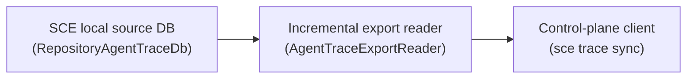

# Agent Trace export readers (read-only)

`cli/src/services/agent_trace_export/mod.rs` defines `AgentTraceExportReader<'a>`, the local read/export boundary between one repository-scoped Agent Trace source database and outbound sync. It is purely additive over the existing schema: it adds no table, no migration, and no writer.

## Layering



- **SCE local source DB** — the existing repository-scoped `RepositoryAgentTraceDb` (see [agent-trace-db.md](agent-trace-db.md)), written by the hook/lifecycle paths already documented there. This reader does not change its writer, schema, or migrations.
- **Incremental export reader** — `AgentTraceExportReader<'a>`, described below. Read-only, stateless across calls, no network.
- **Control-plane client** — `sce trace sync` (see [agent-trace-sync-command.md](../cli/agent-trace-sync-command.md)) composes this reader with the authenticated control-plane HTTP client; the reader itself remains unaware of that caller.

## Composition point

`AgentTraceExportReader::new(&db)` takes a `&RepositoryAgentTraceDb` directly. The reader does not resolve storage, open a database, or generate identity itself. The existing storage resolver composes cleanly with it:

```rust
let storage = resolve_agent_trace_storage_at_state_root(&context, &state_root)?;
let reader = AgentTraceExportReader::new(&storage.db);
let rows = reader.read_messages_after(cursor, limit)?;
```

`storage.metadata` (`RepositoryMetadata { repository_id, source_instance_id }`, see [agent-trace-db.md](agent-trace-db.md#repository-scoped-adapter-seam)) identifies *which* physical database produced the rows; the reader never reads, generates, or accepts a source identity of its own. Identity and progress tracking are deliberately separate concerns:

- `repository_id` / `source_instance_id` identify the *source* (the physical database).
- Each stream's `table.id` (returned as `sourceRowId`) is the per-stream *progress marker* — the caller's cursor. It has no relationship to `source_instance_id` and is never used to derive or validate it.

Test coverage: `cli/src/services/agent_trace_export/mod.rs::tests::source_instance_integration` resolves storage through `resolve_agent_trace_storage_at_state_root`, asserts both metadata fields are populated, and reads one stream through a reader built from `storage.db`.

## Reader contract

Four methods, one per capture stream, sharing one shape: `(cursor: i64, limit: usize) -> Result<Vec<...>>`, running

```sql
SELECT ... FROM <table> WHERE id > ?1 ORDER BY id ASC LIMIT ?2
```

against `messages`, `parts`, `diff_traces`, and `agent_traces` respectively (`read_messages_after`, `read_parts_after`, `read_diff_traces_after`, `read_agent_traces_after`). `cursor` is the last server-accepted `id` for that stream; the reader makes no gap or contiguity assumption about IDs. `diff_traces.patch` / `payload_type` and `agent_traces.trace_json` are returned raw and unmodified — no patch parsing, no JSON reparsing.

Every call validates, before executing any query:

- `cursor >= 0`
- `1 <= limit <= AGENT_TRACE_EXPORT_BATCH_SIZE` (500)

and validates, per returned row before returning:

- every exportable numeric field falls within `0..=9_007_199_254_740_991` (`Number.MAX_SAFE_INTEGER`), rejecting out-of-range rows instead of truncating or casting.

Each stream has an owned `serde::Serialize` export-row DTO (`AgentTraceMessageExportRow`, `AgentTracePartExportRow`, `AgentTraceDiffTraceExportRow`, `AgentTraceAgentTraceExportRow`) with `#[serde(rename_all = "camelCase")]` matching the shipped control-plane ingestion contract; `sourceRowId` is the local `id` unmodified. `post_commit_patch_intersections` is not exported by any reader method.

## What does not exist

This reader introduces no local sync state and no outbound transport:

- No local sync cursor is stored anywhere; the caller (`sce trace sync`) derives cursors from the control plane's `/state` response on every invocation, entirely outside this module.
- No `agent-trace-sync.db` or any other new database or table exists.
- No Turso Sync, no ETL pipeline, and no data-warehouse (DWH) integration exists.
- No network call, no HTTP client, and no auth/WorkOS code exists in this module.

See also: [agent-trace-db.md](agent-trace-db.md), [agent-trace-sync-command.md](../cli/agent-trace-sync-command.md), [context-map.md](../context-map.md)
