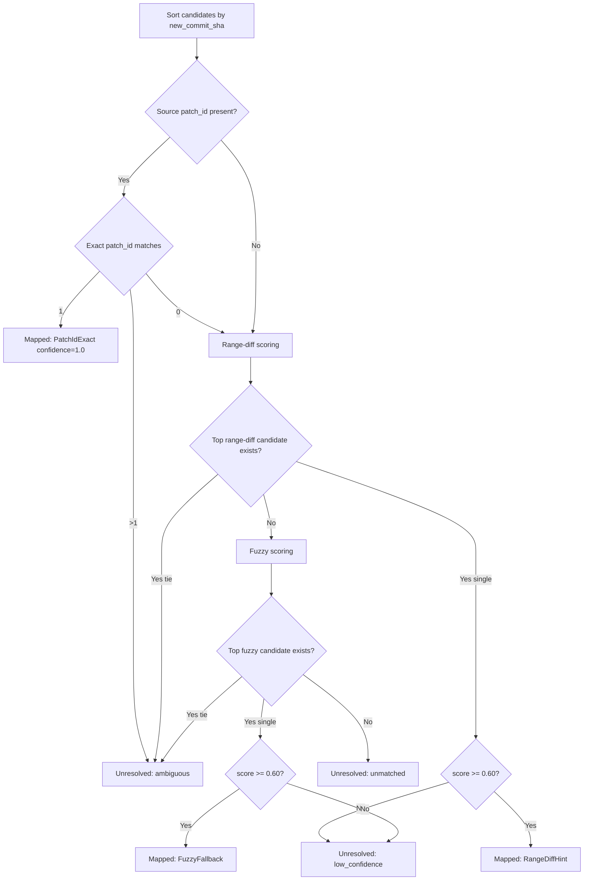

# Agent Trace Rewrite Mapping Engine

## Status
- Plan: `agent-trace-attribution-no-git-wrapper`
- Task: `T13`
- Code surface: `cli/src/services/hosted_reconciliation.rs`

## Goal
Resolve hosted/local rewrite old->new commit identity with deterministic, explainable mapping outcomes before downstream rewrite persistence and trace transformation.

## Engine contract
- Entry point: `map_rewritten_commit(source, candidates)`.
- Inputs:
  - `RewriteSourceCommit`: old commit SHA + optional source patch-id.
  - `RewriteCandidateCommit`: new commit SHA + optional `patch_id`, `range_diff_score`, `fuzzy_score`.
- Score contract:
  - `Score` is constrained to finite `[0.0, 1.0]`.
  - Mapping threshold: `FUZZY_MAPPING_THRESHOLD = 0.60`.
  - Tie window: score comparisons use `SCORE_TIE_EPSILON = 0.00001`; score deltas within epsilon are treated as ties.
- Determinism:
  - Candidates are sorted by `new_commit_sha` before decisioning.
  - Tied top-score outcomes are returned in stable SHA order.

## Decision precedence
1. Patch-id exact match
   - If exactly one candidate patch-id matches source patch-id, map with:
     - `method = PatchIdExact`
     - `confidence = 1.0`
     - `quality = final`
   - If multiple exact patch-id matches exist, return unresolved `ambiguous`.
2. Range-diff scoring
   - Select highest `range_diff_score` when no patch-id mapping exists.
   - Near-equal top scores (within epsilon tie window) return unresolved `ambiguous`.
   - Highest score `< 0.60` returns unresolved `low_confidence`.
3. Fuzzy fallback scoring
   - Applied only when no patch-id or range-diff resolution exists.
   - Uses the same epsilon tie-window and threshold behavior as range-diff.
4. Unmatched
   - If no usable range-diff or fuzzy signals exist, return unresolved `unmatched`.

## Confidence to quality mapping
- `>= 0.90` -> `final`
- `0.60..0.89` -> `partial`
- `< 0.60` -> unresolved `low_confidence` (mapped output is not emitted)

## Unresolved outcomes
- `ambiguous`: two or more candidates tied for best score or multiple patch-id exact matches.
- `unmatched`: candidates exist but no scoring signal exists.
- `low_confidence`: best available score is below `0.60`.

## Verification coverage
- Exact match fixture: patch-id match wins over stronger non-exact scores.
- Ambiguous fixture: tied best range-diff scores return deterministic unresolved candidates.
- Epsilon fixture: near-equal range-diff scores within epsilon return unresolved `ambiguous` with deterministic candidate ordering.
- Distinct fixture: range-diff scores outside epsilon resolve to a single mapped winner.
- Unmatched fixture: no score signals produces `unmatched`.
- Low-confidence fixture: fuzzy best score `< 0.60` returns `low_confidence`.

## Mapping flow

