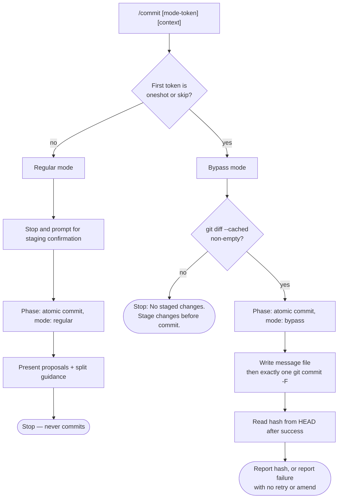

# Atomic Commit Workflow

Behavior contract for the generated `/commit` workflow.

## Current surface

Canonical behavior is authored in `config/pkl/base/workflow-commit.pkl` from the
project-root `.pi/` baseline and generated for OpenCode, Claude, and Pi.

Every target emits one thin command (Pi: prompt) invoking `sce-commit`. The
package contains `SKILL.md`, which owns mode routing, proposal/commit control
flow, and internal statuses; `references/atomic-commit.md`, which owns staged-diff
analysis, message construction, commit-message rules, and the atomic-commit result
contract; and `references/output.md`, which owns all human-visible prompts and
result layouts. The phase reference is read only after the selected path clears
its pre-phase gate.

No target emits an `sce-atomic-commit` package or invokes it as a sibling skill;
each `sce-commit` package embeds the canonical phase behavior directly.
`sce-atomic-commit` names the canonical authoring module and that internal phase.

## Modes

`/commit` takes an optional argument. Its first whitespace-separated token
selects the mode; everything else is free-form commit context that refines
message wording only.

- `oneshot` or `skip` as the exact first token, compared case-insensitively,
  selects **bypass mode**. The two aliases are behaviorally identical.
- Any other first token, or no argument at all, selects **regular mode**.

Nothing else selects bypass — not the commit context, not repository state.

## Regular mode

Proposal-only. The command stops before invoking the skill and asks the user to
stage everything they intend to commit, because atomic commits should contain
only intentionally staged changes. After confirmation, the skill analyzes the
staged diff and returns one or more messages.

When the staged changes pursue unrelated goals, the skill returns one message
per coherent unit plus the rationale and file grouping for the split. When they
form one unit, it returns one message and no split guidance.

The command presents the proposals and stops. It never runs `git commit`; the
user runs the commits they accept.

## Bypass mode

Single-message, command-committed. The command first checks that staged content
exists and stops with `No staged changes. Stage changes before commit.` when
nothing is staged. It then requests exactly one message covering all staged
files, writes that message verbatim to a temporary message file, and runs
`git commit -F <message-file>` exactly once. The multiline message is never
interpolated into shell source or a shell command.

Only after the commit succeeds does the command retrieve the hash explicitly
from `git rev-parse --verify HEAD^{commit}`; it never parses Git's human-readable
output. On failure it reports the failure and stops — no retry, amend, additional
staging, fallback commit, or fabricated hash.

Bypass mode relaxes three regular-mode rules: no split proposals, no
context-file guidance gating, and plan citations are best-effort rather than
blocking.

## Ownership boundary

The command owns user prompting, mode routing, the staged-content precondition,
and the single `git commit`. The skill owns everything about what the commit
says:

- Reading and analyzing the staged diff.
- Deciding whether staged changes form one coherent unit or several.
- Choosing scope and writing every subject and body.
- The plan-citation body rule.
- Staged-scope classification and context-file guidance gating.

Each rule is stated once by its owner. The skill never commits and never asks
about staging.

## Staged truth

Staged changes are the only input describing what is being committed. Neither
document reads unstaged or untracked changes, and neither stages, unstages, or
otherwise modifies files. Supplied commit context refines wording but never
overrides the diff and never adds a claim the diff does not support.

## Plan citations

When a commit's staged files include `context/plans/*.md`, its body cites the
affected plan slug and every updated task ID. Plan slugs and task IDs are never
invented.

When the staged plan diff does not expose them clearly enough to cite
faithfully, regular mode blocks and asks for the reference to be stated or
staged explicitly; bypass mode omits the citation instead of stopping.

## Result contract

The canonical analysis phase reaches exactly one of three results. The full
field-level contract is consolidated into `references/atomic-commit.md`; the
removed `commit-contract.yaml` and `commit-message-style.md` documents are not
generated, and no replacement `commit-contract.md` is used.

- `proposal` — regular mode, one or more messages and an optional split rationale.
- `bypass_message` — bypass mode, exactly one message plus the full staged file
  list.
- `blocked` — messages cannot be written faithfully. Categories are
  `no_staged_changes`, `plan_citation_ambiguity`, `unreadable_diff`, and
  `contradictory_context`.

Every target keeps that status as internal `sce-commit` state and renders only
the applicable layout from `references/output.md`; no result is serialized
between packages. Every staged file still belongs to exactly one commit message. The analysis phase never reports a hash;
only successful bypass-mode `git commit` produces one.

## Related context

- [SCE workflow ownership table](dedup-ownership-table.md)
- [Plan/Code overlap map](plan-code-overlap-map.md)
- [Context workflow rules](context-workflow-rules.md)
