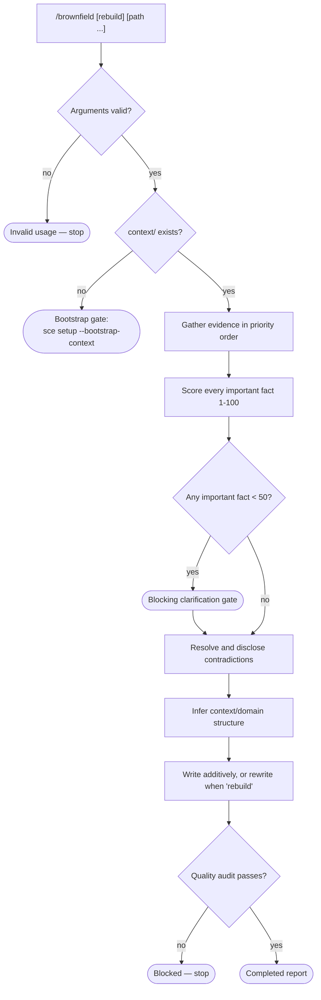

# Brownfield Workflow

Behavior contract for `/brownfield`: reconstruct durable `context/` memory from
an existing repository's own evidence.

## Current surface

`/brownfield` is the sixth catalog-registered SCE workflow, generated for
OpenCode, Claude, and Pi from `config/pkl/base/workflow-brownfield.pkl`. Each
target emits one thin command or prompt routed to exactly one two-file
`sce-brownfield` package (`SKILL.md`, `references/output.md`), and the
repository-root `.pi`, `.claude`, and `.opencode` dogfood mirrors all carry it.
Its catalog record assigns the existing `shared-context-code` OpenCode routing
role, so the Code agent's derived permission list gains `"sce-brownfield":
allow` and no third routing role exists.

Its behavior was authored first as the project-root `.pi/` baseline described in
[Patterns](../patterns.md) ("Use the project-root `.pi/` workflows as the
behavioral baseline for canonical workflow packages"), and the canonical
module's package-mode render still reproduces those baseline documents.

Like [`sce-handover`](handover-workflow.md), `sce-brownfield` is phase-free, so
its structured composite source lists no phases and exposes one
`references/output.md`. Its preamble is a semantic reference rather than a
package-only block: composite rendering drops the preamble the shared renderer
supplies itself but keeps the cold-start and gap-fill scope statement below,
which that renderer has no generic equivalent for.

Generation contracts enforce the workflow rather than merely permitting it:
`generation-contract-check.pkl` requires the expanded exact inventory and asserts
that every generated `sce-brownfield` `SKILL.md` still carries the bootstrap
gate, the documentation-discovery sweep and no-network rule, the sub-`50`
blocking threshold, the always-disclosed contradiction contract, and the
additive-vs-`rebuild` write rule. See [Architecture](../architecture.md).

`/brownfield` is a cold-start and gap-fill tool, not recurring context
maintenance. Ongoing maintenance stays owned by the task and plan
synchronization phases described in
[Context workflow rules](context-workflow-rules.md).

## Arguments

`[rebuild] [path ...]`:

- An optional leading literal `rebuild` token, and only that token, grants
  rewrite authority over existing context files. It is never inferred from
  conversation content, repository state, or the apparent staleness of context.
- Every remaining token is an additional local documentation path — a file or
  directory, inside or outside the repository — read as evidence.
- `rebuild` is recognized only in first position; elsewhere it is a path. A
  token that resolves to no readable local path is invalid usage.

## Flow

## Bootstrap boundary

The context-root check precedes all investigation and writing. When `context/`
is absent the workflow renders the bootstrap gate naming
`sce setup --bootstrap-context`, reads no evidence, and stops. It never creates
the `context/` root and never writes outside it, matching every other workflow's
bootstrap boundary.

## Evidence contract

Evidence is strictly local and gathered in this priority order. When sources
disagree, the earlier class wins:

1. **Current code** — entry points, published interfaces, module boundaries and
   dependency direction, data shapes and persistence, error handling and
   configuration surfaces. Highest authority; nothing later overrides it.
2. **Tests, schemas, migrations, build and runtime configuration** — executable
   truth for intended behavior, the data model, the artifact set, and
   operational behavior.
3. **Discovered documentation** — an explicit sweep rather than a README
   assumption: root Markdown, `docs/`/`doc/`/`documentation/`/`wiki/`/`adr/`/
   `decisions/`/`rfcs/`/`design/`/`notes/` at any depth, per-package `README`/
   `CONTRIBUTING`/`ARCHITECTURE`/`CHANGELOG`, module-level comment blocks, and
   committed agent-instruction files such as `AGENTS.md`.
4. **Argument-supplied local paths** — read at the same authority as discovered
   documentation; directories are read recursively.
5. **Git history** — no less than three months measured back from the current
   date, for when and why current structure arrived, migrations and reversals,
   and recurring risk areas. Older history is read only when recent evidence
   points at a still-relevant decision, migration, rename, deletion, or risk.
   It is the weakest class for current truth.

The workflow performs no network access: no URL fetch, web search, package
registry query, remote API call, or external documentation lookup. Insufficient
local evidence is a gap or a clarification question, never a reason to look
outside the repository.

## Confidence model

An important fact is any statement that would be written into `context/` as
durable truth. Each carries an internal `1`–`100` score assigned from evidence,
not plausibility:

| Score | Status | Basis |
| --- | --- | --- |
| `90`–`100` | Verified | Directly observable in current code or executable configuration |
| `70`–`89` | Strongly supported | Consistent across two independent evidence classes |
| `50`–`69` | Inferred | One evidence class, contradicted by none, not directly observable |
| `1`–`49` | Clarification required | Guessed, doc/history-only, or genuinely ambiguous |

A fact whose evidence conflicted and was resolved carries the status
`Contradiction resolved` and is scored after resolution.

The ledger is internal state and chat evidence only. No score, and nothing
derived from one, is written under `context/`.

## Blocking clarification gate

Any important fact scoring below `50` blocks. It is not written as truth and is
not hedged or omitted to avoid asking. Blocking facts are grouped by area, and
each question offers at least two concrete options drawn from the evidence plus
an explicit freeform answer. No context file is written while waiting.

Answers rescore the affected facts and the workflow continues in the same
session. An unanswered question leaves its fact unwritten and listed as a gap.

## Contradiction handling

A contradiction is material when the conflicting statements would produce
different context. Material contradictions are resolved by evidence priority
and are always disclosed in the report with a classification — stale
documentation, superseded decision, divergent implementations, or unexplained
history — and the interpretation written to context. None is ever resolved
silently. One that evidence priority cannot resolve becomes a blocking
clarification.

## Writing contract

Writes are additive by default: missing files and missing domains only, never
overwriting, truncating, moving, renaming, or deleting an existing context file.
A planned file that already exists is left untouched and reported as skipped,
even when the existing content looks thinner than what was found.

The literal `rebuild` token is the only thing that grants rewrite authority, and
even then:

- Only files this reconstruction has evidence for are rewritten.
- No context file is ever deleted, in either mode.
- `context/plans/`, `context/handovers/`, `context/decisions/`, and
  `context/tmp/` are never touched — other workflows own them.
- A context file with uncommitted changes is never modified.

Every write describes current state rather than the investigation that found it,
and never carries a confidence score, commit hash, timestamp, or date. Structure
is inferred from the repository's own boundaries and terminology rather than a
generic template, and every created or updated domain file is linked from
`context/context-map.md`. File hygiene follows the repository-wide rules in
[Context workflow rules](context-workflow-rules.md): one topic per file, at most
250 lines, relative links, diagrams where structure is complex, and glossary
entries for new domain language.

## Quality audit

Every audit item is blocking rather than advisory: prohibited content under
`context/`, context-map reachability, line and topic limits, relative resolving
links, no sub-`50` fact written as truth, no overwrite without `rebuild` and no
deletion in either mode, nothing written outside `context/`, and every material
contradiction present in the report. An unambiguous repair is applied and the
item rerun; anything else blocks with the preserved files and a retry condition.

## Related context

- [Context workflow rules](context-workflow-rules.md)
- [Handover workflow](handover-workflow.md) (the other phase-free, self-contained workflow)
- `context/plans/brownfield-workflow.md` (source plan)
- [Patterns](../patterns.md) (project-root `.pi/` as the canonical authoring baseline)
- [Architecture](../architecture.md) (workflow catalog, composite renderer, and generation-contract inventory)
