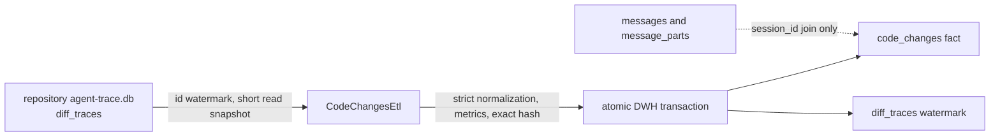

# Code-Change ETL

`CodeChangesEtl` is the CLI-independent incremental bridge from repository-scoped Agent Trace `diff_traces` rows to the DWH `code_changes` fact table. It accepts an open `RepositoryAgentTraceDb` and an `AgentTraceDwhReplica`; source metadata supplies the stable `source_instance_id`. The runner owns neither credentials nor remote transport.

## Incremental contract

`CodeChangesEtl::default()` uses batches of 500. `with_batch_size()` rejects zero and provides the bounded configuration seam. Each run reads the `(repository_id, source_instance_id, diff_traces)` watermark, treating an absent watermark as zero, and extracts only `id > watermark ORDER BY id ASC LIMIT batch_size`. It repeats until an empty batch and reports extracted, inserted, already-present, batch, and before/after watermark statistics.

Extraction selects exactly `id`, `time_ms`, `session_id`, `patch`, `model_id`, `tool_name`, `tool_version`, and `payload_type` into owned `SourceDiffTrace` values. The plain read transaction ends before parsing, hashing, metrics, or destination work. Only transient Busy/database-locked source contention is retried with the shared bounded rollback/backoff mechanics, so source writers can continue.

## Transformation and loading

`patch` and `structured` payloads use the shared strict normalization boundary and produce `ParsedPatch`; malformed, unsupported, future, and invalid-time payloads fail before destination work. Source metadata is preserved, including nullable `model_id` and `tool_version`. `files_changed` counts parsed files, while `lines_added` and `lines_removed` count every touched line by `TouchedLineKind` with checked destination-sized conversion. `patch_sha256` is lowercase hexadecimal SHA-256 over the exact original UTF-8 `patch` bytes, regardless of payload type.

A destination batch ensures repository/source lineage and uses `(repository_id, source_instance_id, source_diff_trace_id)` as its identity. Missing rows are inserted; identical synchronized and derived values count as `already_present`; any mismatch is an integrity conflict and never overwrites the existing row. Facts, lineage dimensions, and the watermark commit together, so a failure leaves progress behind for complete replay without duplicates.

`AgentTraceDwhReplica::run_code_changes_etl()` delegates to `CodeChangesEtl` while retaining replica lock ownership. Pull and push remain explicit caller operations; the runner does not acquire credentials or call either transport method.

## Conversation relationship

A code-change row preserves `session_id` and can be queried with DWH `messages` and `message_parts` for that same repository/session. `code_changes` has no `message_id`, and the ETL does not infer one. The captured relationship proves session membership only; it does not establish causality between a code change and an individual conversation message.

See also: [agent-trace-etl.md](agent-trace-etl.md), [agent-trace-db.md](agent-trace-db.md), [agent-trace-dwh-db.md](agent-trace-dwh-db.md), [agent-trace-dwh-replica.md](agent-trace-dwh-replica.md), [conversation-etl.md](conversation-etl.md), [../architecture.md](../architecture.md), [../glossary.md](../glossary.md), and [../context-map.md](../context-map.md).
