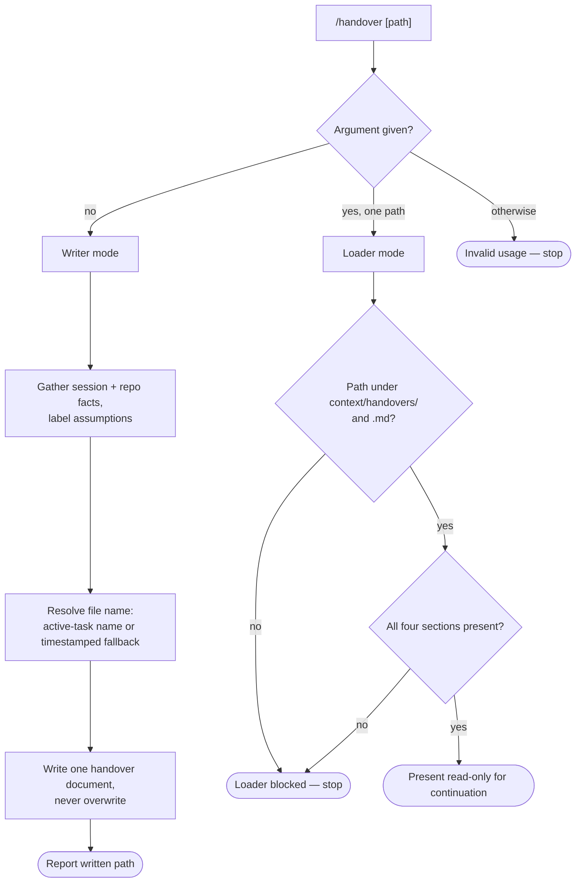

# Handover Workflow

Behavior contract for the `/handover` workflow: the fifth canonical SCE
workflow, generated for OpenCode, Claude, and Pi from
`config/pkl/base/workflow-handover.pkl`.

## Current surface

`/handover` is registered in `config/pkl/base/workflow-catalog.pkl` (OpenCode
role: `shared-context-code`) and wired into
`config/pkl/renderers/workflow-composite.pkl`, so all three targets generate
one thin command routed to exactly one `sce-handover` skill package. The
repository-root dogfood mirrors — `.pi/prompts/handover.md` +
`.pi/skills/sce-handover/`, `.claude/commands/handover.md` +
`.claude/skills/sce-handover/`, and `.opencode/command/handover.md` +
`.opencode/skills/sce-handover/` — are kept byte-identical to canonical
generation, the same as the other four workflows.

Unlike the other four workflows, `sce-handover` has no phases: its base
module's `structuredComposite.phases` listing is always empty, so its `SKILL.md`
never renders an `## Embedded phase behavior` appendix. Composite-mode
rendering (used by every generated target) supplies the shared generic
Purpose / User-visible-output / Composite-control-flow preamble from
`workflow-composite.pkl`, distinct from the skill's own package-mode-only
Purpose text.

The package contains only `SKILL.md`, which owns mode routing, writer and
loader behavior, and internal statuses, plus `references/output.md`, which
owns every human-visible layout. No sibling skill or workflow command is
invoked.

## Modes

`/handover` takes an optional single argument that selects the mode:

- No argument selects **writer mode**.
- Exactly one path argument selects **loader mode**.
- Anything else is invalid input; the skill states expected usage and stops.

## Writer mode

Gathers task-relevant facts from the current conversation and grounds them
against repository state (`git status`/`git diff`, the active
`context/plans/*.md` task, recent commits). Any detail not directly evidenced
is labeled as an assumption rather than presented as fact.

The written file name is `context/handovers/{plan_name}-{task_id}.md` when
exactly one plan task is unambiguously active, otherwise the collision-safe
timestamped fallback `context/handovers/handover-{YYYY-MM-DD-HHMMSS}.md`.
Writer mode never overwrites an existing handover file.

The persisted document always has four required sections, in order:
`Current Task State`, `Decisions Made`, `Open Questions / Blockers`, and
`Next Recommended Step`, plus a trailing `Assumptions` section. A section with
nothing to report still appears, stating `None identified.` or an equivalent.

## Loader mode

Read-only. The argument must resolve to an existing Markdown file under
`context/handovers/`; anything else is rejected without guessing an
alternate file. The loaded file must contain all four required sections, or
loading is blocked.

On success, the skill presents the loaded task state, decisions, open
questions, and next recommended step for continuation in the current session.
It never edits a file, marks a plan task complete, or begins the recommended
next step — loading only surfaces guidance.

## Related context

- [Context workflow rules](context-workflow-rules.md)
- `context/plans/handover-workflow.md` (source plan)
- `context/architecture.md` (canonical workflow catalog, composite renderer, and generation-contract inventory covering all five workflows)
- `context/decisions/2026-07-30-restore-handover-cross-target-workflow.md` (restores this workflow as the fifth catalog-registered cross-target workflow)
