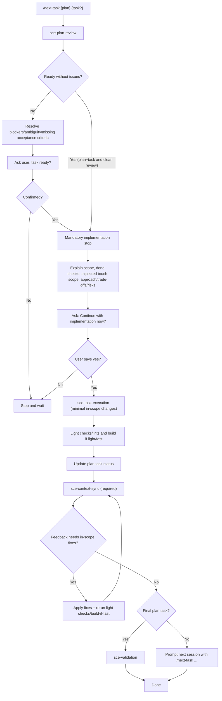

# Shared Context Code Workflow (`/next-task`)

## What this agent is for

The Shared Context Code agent executes exactly one approved plan task from `context/plans/`, validates behavior, and synchronizes `context/` to match current code truth.

Use this agent when you need to:
- continue implementation from an existing SCE plan
- run a specific plan task (`T0X`) or the next unchecked task
- enforce scoped, approval-gated implementation
- treat context synchronization as a required done gate

## Command entrypoint

Canonical command:

`/next-task {plan_name_or_path} {T0X?}`

Examples:
- `/next-task feature-auth T01`
- `/next-task context/plans/feature-auth.md T03`
- `/next-task feature-auth`

## Workflow behavior

`/next-task` keeps orchestration/gating responsibilities, while detailed per-phase contracts are owned by the three phase skills.

1. Run `sce-plan-review` to resolve plan target, task selection, and readiness.
2. Apply the plan-review confirmation gate.
   - Auto-pass only when both plan and task ID are provided and review reports no blockers, ambiguity, or missing acceptance criteria.
   - Otherwise, resolve open points and require explicit user confirmation.
3. Run `sce-task-execution`.
   - Mandatory implementation stop is enforced by the skill before edits.
   - Scoped implementation, light checks/build-if-fast, and plan status updates are skill-owned.
4. Run `sce-context-sync` as a mandatory done gate.
   - Context significance classification and root verify-vs-edit behavior are skill-owned.
5. Wait for feedback; if in-scope fixes are needed, apply fixes, rerun light checks/build-if-fast, and sync context again.
6. If this is the final plan task, run `sce-validation`.
7. If more tasks remain, prompt the next-session command for the next task.

## Mermaid diagram

## Guardrails

- One task per session by default unless user explicitly approves multi-task execution.
- Do not expand scope without explicit approval.
- Code is the source of truth when context and code disagree.
- Context sync is required before the task is considered done.
