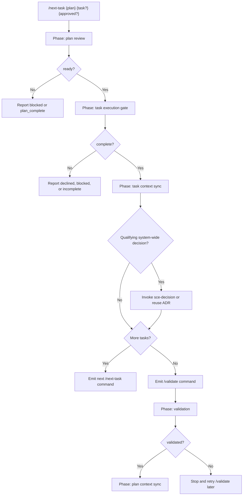

# Shared Context Code Workflows (`/next-task`, `/validate`)

## Purpose

The implementation lifecycle executes at most one reviewed task per `/next-task` invocation, synchronizes durable context only after successful task execution, and runs final plan validation separately through `/validate`. The generated OpenCode Code agent only routes to these commands. Every target embeds each complete lifecycle in `sce-next-task` or `sce-validate`; the phases below are canonical authoring source and internal phases of those skills, not separate generated packages.

## `/next-task` entrypoint

`/next-task {plan-name-or-path} [T0X] [approved]`

- The plan is required.
- A task ID is optional and must match `T01`, `T02`, and so on.
- The exact token `approved` is optional and may be supplied with or without a task ID.
- Unknown positional tokens are rejected.

## `/next-task` phase ownership

Phase names below identify canonical modules in `config/pkl/base/workflow-next-task.pkl` and `workflow-context-sync.pkl`, and the internal phases they compose into.

1. `sce-plan-review`
   - Resolves exactly one plan and at most one task.
   - Selects the requested task or the first incomplete task whose declared dependencies are complete.
   - Returns `ready`, `blocked`, or `plan_complete`.
2. `sce-task-execution`
   - Receives the complete `ready` result.
   - Always presents the implementation gate before editing.
   - Waits for confirmation unless the user supplied `approved` to the command.
   - Implements and verifies exactly one task, then records status and evidence in the plan.
   - Returns `declined`, `blocked`, `incomplete`, or `complete`.
3. `sce-task-context-sync`
   - Runs only from the complete successful execution handoff.
   - Reconciles one task with durable context and performs the mandatory root-file pass.
   - Applies the system-wide decision gate before current-state context edits. Routine,
     local, temporary, and easily reversible choices skip decision writing; each
     qualifying decision reuses an existing ADR or invokes `sce-decision` once.
   - A blocked decision handoff blocks synchronization; written or reused ADR paths
     become synchronization evidence and are available for current-state links.
   - Returns a Markdown report with `synced`, `no_context_change`, or `blocked`.
   - Every report variant lists changed files outside `context/` under `Updated files`;
     task reports omit the impact classification and rendered root-pass checklist
     without changing synchronization behavior.
4. Command continuation
   - Emits exactly one next-task command for the first unchecked task in plan order, or a `/validate` command when all implementation tasks are complete.
   - Never executes the continuation in the same invocation.

A context-sync blocker does not undo successful implementation: the task remains complete in the plan, but the workflow stops because durable context is stale. On every target, review, approval, execution, evidence recording, synchronization, and continuation are internal phases of one `sce-next-task` invocation. The sole sibling-skill exception is the synchronization decision gate's bounded invocation of `sce-decision`.

## `/validate` entrypoint

`/validate {plan-name-or-path}`

1. `sce-validation` verifies that implementation tasks are complete, runs the plan's full validation commands and acceptance checks, cleans temporary scaffolding, and writes the Validation Report.
2. Failed or blocked validation ends the session without repair edits; retry uses `/validate {plan-path}`.
3. `sce-plan-context-sync` runs only from a successful `Status: validated` handoff, applies the same decision gate before current-state edits, and reconciles the completed plan with durable repository context. ADR paths already written during task synchronization are reused for the same decision.

On every target, those validation and plan-sync phase bodies appear directly inside workflow steps 1 and 2 of one `sce-validate` skill, while the plan-file Validation Report format remains a trailing appendix after the workflow rules. Failed and blocked statuses stop before synchronization exactly as in the canonical flow. Final validation never runs from an individual implementation task.

## Flow

```mermaid
flowchart TD
    A["/next-task {plan} {task?} {approved?}"] --> B["Phase: plan review"]
    B --> C{"ready?"}
    C -- "No" --> D["Report blocked or plan_complete"]
    C -- "Yes" --> E["Phase: task execution gate"]
    E --> F{"complete?"}
    F -- "No" --> G["Report declined, blocked, or incomplete"]
    F -- "Yes" --> H["Phase: task context sync"]
    H --> Q{"Qualifying system-wide decision?"}
    Q -- "Yes" --> R["Invoke sce-decision or reuse ADR"]
    Q -- "No" --> I{"More tasks?"}
    R --> I
    I -- "Yes" --> J["Emit next /next-task command"]
    I -- "No" --> K["Emit /validate command"]
    K --> L["Phase: validation"]
    L --> M{"validated?"}
    M -- "Yes" --> N["Phase: plan context sync"]
    M -- "No" --> O["Stop and retry /validate later"]
```

## Target ownership

- OpenCode, Claude, and Pi: thin commands (Pi: prompts) invoking `sce-next-task` or `sce-validate`; each package contains only `SKILL.md` and `references/output.md`.
- OpenCode adds `entry-skill` and a one-entry `skills` list naming that skill. Its Code routing agent allows `sce-next-task`, `sce-validate`, and `sce-commit`, plus internal `sce-decision` invocation; the Plan agent does not allow `sce-decision`.

## Canonical sources

- `config/pkl/base/workflow-next-task.pkl`
- `config/pkl/base/workflow-validate.pkl`
- `config/pkl/base/workflow-context-sync.pkl`
- Workflow composition: `config/pkl/renderers/workflow-composite.pkl` (shared; Claude and Pi consume it)
- Behavioral baselines: `.pi/prompts/{next-task,validate}.md`
