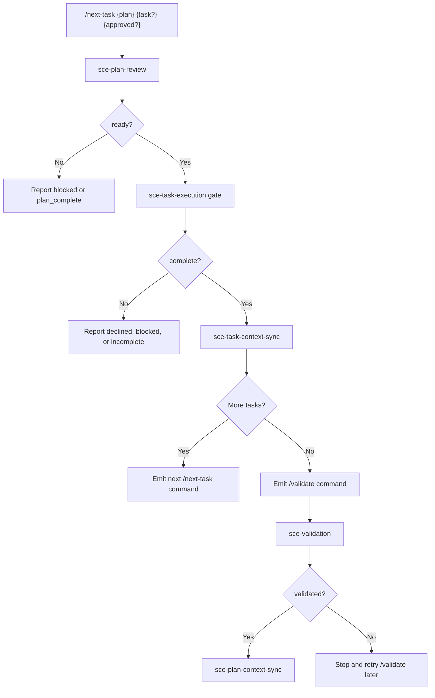

# Shared Context Code Workflows (`/next-task`, `/validate`)

## Purpose

The implementation lifecycle executes at most one reviewed task per `/next-task` invocation, synchronizes durable context only after successful task execution, and runs final plan validation separately through `/validate`. The generated OpenCode Code agent only routes to these commands.

## `/next-task` entrypoint

`/next-task {plan-name-or-path} [T0X] [approved]`

- The plan is required.
- A task ID is optional and must match `T01`, `T02`, and so on.
- The exact token `approved` is optional and may be supplied with or without a task ID.
- Unknown positional tokens are rejected.

## `/next-task` phase ownership

1. `sce-plan-review`
   - Resolves exactly one plan and at most one task.
   - Selects the requested task or the first incomplete task whose declared dependencies are complete.
   - Returns `ready`, `blocked`, or `plan_complete`.
2. `sce-task-execution`
   - Receives the complete `ready` result.
   - Always presents the implementation gate before editing.
   - Waits for confirmation unless the user supplied `approved` to the command.
   - Implements and verifies exactly one task, then records status and evidence in the plan.
   - Returns `declined`, `blocked`, `incomplete`, or `complete`.
3. `sce-task-context-sync`
   - Runs only from the complete successful execution handoff.
   - Reconciles one task with durable context and performs the mandatory root-file pass.
   - Returns a Markdown report with `synced`, `no_context_change`, or `blocked`.
4. Command continuation
   - Emits exactly one next-task command for the first unchecked task in plan order, or a `/validate` command when all implementation tasks are complete.
   - Never executes the continuation in the same invocation.

A context-sync blocker does not undo successful implementation: the task remains complete in the plan, but the workflow stops because durable context is stale.

## `/validate` entrypoint

`/validate {plan-name-or-path}`

1. `sce-validation` verifies that implementation tasks are complete, runs the plan's full validation commands and acceptance checks, cleans temporary scaffolding, and writes the Validation Report.
2. Failed or blocked validation ends the session without repair edits; retry uses `/validate {plan-path}`.
3. `sce-plan-context-sync` runs only from a successful `Status: validated` handoff and reconciles the completed plan with durable repository context.

Final validation never runs from an individual implementation task.

## Flow

```mermaid
flowchart TD
    A["/next-task {plan} {task?} {approved?}"] --> B["sce-plan-review"]
    B --> C{"ready?"}
    C -- "No" --> D["Report blocked or plan_complete"]
    C -- "Yes" --> E["sce-task-execution gate"]
    E --> F{"complete?"}
    F -- "No" --> G["Report declined, blocked, or incomplete"]
    F -- "Yes" --> H["sce-task-context-sync"]
    H --> I{"More tasks?"}
    I -- "Yes" --> J["Emit next /next-task command"]
    I -- "No" --> K["Emit /validate command"]
    K --> L["sce-validation"]
    L --> M{"validated?"}
    M -- "Yes" --> N["sce-plan-context-sync"]
    M -- "No" --> O["Stop and retry /validate later"]
```

## Canonical sources

- `config/pkl/base/workflow-next-task.pkl`
- `config/pkl/base/workflow-validate.pkl`
- `config/pkl/base/workflow-context-sync.pkl`
- Generated baselines: `.pi/prompts/{next-task,validate}.md`
