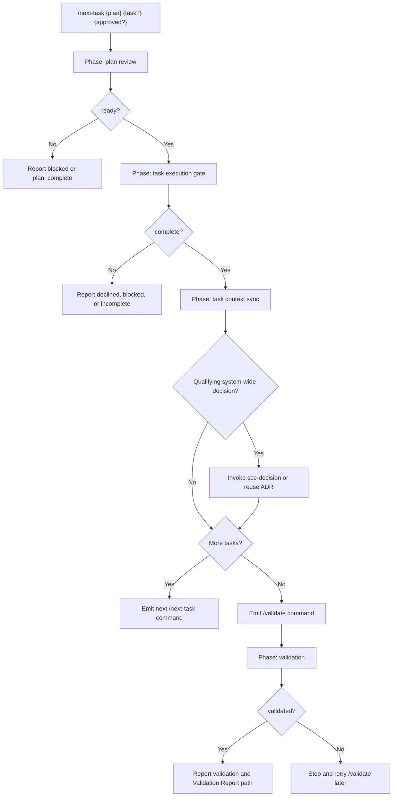

# Shared Context Code Workflows (`/next-task`, `/validate`)

## Purpose

The implementation lifecycle executes at most one reviewed task per `/next-task` invocation, synchronizes durable context only after successful task execution, and runs final plan validation separately through `/validate`. Task-level context synchronization lifecycle state is persisted in each plan as `pending`, `synced`, or `blocked` with blocker, required-action, and retry-condition details for blocked transitions. A completed task also carries a durable "Context synchronization handoff" (changed files, implementation summary, verification, done checks, context impact), so a later session can retry or repair synchronization for that task from the plan alone, without reconstructing it from conversation history. `/validate` is validation-only: it writes the Validation Report and returns its validation status without invoking plan-level context synchronization. The generated OpenCode Code agent only routes to these commands. Every target keeps the complete task lifecycle in `sce-next-task` and the validation lifecycle in `sce-validate`; each `SKILL.md` owns control flow and reads a package-local reference before running the applicable phase. The phases below are internal to those skills, not separate generated packages.

## `/next-task` entrypoint

`/next-task {plan-name-or-path} [T0X] [approved]`

- The plan is required.
- A task ID is optional and must match `T01`, `T02`, and so on.
- The exact token `approved` is optional and may be supplied with or without a task ID.
- Unknown positional tokens are rejected.

## `/next-task` phase ownership

Phase names below identify canonical modules in `config/pkl/base/workflow-next-task.pkl` and `workflow-context-sync.pkl`, and the internal phases they compose into.

1. `sce-plan-review`
   - Resolves exactly one plan and at most one task.
   - Read-only debt detector: inspects every completed task's context lifecycle in plan order, regardless of its position relative to the task being selected or resumed, before allowing any new task to start. A missing field, or any value other than `synced`, is unresolved debt. It never retries or invokes task context synchronization itself.
   - When the first debt-carrying task has no durable "Context synchronization handoff" subsection (a legacy plan predating that structure), it returns `blocked` directly with migration guidance rather than a reconstructed retry.
   - Otherwise it returns `sync_debt`, naming the debt task's ID and title, its persisted "Context synchronization handoff", and — when its lifecycle is `blocked` — its persisted "Context synchronization blocker".
   - Once every completed task is `synced`, selects the requested task or the first incomplete task whose declared dependencies are complete.
   - Returns `ready`, `sync_debt`, `blocked`, or `plan_complete`.
   - Sync-debt recovery: an explicit top-level `/next-task` branch — not plan-review behavior — reached on `sync_debt` before normal task selection resumes. It reads `references/context-sync.md`, then runs task context synchronization using the debt task's persisted handoff (and persisted blocker, when present). On `synced`/`no_context_change` it writes `synced` to the plan, clearing blocker fields, and re-invokes plan review to resume normal task selection. On a renewed `blocked` it writes the refreshed blocker, required action, and retry condition to the plan and stops, rendering the **Context synchronization blocked** layout — distinct from plan review's own **Review blocked** layout.
2. `sce-task-execution`
   - Receives the complete `ready` result.
   - Always presents the implementation gate before editing.
   - Waits for confirmation unless the user supplied `approved` to the command.
   - Captures a pre-edit Git baseline, then reports `changes.files_changed` by comparing
     post-edit state with that baseline, excluding unchanged unrelated staged, unstaged,
     and untracked work.
   - Returns an explicit complete handoff containing the resolved plan, task identity,
     changed files, implementation summary, verification evidence, done-check evidence,
     plan update, and context impact; stale, invalid, or contradictory handoffs block
     deterministically even under auto-approval.
   - Implements and verifies exactly one task, then records status and evidence in the plan.
   - Returns `declined`, `blocked`, `incomplete`, or `complete`.
3. `sce-task-context-sync`
   - Runs only from the complete successful execution handoff.
   - Consumes the handoff's baseline-relative `changes.files_changed` list as authoritative;
     it does not replace it with a whole-working-tree scan or a fresh diff against `HEAD`.
   - Reconciles one task with durable context and performs the mandatory root-file pass.
   - Applies the system-wide decision gate before current-state context edits. Routine,
     local, temporary, and easily reversible choices skip decision writing; each
     qualifying decision reuses an existing ADR or invokes `sce-decision` once.
   - A `not_qualified` or `skipped` decision handoff is non-blocking and synchronization
     continues normally; a `blocked` decision handoff blocks synchronization. Written
     or reused ADR paths become synchronization evidence and are available for
     current-state links.
   - Returns a Markdown report with `synced`, `no_context_change`, or `blocked`.
   - Every report variant lists changed files outside `context/` under `Updated files`;
     task reports omit the impact classification and rendered root-pass checklist
     without changing synchronization behavior.
4. Command continuation
   - Emits exactly one next-task command for the first unchecked task in plan order, or a `/validate` command when all implementation tasks are complete.
   - A completed task's lifecycle is persisted as `pending` before task synchronization and as `synced` or `blocked` afterward; `/next-task` refuses new implementation while completed-task lifecycle debt remains.
   - Never executes the continuation in the same invocation.

A context-sync blocker does not undo successful implementation: the task remains complete in the plan, but the workflow stops because durable context is stale. On every target, review, approval, execution, evidence recording, synchronization, and continuation are internal phases of one `sce-next-task` invocation. Relevant non-SCE skills may assist inside an active step only as helpers that return control to that step; the sole SCE sibling-skill exception is the synchronization decision gate's bounded invocation of `sce-decision`.

## `/validate` entrypoint

`/validate {plan-name-or-path}`

1. `sce-validation` verifies that implementation tasks are complete, runs the plan's full validation commands and acceptance checks, records leftover debug/temp artifacts as failure evidence without deleting or repairing them, and writes the Validation Report.
2. Failed or blocked validation ends the session without repair edits; repair occurs in a later implementation session and retry uses `/validate {plan-path}`.
3. A validated result is reported directly with the Validation Report path; `/validate` does not invoke plan-level context synchronization or persist a plan-sync lifecycle handoff.

On every target, `sce-validate/SKILL.md` dispatches its validation phase through `references/validation.md` and keeps `references/validation-report.md` as the plan-file Validation Report format. Failed, blocked, and validated statuses remain validation-owned terminal outcomes. Final validation never runs from an individual implementation task. Non-SCE helper skills, when relevant, return control to the active validation step without changing its workflow invariants.

## Flow

```mermaid
flowchart TD
    A["/next-task {plan} {task?} {approved?}"] --> B["Phase: plan review"]
    B --> C{"ready?"}
    C -- "No" --> D["Report blocked or plan_complete"]
    C -- "Yes" --> E["Phase: task execution gate"]
    E --> F{"complete?"}
    F -- "No" --> G["Report declined, blocked, or incomplete"]
    F -- "Yes" --> H["Phase: task context sync"]
    H --> Q{"Qualifying system-wide decision?"}
    Q -- "Yes" --> R["Invoke sce-decision or reuse ADR"]
    Q -- "No" --> I{"More tasks?"}
    R --> I
    I -- "Yes" --> J["Emit next /next-task command"]
    I -- "No" --> K["Emit /validate command"]
    K --> L["Phase: validation"]
    L --> M{"validated?"}
    M -- "Yes" --> N["Report validation and Validation Report path"]
    M -- "No" --> O["Stop and retry /validate later"]
```

## Target ownership

- OpenCode, Claude, and Pi: thin commands (Pi: prompts) invoking `sce-next-task` or `sce-validate`.
- `sce-next-task` packages contain `SKILL.md`, `references/{plan-review,task-execution,context-sync,sync-report,output}.md`.
- `sce-validate` packages contain `SKILL.md`, `references/{validation,validation-report,output}.md`. `validation.md` carries the validation steps plus the validation result contract; `output.md` holds the `Completion` layout.
- OpenCode adds `entry-skill` and a one-entry `skills` list naming that skill. Its Plan and Code routing agents allow ordinary non-SCE skills by default, deny arbitrary `sce-*` skills, and then allow only catalog-owned workflows: Plan allows `sce-change-to-plan`; Code allows `sce-next-task`, `sce-validate`, `sce-commit`, `sce-handover`, and `sce-brownfield`, plus the synchronization-only `sce-decision` exception.

## Generated contract checks

The generated-output contract independently verifies semantic workflow integrity in addition to inventory checks: every cited output layout has a matching heading, every package-local reference exists, removed validate/commit reference files stay absent, the commit package emits its split style reference and rejects the obsolete atomic-commit contract section, next-task owns the sync report without duplicating it in `output.md`, target-neutral reference bodies remain identical, stale synchronization-loss wording stays absent, final validation remains observational, and every explicit OpenCode `sce-*` permission names an emitted skill artifact. One checked-in negative fixture covers each semantic assertion.

## Canonical sources

- `config/pkl/base/workflow-next-task.pkl`
- `config/pkl/base/workflow-validate.pkl`
- `config/pkl/base/workflow-context-sync.pkl`
- Workflow composition: `config/pkl/renderers/workflow-composite.pkl` (shared; Claude and Pi consume it)
- Behavioral baselines: `.pi/prompts/{next-task,validate}.md`
