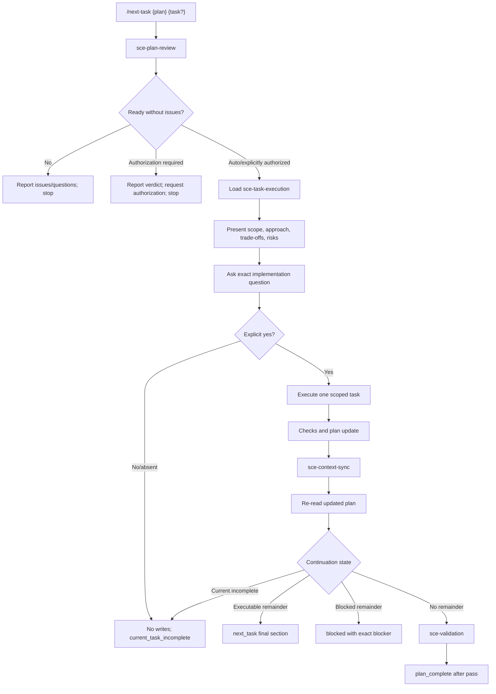

# Shared Context Code Workflow (`/next-task`)

## What this agent is for

The Shared Context Code agent executes exactly one approved plan task from `context/plans/`, validates behavior, and synchronizes `context/` to match current code truth.

Use this agent when you need to:
- continue implementation from an existing SCE plan
- run a specific plan task (`T0X`) or the next unchecked task
- enforce scoped, approval-gated implementation
- treat context synchronization as a required done gate

## Command entrypoint

Canonical command:

`/next-task {plan_name_or_path} {T0X?}`

Examples:
- `/next-task feature-auth T01`
- `/next-task context/plans/feature-auth.md T03`
- `/next-task feature-auth`

## Workflow behavior

`/next-task` keeps orchestration/gating responsibilities, while detailed per-phase contracts are owned by the three phase skills.

1. Run `sce-plan-review` to resolve plan target, task selection, and readiness.
2. Apply the readiness transition.
   - `ready_for_implementation: no` reports issues and focused questions, then stops.
   - Authorization-required readiness reports its verdict and requests authorization, then stops while authorization is absent.
   - Auto-authorized or explicitly authorized readiness immediately loads `sce-task-execution` and presents its scope/approach/risk gate in the same response.
3. Preserve the exact `Continue with implementation now? (yes/no)` stop.
   - Absent or negative confirmation modifies no files and returns `current_task_incomplete`.
   - Positive confirmation permits exactly one scoped task execution.
4. Run task checks, update the plan, and run `sce-context-sync` as a mandatory done gate.
5. Apply only in-scope feedback fixes, rerun light checks, and synchronize context again.
6. Re-read the updated plan from disk and resolve one continuation outcome by plan order and dependency state: `current_task_incomplete`, `next_task`, `blocked`, or provisional `plan_complete`.
7. Run `sce-validation` before returning `plan_complete`.
8. Render `next_task` as the final response section with the actual plan path, task ID, title, and exact invocation; emit no command or generic tail for other outcomes.

## Mermaid diagram

```mermaid
flowchart TD
    A["/next-task {plan} {task?}"] --> B["sce-plan-review"]
    B --> C{"Ready without issues?"}

    C -- "No" --> D["Report issues/questions; stop"]
    C -- "Authorization required" --> E["Report verdict; request authorization; stop"]
    C -- "Auto/explicitly authorized" --> G["Load sce-task-execution"]

    G --> H["Present scope, approach, trade-offs, risks"]
    H --> I["Ask exact implementation question"]
    I --> J{"Explicit yes?"}
    J -- "No/absent" --> Z["No writes; current_task_incomplete"]
    J -- "Yes" --> K["Execute one scoped task"]

    K --> L["Checks and plan update"]
    L --> N["sce-context-sync"]
    N --> O["Re-read updated plan"]
    O --> Q{"Continuation state"}
    Q -- "Current incomplete" --> Z
    Q -- "Executable remainder" --> S["next_task final section"]
    Q -- "Blocked remainder" --> B1["blocked with exact blocker"]
    Q -- "No remainder" --> R["sce-validation"]
    R --> T["plan_complete after pass"]
```

## Guardrails

- One task per session by default unless user explicitly approves multi-task execution.
- Do not expand scope without explicit approval.
- Code is the source of truth when context and code disagree.
- Context sync is required before the task is considered done.
- Continuation selection uses plan order and satisfied dependencies, never task-ID arithmetic.
- The task-execution skill reports current-task completion only; `/next-task` owns plan re-read and next-task selection.
