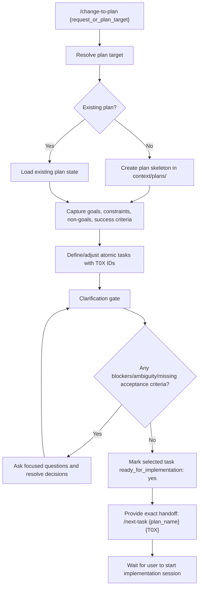

# Shared Context Plan Workflow (`/change-to-plan`)

## What this agent is for

The Shared Context Plan agent prepares or updates one implementation plan in `context/plans/`, keeps task sequencing explicit, and hands off a single approved task for execution.

Use this agent when you need to:
- start a new SCE plan from a scoped change request
- update an existing plan with clarified boundaries or acceptance checks
- stage the next executable task with explicit in/out-of-scope limits
- produce a clean handoff contract for `/next-task`

## Command entrypoint

Canonical command:

`/change-to-plan {request_or_plan_target}`

Examples:
- `/change-to-plan add ci artifact validation`
- `/change-to-plan context/plans/sce-plan-code-convergence-and-sync-policy.md`

## Workflow behavior

1. Resolve target plan intent.
   - If no plan exists, create one under `context/plans/` with stable task IDs (`T01`, `T02`, ...).
   - If a plan exists, load and continue it without reordering completed tasks.
2. Gather and normalize scope.
   - Capture goal, constraints, non-goals, and success criteria in current-state language.
3. Break work into atomic tasks.
   - Define each task with goal, boundaries, done checks, and verification notes.
4. Run clarification gate before plan approval.
   - If blockers, ambiguity, or missing acceptance criteria exist, stop and ask focused questions.
   - Do not mark a task ready for implementation until unresolved points are closed.
5. Publish implementation-ready output contract.
   - Identify the recommended next task (`T0X`) and provide exact `/next-task {plan_name} {T0X}` handoff command.
6. Keep plan continuity durable.
   - Store continuation state in the plan markdown checkboxes/status only.
   - Do not mutate code/runtime files during plan-authoring work.

## Output contract

- Plan target resolved (`plan_name` and path).
- Task stack with stable IDs and explicit acceptance checks.
- Readiness verdict for the selected task:
  - `ready_for_implementation: yes|no`
  - if `no`, include issue categories: blockers, ambiguity, missing acceptance criteria.
- Explicit decisions/questions required from the human before execution.
- Exact next-session execution command: `/next-task {plan_name} {T0X}`.

## Mermaid diagram

## Guardrails

- Planning and execution stay separate: `/change-to-plan` does not implement code changes.
- One-task execution handoff by default; multi-task execution requires explicit user approval at `/next-task` time.
- Keep plan files current-state oriented and avoid prose-heavy historical narration.
- If context and code diverge during planning, treat code as source of truth and queue context repair tasks.
