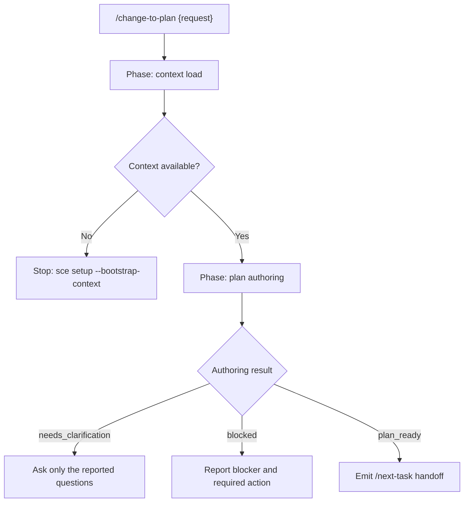

# Shared Context Plan Workflow (`/change-to-plan`)

## Purpose

`/change-to-plan` turns one change request into one scoped implementation plan under `context/plans/`. The generated OpenCode Plan agent is only a routing surface. Every target renders the same behavior into the single `sce-change-to-plan` workflow skill; the two phases below are canonical authoring source and internal phases of that skill, not separate generated packages.

## Command entrypoint

`/change-to-plan {change request}`

The request must be non-empty. The workflow does not accept approval or execution flags.

## Phase ownership

Phase names below identify canonical modules in `config/pkl/base/workflow-change-to-plan.pkl` and the internal phases they compose into.

1. `sce-context-load`
   - Confirms whether `context/` exists.
   - Loads only durable context relevant to the requested focus.
   - Reports gaps and context-versus-code drift without editing context.
   - Returns `loaded` or `bootstrap_required`.
2. `sce-plan-authoring`
   - Runs only from a complete `loaded` handoff.
   - Resolves ambiguity and material decisions before writing.
   - Creates or updates one plan with stable task IDs, explicit scope, dependencies, done checks, and verification notes.
   - Returns `plan_ready`, `needs_clarification`, or `blocked`.

Every target keeps those statuses and their data as internal state inside `sce-change-to-plan` and continues immediately across the phase boundary. No sibling skill handoff and no serialized phase-result contract exists on any target.

## Bootstrap boundary

When context loading returns `bootstrap_required`, the workflow stops without creating context and tells the user to run:

`sce setup --bootstrap-context`

After the user reports that bootstrap completed, the waiting workflow re-runs the
context-load phase and continues with the original request in the same session.

## Planning boundary

- Planning does not implement application or test changes.
- One invocation authors at most one plan.
- Every executable task is sliced as one coherent commit unit by default.
- Durable repository context is read, not synchronized, during planning.
- A ready plan ends with an exact `/next-task {plan-path} {task-id}` handoff; the workflow does not request implementation approval itself.

## Flow

```mermaid
flowchart TD
    A["/change-to-plan {request}"] --> B["Phase: context load"]
    B --> C{"Context available?"}
    C -- "No" --> D["Stop: sce setup --bootstrap-context"]
    C -- "Yes" --> E["Phase: plan authoring"]
    E --> F{"Authoring result"}
    F -- "needs_clarification" --> G["Ask only the reported questions"]
    F -- "blocked" --> H["Report blocker and required action"]
    F -- "plan_ready" --> I["Emit /next-task handoff"]
```

## Target ownership

- OpenCode, Claude, and Pi: one thin command (Pi: prompt) invoking `sce-change-to-plan`; package files are `SKILL.md` and `references/output.md`.
- OpenCode adds `entry-skill` and a one-entry `skills` list naming that skill, and its Plan routing agent allows exactly `sce-change-to-plan`.

## Canonical sources

- `config/pkl/base/workflow-change-to-plan.pkl`
- Workflow composition: `config/pkl/renderers/workflow-composite.pkl` (shared by all three targets)
- Behavioral baseline: `.pi/prompts/change-to-plan.md`
